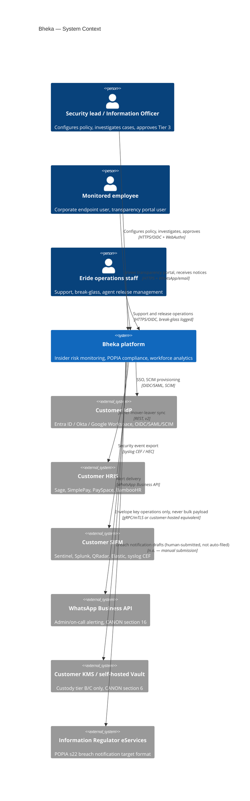
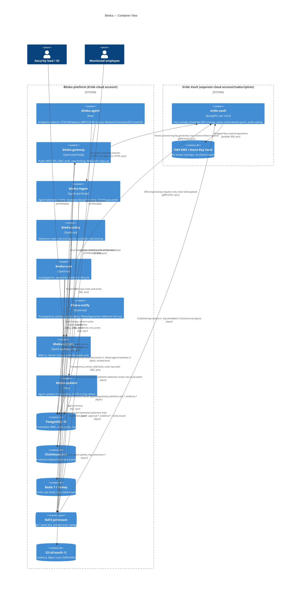
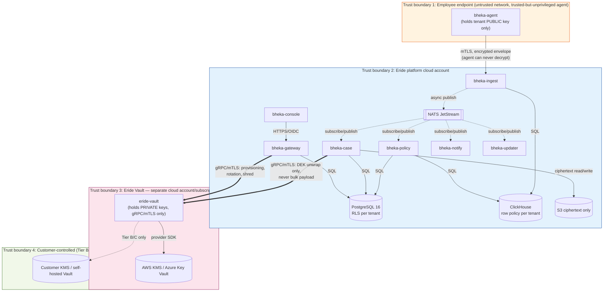

> CONFIDENTIAL — Eride Technologies (Pty) Ltd. Not for distribution outside Eride
> Technologies or parties under written NDA. Contains proprietary architecture.

## 1. Purpose and scope

This document is the C4 context and container view of Bheka: the nine services of
CANON section 3, their trust boundaries, and which interactions are synchronous
(request/response) versus asynchronous (event bus). It does not restate database
columns or API request/response shapes; those live in `schemas/database/*.sql`
and `schemas/api/openapi.yaml` respectively (CANON section 14).

## 2. C4 level 1 — system context

Bheka sits between three human actor groups (tenant admins/security leads,
monitored employees, and Eride operations staff) and a small set of external
systems: the customer's identity provider, HRIS, SIEM, ticketing system,
WhatsApp Business API, and — only for custody Tier B/C tenants — the customer's
own KMS or self-hosted Vault.

## 3. C4 level 2 — container view

All nine services from CANON section 3 are shown below with their primary
datastore and their sync (solid) vs async (dashed, via NATS JetStream)
relationships.

## 4. Sync vs async boundaries

| Interaction | Mode | Rationale |
|---|---|---|
| Console → bheka-gateway | Sync HTTPS | Server Actions are prohibited for privileged operations (CANON section 2); every write must be an auditable REST call. |
| Agent → bheka-ingest | Sync HTTPS over mTLS | Agent needs a delivery acknowledgement to clear its local SQLite/SQLCipher buffer; store-and-forward semantics live in the agent, not the transport. |
| bheka-ingest → ClickHouse | Sync | Write path needs to know success/failure before acking the agent batch. |
| bheka-ingest → NATS JetStream | Async, fire-and-forget from the ingest request path | Downstream rule evaluation and notification must never block telemetry acknowledgement to the agent, especially on a degraded link (CANON section 16). |
| bheka-policy → NATS JetStream (publish) | Async | Detection and risk-score consumers (bheka-case, bheka-notify, bheka-console) are decoupled from the rule engine's execution time. |
| bheka-case ↔ eride-vault | Sync gRPC/mTLS | Key unwrap is on the critical path of an evidence view; the Vault has a hard round-trip SLO and never handles bulk payload (ADR-011), so the call is small and fast enough to stay synchronous. |
| bheka-case → S3 | Sync | Evidence read/write correctness (Object Lock retention, hash-chain verification) must be confirmed before returning to the caller. |
| bheka-notify → WhatsApp/email/webhooks | Async, consumed off NATS JetStream | Notification delivery to third parties (WhatsApp Business API, customer email, customer webhook endpoints) has unpredictable latency and must not block the domain event producers. |
| bheka-updater ↔ bheka-agent | Sync HTTPS poll | Agents pull the update manifest on their own schedule (ring-aware); there is no server-push channel to endpoints, consistent with "no remote control of an employee machine" (CANON section 5). |

## 5. Trust boundaries

Boundary-crossing rules that the architecture enforces structurally, not just
by convention:

1. **TB1 → TB2**: the agent physically cannot decrypt its own uploads (CANON
   section 2), so a full compromise of TB2's ingest path still cannot expose
   plaintext telemetry beyond what that ingest path is already processing in
   memory. See `docs/003_THREAT_MODEL.md` T-ENDPOINT-01.
2. **TB2 → TB3**: only `bheka-case` and `bheka-gateway` may call `eride-vault`,
   over gRPC/mTLS, and the Vault is never reachable from the public internet
   (CANON section 2). The Vault accepts DEK-unwrap requests only — routing a
   400 MB screen recording through it is prohibited by ADR-011 and is enforced
   by a hard request-size ceiling at the Vault's gRPC layer.
3. **TB3 → TB4**: exists only for custody Tier B (customer-managed CMK) and
   Tier C (customer-hosted Vault) tenants (CANON section 6). For Tier A
   tenants, TB4 does not exist; TB3 is the terminus.
4. Every cross-boundary call in TB2/TB3 writes to `audit_log` before returning
   for privileged operations (CANON section 9); see
   `schemas/database/090_audit_log.sql`.

## 6. Service inventory cross-reference

See CANON section 3 for the canonical table (service, language, purpose). This
document does not repeat it; refer to `../../CANON.md` directly.

## 7. Data residency

Primary object storage and databases run in AWS `af-south-1` (Cape Town) for
all tenants by default (CANON section 2). Government/DPSA-bound tenants are
contractually and technically pinned to `af-south-1`; see
`schemas/database/010_tenants.sql` column `tenants.data_residency_region`.
Eride Vault (TB3) runs in a separate cloud account/subscription from the rest
of the platform, also in `af-south-1` for Tier A, or inside the customer's own
account/estate for Tier B/C.

## AI implementation constraints

- Do not introduce a tenth service or rename any of the nine services in CANON
  section 3. If a new capability is needed, place it inside an existing
  service's boundary and justify the placement in an ADR.
- Do not route bulk evidence payloads through `eride-vault`. Any code path that
  sends more than a DEK-sized payload (target: under 4 KiB) to the Vault's gRPC
  interface is a defect against ADR-011.
- Do not add a synchronous call from `bheka-ingest`'s agent-facing write path
  to `bheka-policy`, `bheka-case`, or `bheka-notify`. All fan-out from ingest is
  via NATS JetStream publish only.
- Console (`bheka-console`) Server Components may perform reads directly
  against `bheka-gateway`'s read endpoints; Server Actions must not perform
  writes. All writes go through the versioned REST API.

## Required inputs

- CANON.md (this repository), section 3 service inventory, section 2 stack.
- Confirmed AWS account/subscription boundary between the main platform and
  Eride Vault before Terraform is written.

## Expected outputs

- This document, kept in sync with `schemas/database/*.sql`,
  `schemas/api/openapi.yaml` and `schemas/events/*.json` whenever a service
  boundary or data flow changes.
- Terraform modules that provision two distinct cloud accounts/subscriptions
  matching trust boundaries TB2 and TB3.

## Dependencies

- None (this is a level-0 architecture document; other docs depend on it).

## Acceptance criteria

- Given a new engineer reading only CANON.md and this document, when they are
  asked to name the nine services and state which trust boundary each runs in,
  then they can do so without consulting any other document.
- Given the Mermaid diagrams in this file, when rendered on GitHub, then they
  render without syntax errors.
- Given any proposed architecture change, when it would move a service across
  a trust boundary or change a sync/async boundary, then it requires an ADR
  before implementation.

## Test checklist

- [ ] Both C4 diagrams render without Mermaid syntax errors on GitHub.
- [ ] The trust boundary diagram renders without Mermaid syntax errors on GitHub.
- [ ] All nine CANON section 3 services appear exactly once across the two C4 diagrams.
- [ ] No sync call is documented from bheka-ingest into bheka-policy, bheka-case, or bheka-notify.
- [ ] eride-vault has no inbound relationship originating from bheka-console, bheka-notify, bheka-ingest, bheka-policy, or bheka-updater.
- [ ] Every table name mentioned in this document exists in schemas/database/*.sql.
