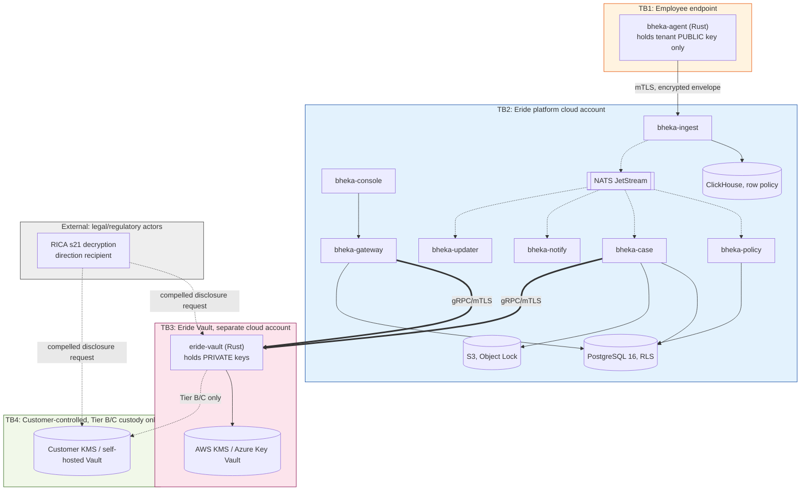

> CONFIDENTIAL — Eride Technologies (Pty) Ltd. Not for distribution outside Eride
> Technologies or parties under written NDA. Contains proprietary architecture.

# Threat model

Status note: this threat model was produced in-house against the architecture in
`002_SYSTEM_ARCHITECTURE.md` and the schemas under `schemas/`. It has not yet had
an independent security review or penetration test. Treat every mitigation below
as a design intent, not a verified control, until that review happens. This
document is marked Provisional as a whole for that reason, even though individual
threats are described in confident, specific terms — the specificity is about
what the design is supposed to do, not a claim that it has been tested.

## 1. Method

STRIDE (Spoofing, Tampering, Repudiation, Information disclosure, Denial of
service, Elevation of privilege) is applied per trust boundary from
`002_SYSTEM_ARCHITECTURE.md` section 5. Each threat has a stable ID so it can be
referenced from code comments and schema comments without drift — several IDs
below (T-EVID-01, T-EVID-02, T-SUPPLY-01) are already referenced from SQL
comments in `schemas/database/010_tenants.sql`, `080_evidence.sql`,
`090_audit_log.sql`, and `040_endpoints_agents.sql`; those references and the
descriptions here must stay in agreement.

Likelihood and impact are each rated Low, Medium, or High, using the same
convention as `030_RISK_REGISTER.md`. Residual risk is the rating after the
stated mitigation is correctly implemented, not the current implementation
state (v1 development is in progress; see `028_ROADMAP_AND_MILESTONES.md`).

## 2. Trust boundary diagram

## 3. Threat register

| ID | Trust boundary | STRIDE | Description | Likelihood | Impact | Mitigation | Residual risk |
|---|---|---|---|---|---|---|---|
| T-INSIDER-01 | TB2 (customer-facing roles) | Elevation of privilege | A malicious insider holding a customer admin role (e.g. tenant owner or investigator) abuses legitimate access to open unjustified cases, escalate to Tier 3 without genuine cause, or view evidence beyond their remit. | Medium | High | Dual-authorisation with a mandatory Information Officer approver for every Tier 3 escalation (`schemas/database/070_cases.sql`, `approvals` table CHECK constraints); every view and export is logged in `evidence_views`/`audit_log` (`schemas/database/080_evidence.sql`, `090_audit_log.sql`); transparency notices are issued to the data subject on every Tier 3 activation so covert abuse is structurally impossible (CANON section 5, permanent refusal 8). | Medium — dual authorisation raises the bar to collusion between two role holders, one of whom must be the Information Officer; collusion risk is not eliminated. |
| T-INSIDER-02 | TB2 | Repudiation | A customer admin denies having approved a Tier 3 escalation or evidence export after the fact, to avoid accountability for an investigation that turns out to be unjustified or discriminatory. | Low | Medium | `approvals` rows require WebAuthn step-up verification at grant time (`schemas/database/070_cases.sql`); `audit_log` is hash-chained and insert-only via both withheld UPDATE/DELETE grants and the `reject_audit_log_mutation()` trigger (`schemas/database/090_audit_log.sql`). | Low — repudiation of a WebAuthn-verified, hash-chained action requires compromising the approver's authenticator, which is a distinct threat (see T-ENDPOINT-01). |
| T-ENDPOINT-01 | TB1 | Tampering, Information disclosure | An employee's corporate endpoint is compromised by malware or a sophisticated attacker before or after `bheka-agent` is installed, potentially exposing raw pre-encryption telemetry, or allowing the attacker to tamper with or disable the agent. | Medium | Medium | The agent holds only the tenant's X25519 public key and can never decrypt its own prior uploads (CANON section 2), so a post-compromise attacker gains no read access to historical telemetry via the agent itself; per-blob DEKs sealed with HPKE RFC 9180 limit exposure to newly captured data only, and only if the attacker can read agent process memory at capture time; `agent_status`/tamper-detection events (`schemas/database/clickhouse/070_events_process.sql`, column `is_tamper_signal`) raise `bheka.detection.raised.v1` for uninstall/tamper attempts. | Medium — a sufficiently privileged endpoint compromise (kernel-level, pre-encryption) can still see plaintext keystrokes or screen content at capture time; no software control fully eliminates this for an attacker who already owns the OS kernel. |
| T-ENDPOINT-02 | TB1 | Spoofing | An attacker attempts to enrol a rogue device as a legitimate agent to inject false telemetry or exhaust tenant Tier 2/3 collection budget. | Low | Medium | Enrolment requires a short-lived `ENROLMENT_TOKEN` issued out-of-band via the MSI `SecureCustomProperties` mechanism (CANON section 11) and results in a per-agent mTLS certificate; `bheka-gateway` validates enrolment tokens are single-use and tenant-scoped before `bheka.agent.enrolled.v1` is emitted (`schemas/events/bheka.agent.enrolled.v1.json`). | Low — requires exfiltrating a live enrolment token before it is consumed or before its validity window expires. |
| T-EMPLOYEE-01 | TB2 (Eride personnel) | Elevation of privilege, Information disclosure | A compromised or malicious Eride employee with production access attempts to read customer telemetry, evidence, or tenant key material outside a legitimate support ticket. | Low | High | Eride staff access to `bheka-gateway`/console production data requires OIDC auth and is itself logged in `audit_log`; Eride cannot reach `eride-vault` private key material through the platform account because TB3 is a separate cloud account/subscription (`002_SYSTEM_ARCHITECTURE.md` section 5); Tier B/C tenants structurally deny Eride decryption ability regardless of any Eride employee's access level (CANON section 6); break-glass reidentification is a distinct, separately logged operation (`schemas/api/openapi.yaml`, users break-glass reidentify endpoint, `x-bheka-writes-audit-log: true`). | Medium for Tier A tenants (Eride retains technical decrypt capability by design, so this reduces to a personnel/process control, not a cryptographic one); Low for Tier B/C tenants (Eride cannot decrypt regardless of employee access). |
| T-EMPLOYEE-02 | TB2/TB3 boundary | Tampering | A compromised Eride employee with deploy access modifies `bheka-policy` or `eride-vault` code to introduce a covert backdoor (e.g. silent Tier 3 activation, key exfiltration). | Low | High | Code review requirements and CI/CD via GitHub Actions (CANON section 2); `eride-vault` is a small, auditable Rust codebase sharing the `bheka-crypto` crate with the agent so it is reviewed once (ADR-003); no path exists for `eride-vault` to be updated by the same deployment pipeline as `bheka-policy` since they run in separate cloud accounts. Independent security review is planned before Tier B/C general availability (`030_RISK_REGISTER.md` item 16) but has not yet occurred. | Medium — this is fundamentally a software supply-chain and personnel-security control, not eliminated until independent review and stricter deploy segregation (e.g. two-person review mandatory on `eride-vault` and `bheka-policy` changes) are verified in place. |
| T-RICA-01 | TB3/TB4 boundary, external (EXT) | Information disclosure | A South African law enforcement or state security body issues a RICA section 21 decryption direction to Eride (as an apparent "decryption key holder") for a Tier A tenant, or attempts to compel disclosure for a Tier B/C tenant where Eride structurally cannot comply. | Low | High | For Tier A, Eride can technically comply (Vault holds the key) and any lawful direction would be handled through counsel, consistent with the Cybercrimes Act section 39 disclosure framework (CANON section 7). For Tier B/C, Eride cannot decrypt and this is the explicit design rationale for those tiers (CANON section 6) — Eride can accurately state technical incapacity to comply, shifting the request to the customer as the actual key holder. This entire threat entry is Provisional: the current operative text of RICA section 21 requires attorney confirmation, since parts of RICA were declared unconstitutional in 2021 ([Constitutional Court judgment, AmaBhungane v Minister of Justice, 2021](https://www.concourt.org.za/), n.a. for a direct case citation URL at time of writing — confirm with counsel before relying on this threat entry in a customer-facing document). | Provisional — cannot rate residual risk with confidence until counsel confirms current RICA section 21 text and Eride's specific obligations as an intermediary versus a "decryption key holder." See `019_LEGAL_AND_REGULATORY_FRAMEWORK.md` section 3 and `030_RISK_REGISTER.md` item 6. |
| T-SUPPLY-01 | TB1/TB2 boundary (`bheka-updater` channel) | Tampering, Elevation of privilege | An attacker compromises the agent build, signing, or distribution pipeline to push a malicious update to endpoints at scale, analogous in blast-radius terms to the CrowdStrike Channel File 291 incident ([CrowdStrike post-incident review](https://www.crowdstrike.com/en-us/falcon-content-update-remediation-and-guidance-hub/), referenced in CANON section 11). | Low | High | Every artifact is signed (EV code signing on a FIPS hardware token for Windows, notarized Developer ID for macOS, GPG for Linux and on-prem, CANON section 11) and `agent_versions.artifact_sha256` is verified before a ring advances; staged rollout (Canary to Ring 0 1 percent, Ring 1 10 percent, Ring 2 50 percent, Ring 3 100 percent) with minimum 24-hour soak per ring and automatic halt on crash-rate regression (`schemas/database/040_endpoints_agents.sql`, enum `update_ring`; `bheka.agent.update_ring_advanced.v1`) bounds blast radius even if signing keys are compromised undetected. See `docs/002_SYSTEM_ARCHITECTURE.md` section 4 for the sync poll model that removes any server-push channel. | Medium — staged rollout limits blast radius but does not prevent a signed, malicious artifact from reaching Canary and Ring 0 hosts; detection depends on crash-rate and telemetry-anomaly monitoring catching the regression within the soak window, which is a process control that has not yet been operationally tested at scale. |
| T-TENANT-01 | TB2 (PostgreSQL, ClickHouse) | Elevation of privilege, Information disclosure | A bug in application code, a missing `tenant_id` filter, or a misconfigured session fails to set `current_tenant_id()` correctly, allowing one tenant's data to be read or written by a session authenticated for a different tenant. | Medium | High | Every tenant-scoped PostgreSQL table enforces Row Level Security using `current_tenant_id()` (`schemas/database/000_extensions_and_domains.sql`), with no exceptions per CANON section 8; the `bheka_app` role has no BYPASSRLS, unlike `bheka_migrator`; ClickHouse enforces the equivalent via `CREATE ROW POLICY` (`schemas/database/clickhouse/000_database_and_conventions.sql`, `010_events_raw.sql`). | Medium — RLS and row policies are strong structural controls, but a bug that fails to set the tenant GUC before a query executes, or a query executed under `bheka_migrator`/superuser context by mistake, would bypass them; this is why automated tests must include a cross-tenant negative test (see Test checklist) run on every migration change, not just at initial validation. |
| T-TENANT-02 | TB3 (Vault) | Elevation of privilege | A bug or misconfiguration in `eride-vault` allows a DEK-unwrap request for tenant A's evidence to be serviced using tenant B's root key context, or vice versa. | Low | High | Per-tenant root keys with no common ancestor (CANON section 6) mean a request scoped to the wrong tenant fails cryptographically rather than silently succeeding, because the wrong key simply cannot unwrap the DEK; `tenant_keys` rows are strictly one-to-one with `tenants` by `tenant_id` (`schemas/database/010_tenants.sql`). | Low — the cryptographic structure itself (not just access control logic) makes cross-tenant unwrap fail closed rather than fail open. |
| T-EVID-01 | TB3 (Vault, KMS) | Tampering, Denial of service (of the wrong kind) | Destruction, loss, or unauthorized triggering of a tenant's root key, either maliciously or accidentally, which is technically indistinguishable from a legitimate crypto-shred and renders all that tenant's evidence permanently unrecoverable, including backups (`schemas/database/010_tenants.sql`, `080_evidence.sql`). | Low | High | Crypto-shred is intentionally destructive by design (POPIA section 14 retention mechanism, CANON section 6) so the mitigation is procedural, not technical: `tenant_keys.shredded_by_user_id` and `bheka.key.shredded.v1` require an approval record before `eride-vault` executes destruction (`schemas/api/openapi.yaml`, tenant key shred endpoint, `x-bheka-webauthn-step-up: true`, `x-bheka-writes-audit-log: true`); KMS-side deletion protections (e.g. AWS KMS scheduled deletion windows) should be used as a secondary safeguard against accidental triggering, pending confirmation this is compatible with the crypto-shred SLA. | Medium — the approval and WebAuthn step-up gate reduces accidental or unilateral triggering, but a legitimate dual-approved shred and a coerced or socially engineered one are procedurally identical from the Vault's point of view; this is an inherent tension in an irreversible-by-design control. |
| T-EVID-02 | TB2 (evidence, audit_log) | Tampering, Repudiation | An attacker or insider with database access attempts to alter or delete `evidence` or `audit_log` rows to cover up wrongdoing or undermine the evidentiary value of a case, threatening admissibility under LRA/BCEA procedural fairness standards (CANON section 7). | Low | High | `audit_log` is insert-only via withheld UPDATE/DELETE grants plus the defense-in-depth `reject_audit_log_mutation()` trigger (`schemas/database/090_audit_log.sql`); both `audit_log` and `evidence` carry hash-chain fields (`prev_hash`/`row_hash` and `hash_chain_prev_evidence_id`/`hash_chain_value` respectively) so any row modification breaks the chain and is detectable by recomputation; sealed evidence objects use S3 Object Lock in COMPLIANCE mode (CANON section 2), which prevents deletion or overwrite even by the bucket owner for the configured retention period. | Low — Object Lock COMPLIANCE mode combined with hash-chain verification means undetected tampering would require compromising both the database hash chain and the underlying S3 immutability guarantee simultaneously, which is a materially higher bar than compromising either alone. |
| T-CONSOLE-01 | TB2 (bheka-console) | Elevation of privilege | An attacker exploits a vulnerability in `bheka-console` (e.g. a Server Action improperly performing a privileged write, or a client-side authorization bypass) to perform an action the authenticated user's role should not permit. | Medium | Medium | Server Actions are prohibited for any privileged operation; all writes route through the versioned REST API on `bheka-gateway`, which independently enforces RBAC and writes to `audit_log` before returning (CANON section 2, section 9; `002_SYSTEM_ARCHITECTURE.md` section 4). This means a console-layer bug cannot itself grant a privilege the API layer would not independently authorize. | Low — defense in depth from the API layer holds even if the console layer is compromised, provided the API layer's own RBAC checks (`roles`/`role_assignments`, `schemas/database/030_users_roles.sql`) are correctly implemented and tested. |
| T-DOS-01 | TB1/TB2 boundary (`bheka-ingest`) | Denial of service | A high volume of agent telemetry (legitimate spike, misconfigured policy causing excessive Tier 2 capture, or deliberate flooding from compromised endpoints) overwhelms `bheka-ingest` or ClickHouse write capacity, delaying detection and risk scoring platform-wide. | Medium | Medium | Rate limiting at `bheka-gateway` (`RateLimit-*` headers, CANON section 9); agent-side low-bandwidth mode and aggressive batching/zstd compression reduce baseline volume (CANON section 16); NATS JetStream decouples `bheka-ingest`'s write acknowledgement to the agent from downstream rule evaluation load, so a `bheka-policy` backlog does not block telemetry intake (`002_SYSTEM_ARCHITECTURE.md` section 4). | Medium — ClickHouse write throughput itself is not inherently rate-limited in the current design; a sustained flood could still degrade query performance for `bheka-policy`'s rule evaluation even if ingest acknowledgement stays healthy. Capacity testing is a v1 readiness item, not yet performed. |

## 4. Threats explicitly out of scope for this document

- Physical security of customer premises and endpoints — a customer operational
  responsibility, referenced but not modeled here.
- Denial-of-service against the WhatsApp Business API or other third-party
  notification channels — availability of those channels is outside Eride's
  control; `021_AFRICA_MODULE.md` notes email/console as fallback.
- Generic cloud-provider (AWS) infrastructure compromise — assumed out of scope
  per the shared responsibility model; not re-litigated here.

## 5. Review status

This threat model has not been reviewed by an external security firm or
penetration tester. It should be treated as a structured starting hypothesis,
not a certification of security. `030_RISK_REGISTER.md` item 16 already flags
independent security review as a precondition for Tier B/C general
availability; that review should explicitly re-score every threat in section 3
above.

## AI implementation constraints

- Do not remove or renumber an existing threat ID (T-EVID-01, T-EVID-02,
  T-SUPPLY-01, and any others introduced here) without updating every SQL
  comment and document that references it. Search the repository for the ID
  string before renaming.
- Do not mark T-RICA-01 residual risk as anything other than Provisional until
  a named attorney confirms current RICA section 21 text in writing.
- Any new service, table, or event topic added to CANON must be checked against
  this threat model for a corresponding new threat entry before merge, not
  after.

## Required inputs

- `002_SYSTEM_ARCHITECTURE.md` trust boundary diagram and sync/async table.
- `schemas/database/*.sql` for the specific tables and constraints cited above.
- `schemas/events/*.json` for the event names cited above.
- Attorney confirmation of current RICA section 21 text (outstanding, blocks
  T-RICA-01 from moving out of Provisional status).

## Expected outputs

- This threat model, kept current as new services or trust boundaries are
  added.
- A follow-on penetration test report and independent security review report,
  once commissioned, cross-referenced against the threat IDs here.

## Dependencies

- `002_SYSTEM_ARCHITECTURE.md` (trust boundaries and service inventory).
- `030_RISK_REGISTER.md` (business-level risk framing for T-EMPLOYEE-02,
  T-SUPPLY-01, T-EVID-01).
- `019_LEGAL_AND_REGULATORY_FRAMEWORK.md` (RICA/POPIA/Cybercrimes Act framing
  for T-RICA-01, T-EMPLOYEE-01).

## Acceptance criteria

- Given this document, when a reviewer searches for T-EVID-01, T-EVID-02, or
  T-SUPPLY-01, then the description here matches the context of every SQL
  comment referencing that ID.
- Given a new trust-boundary-crossing feature proposal, when it is reviewed
  against this document, then it either maps to an existing threat entry or
  requires a new one before merge.
- Given the Mermaid trust boundary diagram, when rendered on GitHub, then it
  renders without syntax errors and shows all four trust boundaries plus the
  external RICA actor.

## Test checklist

- [ ] Automated cross-tenant negative test exists: a session authenticated as tenant A cannot read or write any row belonging to tenant B in any RLS-protected PostgreSQL table.
- [ ] Automated cross-tenant negative test exists for ClickHouse row policies equivalent to the PostgreSQL test above.
- [ ] `reject_audit_log_mutation()` trigger is verified to reject both UPDATE and DELETE against `audit_log` in a test database.
- [ ] Hash-chain recomputation across `audit_log` and `evidence` is implemented as an automated integrity check, not only a manual procedure.
- [ ] Tier 3 escalation path is verified to require two distinct approvers with WebAuthn step-up, one holding the Information Officer role, before `bheka.case.tier_escalated.v1` is emitted.
- [ ] Agent artifact signature verification is tested to reject an unsigned or tampered update package before it reaches any ring.
- [ ] Ring rollout auto-halt on crash-rate regression is tested against a simulated crash-rate spike in Ring 0.
- [ ] Attorney has confirmed current RICA section 21 text and Eride's specific obligations before T-RICA-01 is promoted out of Provisional status.
- [ ] Independent security review or penetration test has been commissioned before Tier B/C general availability.
