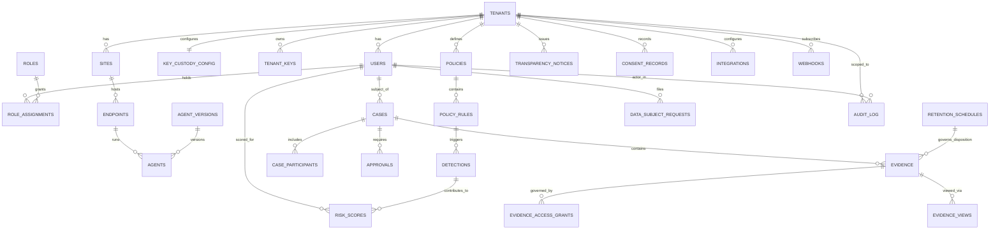

> CONFIDENTIAL — Eride Technologies (Pty) Ltd. Not for distribution outside Eride
> Technologies or parties under written NDA. Contains proprietary architecture.

# Data model

This document explains the domain model in narrative form: what the aggregates
are, how they relate, and why the platform splits data across PostgreSQL and
ClickHouse. Per the anti-drift rule (CANON section 14), it does not restate any
column list. Every table referenced below has its authoritative definition in
`schemas/database/*.sql` or `schemas/database/clickhouse/*.sql`; follow the
path given at first mention of each table.

## 1. Two datastores, one reason

PostgreSQL 16 holds everything that is low-volume, relational, and subject to
Row Level Security: tenants, identity, policy configuration, case management,
evidence metadata, and the audit trail. ClickHouse 24.x holds everything that
is high-volume and append-mostly: the raw endpoint telemetry events an agent
produces continuously (app usage, file operations, USB activity, web activity,
keystroke metadata, process activity, network activity).

The split exists because these two workloads have incompatible performance
profiles under one engine. A single tenant's endpoints can produce millions of
telemetry rows a day at Tier 1 alone; running Row-Level-Security-checked
relational queries at that volume in PostgreSQL would not scale, and running
transactional case/approval/evidence workflows in ClickHouse (which has no
transactional guarantees suited to multi-step approval workflows) would be the
wrong tool in the other direction. `bheka-ingest` is the only service that
writes to ClickHouse; see `docs/002_SYSTEM_ARCHITECTURE.md` section 3.

Both datastores enforce tenant isolation, but by different mechanisms. See
section 5 below.

## 2. The tenancy and identity aggregate

Every tenant-scoped table traces back to `tenants`
(`schemas/database/010_tenants.sql`). A tenant has one or more `sites`
(`schemas/database/020_sites.sql`) representing physical or logical locations
with their own bandwidth profile, relevant to the Africa module's low-bandwidth
mode (CANON section 16). A tenant has `users`
(`schemas/database/030_users_roles.sql`), which represent both human accounts
(admins, investigators, monitored employees who use the transparency portal)
and any service identity that needs an audit trail entry. Authorization is
role-based: `roles` and `role_assignments` bind a user to a role within a
scope. The Information Officer role is structurally significant, not just
descriptive — `030_users_roles.sql` enforces at most one active Information
Officer assignment per tenant via a trigger, because POPIA's Information
Officer role (CANON section 7) and the Tier 3 dual-authorisation requirement
(CANON section 4) both depend on that role being unambiguous.

`tenants` also links forward to `key_custody_config` and `tenant_keys`
(`schemas/database/010_tenants.sql`), which record which of the three custody
tiers (A/B/C, CANON section 6) a tenant uses and the tenant's own encryption
key material lifecycle. This link matters structurally: it is what makes
crypto-shredding tenant-scoped rather than global, since each tenant's root key
has no common ancestor with any other tenant's.

## 3. The endpoint and agent aggregate

`endpoints` (`schemas/database/040_endpoints_agents.sql`) represent physical or
virtual machines. Every endpoint is corporate-owned by structural constraint
(a CHECK constraint forces `is_corporate_owned = true`), which is the database
enforcing the permanent product refusal against BYOD (CANON section 5, refusal
4) rather than leaving it as a policy convention. Each endpoint runs at most
one active `agents` row at a time, and each agent instance is tied to a
specific `agent_versions` row, which is how the update ring model (CANON
section 11) is tracked per-endpoint: an endpoint's current ring assignment and
the artifact hash it should be running are both visible without joining
against telemetry at all.

## 4. The policy, detection, and risk aggregate

`policies` and `policy_rules` (`schemas/database/050_policies.sql`) define what
the platform watches for and at what visibility tier. A policy rule targeting
Tier 3 cannot be saved without `requires_dual_authorisation = true` — this is a
CHECK constraint, not application logic, so the dual-authorisation requirement
in CANON section 4 cannot be silently bypassed by a future code change that
forgets to check it. When a rule matches incoming telemetry, `bheka-policy`
writes a `detections` row (`schemas/database/060_detections_and_risk.sql`).
Detections never carry event content; they carry `source_event_ids`, an array
of pointers into ClickHouse, keeping the visibility-tier boundary intact even
inside the relational side of the system: a Tier 1-scoped user with database
access to `detections` still cannot recover Tier 3 content from that table
alone. `risk_scores` are appended (never updated) on the same table, each row
carrying its own `contributing_signals` for explainability, consistent with the
product's explainable-risk-scoring position and its avoidance of the
permanently refused sentiment/loyalty scoring (CANON section 5, refusal 6).

## 5. The case, approval, and evidence aggregate

This is the aggregate with the most legal weight. A `cases` row
(`schemas/database/070_cases.sql`) is the unit of investigation; it has
`case_participants` (investigators, the subject, witnesses) and `approvals`.
The `approvals` table is generic across several approval subject types (tier
escalation, evidence export, evidence reidentification, legal hold override,
tenant key shred — see `schemas/events/bheka.approval.requested.v1.json` for
the enumerated list), rather than one approval table per subject type, because
the underlying rule is the same regardless of what is being approved: bounded
window, WebAuthn step-up, and for Tier 3 specifically, two distinct approvers
one of whom holds the Information Officer role. `070_cases.sql`'s CHECK
constraints enforce the bounded window and step-up requirement at the database
level.

`evidence` (`schemas/database/080_evidence.sql`) is sealed once captured: it
carries hash-chain fields linking each evidence row to the previous one for
that case, so tampering with any single row breaks a chain that can be
independently recomputed, not just flagged by a trust-me audit column. Access
to evidence is mediated through `evidence_access_grants`, and every actual view
is recorded in `evidence_views`, which has no UPDATE grant at all — a view
record cannot be edited after the fact, only ever inserted. This is what makes
four-eyes evidence viewing auditable rather than merely policy-documented.

## 6. Audit as a cross-cutting concern, not a downstream log

`audit_log` (`schemas/database/090_audit_log.sql`) is written to directly by
every service performing a privileged operation, before that operation
returns to its caller (CANON section 9). It is not populated by scraping
application logs after the fact. Like `evidence`, it is hash-chained
(`prev_hash`/`row_hash`), and mutation is blocked both by withheld
UPDATE/DELETE grants and by the `reject_audit_log_mutation()` trigger — two
independent enforcement layers for the same invariant, because this table is
the platform's primary defense against the repudiation threats in
`docs/003_THREAT_MODEL.md` (T-INSIDER-02, T-EVID-02).

## 7. Transparency and data subject rights

`transparency_notices`, `data_subject_requests`, and `consent_records`
(`schemas/database/100_transparency.sql`) exist because Bheka's entire
positioning depends on monitoring never being silent (CANON section 5, refusal
8). A `transparency_notices` row is generated for deployment, every Tier 2/3
activation, conclusion disclosures, policy changes, and breach notices — the
enumerated kinds are visible in
`schemas/events/bheka.notice.issued.v1.json`. `data_subject_requests` tracks
POPIA sections 23 to 25 access, correction, and objection requests as
first-class records rather than as support tickets, so an Information Officer
can demonstrate a complete, queryable history of how the organisation
responded to data subject rights.

## 8. Retention, key custody, and disposition

`retention_schedules` (`schemas/database/110_retention.sql`) governs how long
evidence and other tenant data are kept and what happens at expiry
(disposition options include crypto-shred). `evidence.retention_schedule_id`
ties individual evidence rows to a schedule. The actual destructive act — a
crypto-shred — is not a `DELETE` statement against PostgreSQL rows; it is
`eride-vault` destroying the tenant's root key so that all ciphertext
depending on it, in PostgreSQL, ClickHouse, and S3 alike, becomes permanently
unrecoverable at once (CANON section 6). This is why `tenant_keys`
(`schemas/database/010_tenants.sql`) is the actual mechanism behind POPIA
section 14 retention limits, and why `retention_schedules` is best understood
as scheduling intent, with `tenant_keys`/`eride-vault` as the enforcement
point.

## 9. Integrations and webhooks as the edge

`integrations` (`schemas/database/120_integrations.sql`) records configured
connections to external systems named in CANON section 2 and the product
feature spec (customer IdP for SSO/SCIM, HRIS, SIEM, ticketing, WhatsApp
Business API, MDM). `webhooks` (`schemas/database/330_webhooks.sql`) records
tenant-configured outbound delivery targets for platform events; the table
enforces `https://` URLs only via a CHECK constraint, since these endpoints
carry event payloads (`schemas/events/*.json`) to systems outside Eride's
control.

## 10. Row Level Security versus row policy

PostgreSQL enforces tenant isolation with native Row Level Security, gated by
a `current_tenant_id()` function that reads a session GUC
(`schemas/database/000_extensions_and_domains.sql`). Every tenant-scoped table
has this policy attached with no exceptions (CANON section 8); only the
`bheka_migrator` role bypasses it, and only for schema migrations, never
application queries. ClickHouse achieves the equivalent with `CREATE ROW
POLICY` bound to a settings profile
(`schemas/database/clickhouse/000_database_and_conventions.sql`,
`010_events_raw.sql`). Both mechanisms fail closed: a query that does not
correctly set the tenant context returns zero rows rather than all rows. This
structural choice is what T-TENANT-01 and T-TENANT-02 in
`docs/003_THREAT_MODEL.md` are scored against.

## 11. Entity relationship overview

The diagram below shows relationships only, not columns or types, consistent
with the anti-drift rule. Refer to the SQL files cited throughout this
document for actual field definitions.

## AI implementation constraints

- Do not add a column list, enum value list, or constraint description to this
  document. If a reader needs that detail, add or correct it in the relevant
  `schemas/database/*.sql` file and reference the path here instead.
- Do not introduce a new core table without updating both the SQL migration
  file and the count check in the final validation pass (CANON section 8 lists
  27 canonical tables; this document must not silently drift from that count).
- When adding a relationship to the ER diagram in section 11, verify the
  corresponding foreign key actually exists in the referenced SQL file before
  adding the line.

## Required inputs

- `schemas/database/*.sql` (PostgreSQL) and `schemas/database/clickhouse/*.sql`
  (ClickHouse), as the sole source of truth for structure.
- `docs/002_SYSTEM_ARCHITECTURE.md` for which service writes to which
  datastore.

## Expected outputs

- This narrative document, updated whenever a table is added, removed, or
  re-scoped, without ever re-embedding column definitions.

## Dependencies

- `002_SYSTEM_ARCHITECTURE.md`.
- `003_THREAT_MODEL.md` for the security rationale behind RLS, hash chains, and
  crypto-shredding referenced in sections 5, 6, 8, and 10 above.

## Acceptance criteria

- Given this document, when a reader searches it for a column name, then none
  is found outside of a table or file path reference.
- Given the ER diagram in section 11, when compared against the foreign keys
  actually declared in `schemas/database/*.sql`, then every relationship shown
  corresponds to a real foreign key or a documented cross-datastore pointer
  (such as `detections.source_event_ids` referencing ClickHouse).
- Given CANON section 8's list of 27 canonical tables, when compared against
  the tables mentioned in this document, then every one is mentioned at least
  once with a correct file path.

## Test checklist

- [ ] Every SQL file path cited in this document exists at that exact path.
- [ ] Every table name cited in this document matches a table name in CANON section 8 or the ClickHouse table list, with no renames.
- [ ] The Mermaid ER diagram renders without syntax errors on GitHub.
- [ ] No column name, enum value, or data type appears anywhere in this document's prose.
- [ ] Cross-reference check: every foreign key relationship shown in the ER diagram has a corresponding column in the cited SQL file.
