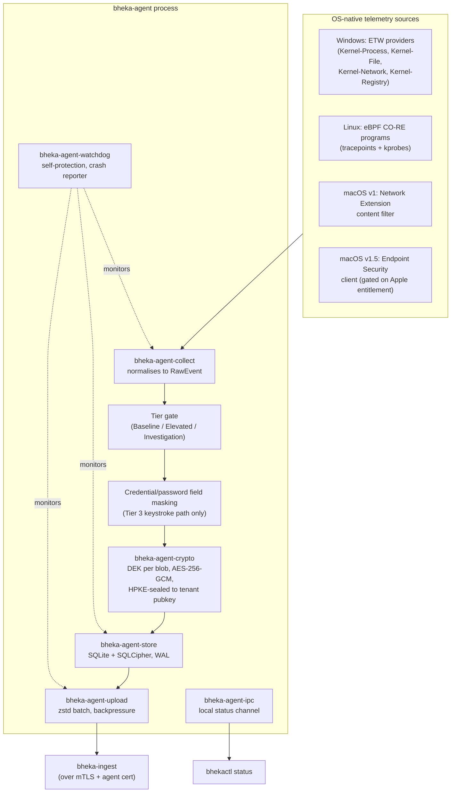
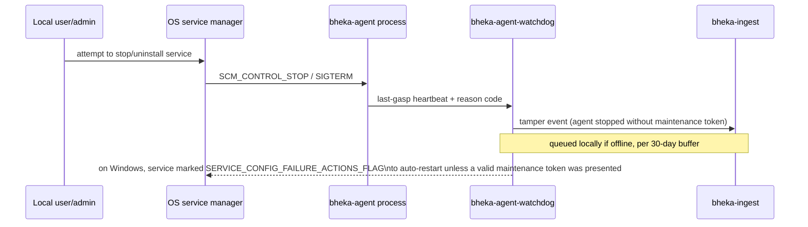
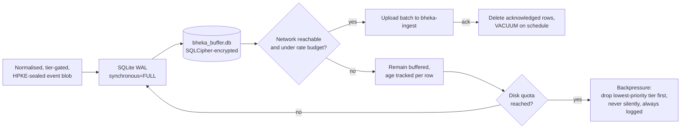
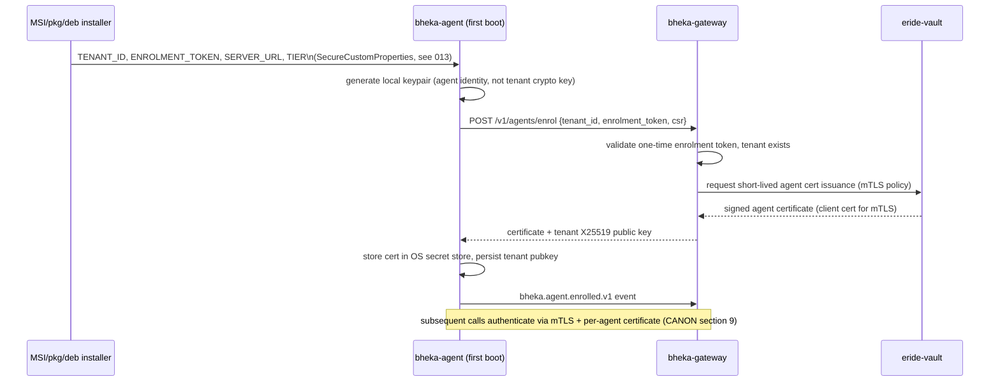

> CONFIDENTIAL — Eride Technologies (Pty) Ltd. Not for distribution outside Eride
> Technologies or parties under written NDA. Contains proprietary architecture.

Status note: marked Provisional because the macOS Endpoint Security Framework (ESF) code
paths described here depend on Apple granting `com.apple.developer.endpoint-security.client`,
an entitlement Apple grants at its own discretion with reported waits of 4 weeks to 13
months and no status visibility once submitted (see `013_PACKAGING_AND_DISTRIBUTION.md` and
[Apple Developer Forums thread 133494](https://developer.apple.com/forums/thread/133494)).
Everything describing Windows ETW and Linux eBPF CO-RE is Locked per CANON section 2.

## 1. Purpose and scope

`bheka-agent` is the Rust binary that runs on every enrolled endpoint. It collects
telemetry at the tier currently assigned to the endpoint (CANON section 4: Baseline,
Elevated, Investigation), encrypts it so that the agent itself can never read it back, and
forwards it to `bheka-ingest`. This document covers agent-internal architecture only. Wire
formats belong in `schemas/events/*.json`, not here (CANON section 14).

## 2. Design constraints inherited from CANON

- No hidden or disguised operation mode (CANON section 5, item 1). Every design decision in
  this document must keep the agent discoverable: a running process, a visible service/daemon
  entry, and a local status command.
- No kernel driver and no minifilter in v1 on Windows; no out-of-tree kernel module on Linux
  (CANON section 2). This avoids Secure Boot MOK enrolment, which requires a physical
  console reboot per machine and is unworkable at fleet scale.
- The agent holds only the tenant's X25519 public key. It cannot decrypt its own prior
  uploads. Every blob is sealed with a random per-blob AES-256-GCM data encryption key
  (DEK), and the DEK is sealed to the tenant public key via HPKE (RFC 9180) before either
  touches disk (CANON section 2, Agent crypto).
- 30-day offline capacity, journaled writes that survive ungraceful power loss (load-shedding),
  backpressure and a disk quota (CANON section 16, Africa module).

## 3. Crate layout

`bheka-agent` is a Cargo workspace, not a single crate, so platform-specific code is
isolated behind trait boundaries and the crypto implementation is shared with `eride-vault`
per ADR-003.

```
bheka-agent/
├── Cargo.toml                      # workspace manifest
├── crates/
│   ├── bheka-agent-core/           # platform-agnostic state machine, config, tier logic
│   ├── bheka-agent-collect/        # trait: Collector; tier gating; event normalisation
│   ├── bheka-agent-collect-win/    # ETW consumer implementation (windows target only)
│   ├── bheka-agent-collect-linux/  # eBPF CO-RE loader + userspace ring-buffer reader
│   ├── bheka-agent-collect-macos/  # NEFilterDataProvider bridge + (v1.5) ESF client
│   ├── bheka-agent-store/          # SQLite+SQLCipher buffer, WAL journal, quota, GC
│   ├── bheka-agent-crypto/         # re-exports bheka-crypto (shared with eride-vault)
│   ├── bheka-agent-upload/         # HTTPS batching client to bheka-ingest, backpressure
│   ├── bheka-agent-enrol/          # enrolment protocol, certificate lifecycle, mTLS identity
│   ├── bheka-agent-watchdog/       # self-protection, health checks, crash reporting
│   ├── bheka-agent-ipc/            # local named-pipe/UDS status & admin channel
│   └── bheka-agent-cli/            # `bhekactl` — status, diagnostics, uninstall gate
├── bin/
│   ├── bheka-agent-svc/            # Windows service / launchd daemon / systemd unit entrypoint
│   └── bhekactl/                   # thin binary wrapping bheka-agent-cli
└── xtask/                          # cross-compilation and packaging helper (invoked by CI)
```

Rationale: `bheka-agent-collect` defines a single `Collector` trait
(`fn poll(&mut self) -> Vec<RawEvent>` plus an async variant for OS callback-driven sources)
so `bheka-agent-core`'s tier state machine and batching logic are compiled and tested once,
independent of platform. Only the three `collect-*` crates carry `#[cfg(target_os = ...)]`
gates, and CI cross-compiles all three from a single Linux host using `cross` and, for
macOS, an actual macOS runner (Apple toolchains cannot be legally cross-compiled from
non-Apple hardware for code-signing purposes).

## 4. Runtime architecture



The agent never holds a decryption key: `ENCRYPT` seals every blob before it reaches
`STORE`, so a stolen laptop disk or a compromised local admin account exposes only
ciphertext plus the tenant's public key, per CANON's envelope encryption rule (ADR-011:
the Vault decrypts DEKs only, never bulk payloads — this rule is enforced upstream at
`bheka-ingest`/`eride-vault`, not on the endpoint).

## 5. Windows: ETW consumer design

v1 ships fully user-mode: no kernel driver, no minifilter (CANON section 2; also the
explicit v1 recommendation in the packaging research — "ship v1 fully user-mode (ETW +
Win32 clipboard/print/window hooks + `ReadDirectoryChangesW`)... avoids the EV+Partner
Center+HLK chain, avoids the April 2026 cross-signing cliff" — see
`agent_packaging_distribution.md` Topic 1.9, sourced from
[Microsoft Learn — Event Tracing](https://learn.microsoft.com/en-us/windows/win32/etw/event-tracing-portal)
and the file-system-filter unsupportability of user mode
([Stack Overflow](https://stackoverflow.com/questions/2849790/windows-filesystem-minifilter-drivers-can-i-monitor-and-prevent-fs-operations-u)).

### 5.1 Session and provider model

- `bheka-agent-collect-win` opens one real-time ETW trace session
  (`StartTrace`/`ProcessTrace`) as a controller and consumer in the same process, running
  on a dedicated Tokio blocking thread because the ETW consumer callback API is synchronous
  and callback-driven.
- Providers enabled at Baseline tier: `Microsoft-Windows-Kernel-Process` (process
  create/exit, image load), `Microsoft-Windows-Kernel-Network` (TCP/UDP connect events,
  no payload), and a lightweight window-focus/idle hook via `SetWinEventHook` for app usage
  timing (not a kernel-mode capability, listed here because it feeds the same
  `events_app_usage` pipeline).
- Providers enabled additionally at Elevated tier: `Microsoft-Windows-Kernel-File` (file
  create/rename/delete metadata only — no minifilter, so operations cannot be blocked, only
  observed after the fact) and a Win32 clipboard-format-listener hook
  (`AddClipboardFormatListener`) for clipboard event metadata.
- Providers enabled additionally at Investigation tier: a low-level keyboard hook
  (`WH_KEYBOARD_LL`) for keystroke content, gated by the credential-field masking layer
  described in section 8, and periodic screen capture via the Windows Graphics Capture API.
- Registry telemetry uses `Microsoft-Windows-Kernel-Registry`, Baseline tier restricts this
  to a narrow allow-list of autorun/persistence-relevant keys to bound event volume.

### 5.2 Buffering and back-pressure inside the ETW session

ETW itself buffers events in kernel memory before delivering them to the consumer
callback; if the consumer falls behind, ETW drops events and increments a per-session lost
event counter. `bheka-agent-collect-win` sets `BufferSize`, `MinimumBuffers` and
`MaximumBuffers` conservatively (target: worst case bursts of process-creation storms, e.g.
a build server or a fork bomb, must not stall the callback thread) and surfaces the
ETW-reported lost-event count as its own internal metric so operators can see when kernel
buffers overflowed, distinct from the agent's own disk-buffer backpressure (section 7).

### 5.3 No kernel driver in v1 — what this means operationally

ETW observes; it cannot block. A user with local admin rights can, in principle, kill the
consumer process or evade file-level events by operating below what user-mode ETW providers
expose. This is a documented v1 limitation, not a secret: it is disclosed in
`012_AGENT_PLATFORM_MATRIX.md`. Blocking behaviour (a minifilter) is deferred to v2 and, per
CANON, would require the EV certificate → Windows Partner Center hardware account →
Windows Hardware Lab Kit (HLK) chain, since Microsoft is removing trust for cross-signed
kernel drivers from April 2026
([Windows IT Pro blog](https://techcommunity.microsoft.com/blog/windows-itpro-blog/advancing-windows-driver-security-removing-trust-for-the-cross-signed-driver-pro/4504818)).

## 6. Linux: eBPF CO-RE design

- Loader: `aya` (pure-Rust eBPF loader, no libbpf C dependency) for the userspace side;
  programs are compiled once against `vmlinux.h` BTF and loaded via `bpf()`, never
  `init_module`, so Secure Boot MOK enrolment does not apply
  (`agent_packaging_distribution.md` Topic 3.4, referencing the 2025 HORNET LSM proposal for
  eventual eBPF signature verification —
  [bpfconf 2025 PDF](https://bpfconf.ebpf.io/bpfconf2025/bpfconf2025_material/hornet-lsm.pdf)).
- Minimum supported kernel: 5.8 (CO-RE + BTF baseline), matching the packaging report's
  recommendation.
- Program types: tracepoints on `sched_process_exec`/`sched_process_exit` for process
  lifecycle, kprobes on `vfs_open`/`vfs_unlink`/`vfs_rename` for file operation metadata, and
  a cgroup/skb program for network connection metadata. All programs write into a
  `BPF_MAP_TYPE_RINGBUF` shared with the userspace daemon; no per-event syscall round trip.
- Kernel lockdown interaction: if the host runs in lockdown integrity mode, BPF loading may
  be restricted (`/sys/kernel/security/lockdown`); `bheka-agent-collect-linux` detects this
  at startup, logs a discoverable warning (never silently degrades — CANON section 5, item
  1), and falls back to a reduced feature set built on `/proc` polling and inotify/fanotify
  for file events.
- No out-of-tree kernel module is shipped, so there is no MOK enrolment step and no
  per-distro kernel module build matrix to maintain, consistent with the packaging report's
  explicit recommendation.

## 7. macOS: Network Extension content filter (v1) and ESF (v1.5+)

### 7.1 v1 — Network Extension content filter, no Apple approval required

v1 macOS telemetry uses an `NEFilterDataProvider` system extension. This is deliberately
the first macOS capability shipped because "There is no approval process for this. Most NE
entitlements, including the one for content filters, are available to all (paid)
developers" (`agent_packaging_distribution.md` Topic 2.2, citing
[Apple Developer Forums thread 816877](https://developer.apple.com/forums/thread/816877)).
It gives network-flow and URL/domain visibility (feeding `events_network` and
`events_web`) without waiting on any Apple entitlement queue.

### 7.2 v1.5 — Endpoint Security Framework, gated

Process, file and fork/exec visibility equivalent to Windows ETW and Linux eBPF requires
Apple's `com.apple.developer.endpoint-security.client` entitlement. This is a restricted
entitlement only Apple can grant, requested via the System Extension request form at
`https://developer.apple.com/contact/request/system-extension/`
(`agent_packaging_distribution.md` Topic 2.1). Reported wait times range from "4-6 weeks
turnaround in ideal case" ([Michael Tsai](https://mjtsai.com/blog/2020/11/23/requesting-entitlements-still-broken/))
to "it took 13 months" ([Apple Developer Forums 133494](https://developer.apple.com/forums/thread/133494)),
with no status visibility once filed
([Apple Developer Forums 733491](https://developer.apple.com/forums/thread/733491)). The
request was filed in week 1 of the project per CANON section 15 and `013_PACKAGING_AND_DISTRIBUTION.md`.
Without the entitlement, an ES client cannot be created unless SIP and AMFI are disabled,
which is not a shippable configuration for a customer machine
([The Art of Mac Malware Vol. 2, ch. 11](https://taomm.org/vol2/pdfs/CH%2011%20Persistence%20Monitor.pdf)).

Until the entitlement is granted, `bheka-agent-collect-macos` compiles the ESF code path
behind a feature flag that is inert at runtime; the binary ships identically to every
customer, and the ESF path activates only once a provisioning profile with the "System
Extension EndpointSecurity for macOS" profile type exists and is embedded at
`Contents/embedded.provisionprofile`. This is Open until Apple responds: there is no
committed date.

### 7.3 macOS-specific constraints affecting design

- Screen Recording permission is deny-only in a PPPC (Privacy Preferences Policy Control)
  MDM profile — Apple's payload can only deny, never silently grant, access to screen
  capture (`agent_packaging_distribution.md` Topic 2.2, citing
  [Apple — PPPC payload](https://support.apple.com/guide/deployment/privacy-preferences-policy-control-payload-dep38df53c2a/web)
  and [ActivTrak's confirmation that there is no fully automated grant path on Sequoia](https://support.activtrak.com/hc/en-us/articles/30043256082715-Deploy-the-Agent-on-macOS-Sequoia-and-higher)).
  Consequence: Tier 3 periodic screenshot capture on macOS requires an explicit,
  user-visible first-run grant even under MDM, or an organization must accept manual
  per-machine TCC approval. This is disclosed, not hidden, consistent with CANON section 5.
- Tamper resistance on macOS uses `NonRemovableSystemExtensions` /
  `NonRemovableFromUISystemExtensions` (Jamf Pro 11.9.1+) and `RemovableSystemExtensions`
  (macOS 12.0.1+) MDM keys, because Sequoia otherwise lets an admin user remove a system
  extension through System Settings
  ([Jamf blog](https://www.jamf.com/blog/system-extension-changes-in-sequoia/),
  [Apple — System Extensions in macOS](https://support.apple.com/guide/deployment/system-extensions-in-macos-depa5fb8376f/web)).

## 8. Tamper resistance without a hidden mode

CANON section 5 item 1 prohibits a hidden or disguised agent. Tamper resistance is
therefore about resisting unauthorized *removal or disabling*, not about concealment.



- Windows: the service is registered with `SERVICE_CONFIG_FAILURE_ACTIONS` for automatic
  restart, and `bhekactl` requires a signed, short-lived maintenance token (issued by
  `bheka-gateway`, mirroring the "maintenance token to uninstall, upgrade, or modify the
  sensor" pattern documented for a comparable EDR product —
  [InventiveHQ — configure sensor update policies](https://inventivehq.com/knowledge-base/crowdstrike/how-to-configure-crowdstrike-sensor-update-policies))
  before the MSI uninstall path or the service-stop path completes cleanly. Without a
  token, stopping the service is still possible for a local admin (Windows service control
  is an OS-level capability Bheka does not attempt to override, since doing so would require
  the kernel-mode footprint CANON rules out for v1) but it is always logged and always
  reported, both locally (visible via `bhekactl status`) and to the backend the next time
  connectivity exists.
- Linux: the systemd unit sets `Restart=always` and the userspace daemon is monitored by
  `bheka-agent-watchdog` running as a second systemd unit with `PartOf=` binding, so a
  simple `kill -9` on the collector process is auto-restarted within seconds; the watchdog
  itself is visible in `systemctl status` and `ps`, not hidden.
- macOS: `NonRemovableSystemExtensions` (section 7.3) prevents casual removal through the
  System Settings UI when device supervision and MDM allow it; where a device is
  unsupervised, removal remains possible and is reported like the Windows case.
- In every case, the CANON rule is honoured literally: the agent is discoverable via
  standard OS tooling (Task Manager/Activity Monitor/`ps`, the services/launchd/systemd
  list, and `bhekactl status`) at all times. Tamper resistance means "hard to remove without
  a trail," never "invisible."

## 9. Local buffer: SQLite + SQLCipher, 30-day offline capacity

- Storage engine: SQLite compiled with the SQLCipher extension, database key derived at
  enrolment time and held only in the OS-native secret store (Windows DPAPI /
  `CryptProtectData`, macOS Keychain, Linux kernel keyring or, where unavailable,
  a root-only file with `0600` permissions) — this key protects the local buffer file at
  rest; it is unrelated to the tenant public key used for payload encryption in section 4,
  and possessing it never allows decrypting the HPKE-sealed blobs themselves.
- Journal mode: WAL (write-ahead log) with `PRAGMA synchronous = FULL` on the WAL file for
  every batch commit. This is the specific setting that survives ungraceful power loss:
  SQLite's WAL mode guarantees that a checkpoint interrupted by power loss leaves the
  database in the pre-transaction state, never a torn write, provided `synchronous = FULL`
  forces an `fsync` before the transaction is acknowledged as committed. This directly
  addresses the CANON section 16 load-shedding requirement.
- Schema: event tables mirror the ClickHouse sink tables at a coarse grain (raw encrypted
  blob + metadata columns for retry/ordering), per CANON's anti-drift rule the exact column
  list lives in `schemas/database/agent/*.sql`, not here.
- Capacity target: 30 days of Baseline-tier telemetry for a typical single-user endpoint,
  sized against observed event rates from pilot deployments. The exact bytes-per-day budget
  is Open pending telemetry volume data from the first pilot customers — do not treat any
  number here as final.
- Disk quota: a hard ceiling (see section 12) on the buffer file's on-disk size. When the
  quota is approached, the agent applies backpressure (section 10) rather than growing
  unbounded.



## 10. Backpressure and disk quota policy

Ordering of degradation under sustained offline conditions or a disk quota breach, most
disposable first:

1. Stop periodic screenshot capture (Tier 3) — largest payload class.
2. Drop to metadata-only mode for Elevated-tier file/clipboard events (retain counts, drop
   detail fields) — this is the same mechanism used for the CANON section 16 low-bandwidth
   mode, reused here for disk pressure rather than network pressure.
5. Baseline-tier metadata (app/URL categories, session times, counts) is the last thing
   dropped, and dropping it always produces a locally visible and later-reported gap marker
   so investigators know a period of blindness occurred — the agent never silently
   fabricates continuity.
6. The disk quota itself is a hard ceiling (section 12); once reached with nothing left to
   degrade, the oldest unacknowledged rows are evicted FIFO and the eviction event itself is
   recorded as a small, high-priority metadata row so the gap is auditable.

This ordering is a design decision, not yet validated against a real 30-day offline pilot;
treat the exact thresholds as Provisional pending field data.

## 11. Enrolment and certificate lifecycle



- Enrolment token is single-use and short-lived, generated per-endpoint by
  `bheka-gateway` and delivered via the install-time MSI property or `.mobileconfig`/enrol
  script, never baked into the generic installer binary (CANON section 11: "Never
  per-tenant builds").
- Certificate rotation: the agent certificate is short-lived (exact lifetime is an
  operational parameter owned by `bheka-gateway`'s issuance policy, not fixed in this
  document to avoid schema drift); the agent requests renewal before expiry using its
  current valid certificate, and a lapsed certificate causes the agent to fail closed on
  new uploads (queued locally, per section 9) rather than falling back to an unauthenticated
  channel.
- Revocation: an operator revoking an endpoint in `bheka-console` triggers immediate
  certificate revocation at `eride-vault`'s policy enforcement point; the agent's next
  connection attempt is rejected at the mTLS handshake, and the endpoint enters a
  `revoked` state visible in the `endpoints` table (CANON section 8 core tables).
- The agent's identity certificate (mTLS client auth) is distinct from the tenant X25519
  encryption public key. Compromising one does not compromise the other: a stolen agent
  certificate lets an attacker impersonate that one endpoint's upload channel, but grants no
  ability to decrypt any tenant data, since decryption keys are never present on the
  endpoint.

## 12. Resource budgets — hard ceilings

| Resource | Baseline tier ceiling | Elevated tier ceiling | Investigation tier ceiling | Enforcement |
|---|---|---|---|---|
| CPU (sustained, single core) | target low single-digit percent | moderate increase during active window | highest, bounded window only | self-throttling collector poll intervals; watchdog kills and restarts a collector thread that exceeds ceiling for a sustained period |
| RAM (resident) | fixed cap | fixed cap plus screenshot encode buffer | fixed cap plus larger capture buffer | process-level working-set cap where the OS supports it; internal ring buffers are fixed-capacity, never unbounded `Vec` growth |
| Disk (local buffer) | quota per section 10 | same quota, shared budget | same quota, shared budget | `bheka-agent-store` enforces size ceiling; FIFO eviction on breach |
| Network (upload bandwidth) | throttled batch upload | throttled, larger batches | throttled, largest batches, still capped | token-bucket rate limiter in `bheka-agent-upload`; low-bandwidth mode switches to metadata-only per CANON section 16 |

Exact numeric ceilings (MB, percent, Mbps) are Open pending performance testing against
target hardware profiles from pilot customers; publishing fabricated numbers here would
violate CANON section 17's honesty requirement. This table exists so the *shape* of the
budget — one ceiling per resource, per tier, always enforced, never advisory — is locked
even though the numbers are not.

## 13. Self-protection, watchdog, and crash reporting

- `bheka-agent-watchdog` runs as an independent OS-level unit (separate Windows service /
  separate systemd unit / separate launchd job) from the collector process, so a crash in
  `bheka-agent-collect-*` does not take down the watchdog that reports the crash.
- On crash, the watchdog captures a minidump (Windows: `MiniDumpWriteDump`; Linux: core
  pattern handler writing a `core` file; macOS: relies on the OS crash reporter) and queues
  a crash report as a small metadata event (crash signature, agent version, OS build — never
  memory contents that could carry customer evidence content) for upload via the same
  buffered channel as telemetry.
- Watchdog restarts a crashed collector with exponential backoff and a circuit breaker: if a
  collector crashes more than a small fixed number of times in a short window, it stops
  auto-restarting and instead surfaces a persistent local alert (via `bhekactl status` and a
  reported `agents` table health field) rather than crash-looping silently.
- Self-protection covers process termination attempts and service-disable attempts as
  described in section 8; it explicitly does not include anti-debugging, code obfuscation,
  or anything that would make the binary harder to inspect — CANON's no-hidden-mode rule
  extends to not resisting legitimate inspection by the customer's own security team.

## 14. What this document does not cover

- Exact ETW/eBPF program source and event schema — see `bheka-agent` crate source and
  `schemas/events/*.json`.
- Detection logic and risk scoring — owned by `bheka-policy`, out of scope for the agent.
- Packaging, signing and distribution mechanics — see `013_PACKAGING_AND_DISTRIBUTION.md`.
- Per-platform capability availability and version gating — see
  `012_AGENT_PLATFORM_MATRIX.md`.

## AI implementation constraints
- Do not implement a kernel driver or minifilter on Windows in v1; ETW user-mode consumers
  only, per CANON section 2.
- Do not implement an out-of-tree Linux kernel module; eBPF CO-RE via `aya`/`libbpf` only.
- Do not implement any code path that conceals the agent's presence, process name, or
  service entry from the operating system's standard tooling.
- Do not implement a mode where the agent can decrypt its own buffered or uploaded data;
  only the tenant public key may ever be present on the endpoint.
- Do not hardcode numeric resource ceilings from section 12 without a corresponding
  performance-test record; treat placeholders as Open, not as shipped defaults.

## Required inputs
- Target hardware/OS support matrix (minimum Windows/macOS/Linux versions) from product.
- Pilot telemetry volume data to size the 30-day buffer and resource ceilings.
- Apple ESF entitlement grant status (blocks v1.5 macOS code path activation).
- `bheka-gateway` enrolment API contract (`schemas/api/openapi.yaml`).

## Expected outputs
- `bheka-agent` Cargo workspace matching the crate layout in section 3.
- Cross-platform CI matrix building signed artefacts for Windows, Linux, macOS per
  `013_PACKAGING_AND_DISTRIBUTION.md`.
- Local buffer schema migrations under `schemas/database/agent/`.
- Crash and tamper event emission wired to `bheka.agent.enrolled.v1` and related topics
  (CANON section 10).

## Dependencies
- `eride-vault` cert issuance and revocation API.
- `bheka-gateway` enrolment endpoint.
- Apple ESF entitlement (external, non-Eride-controlled).
- `bheka-crypto` shared crate (ADR-003).

## Acceptance criteria
- Given an endpoint with no network connectivity for 30 days at Baseline tier, when local
  disk capacity is within the provisioned quota, then no telemetry is lost and all events
  upload successfully once connectivity resumes.
- Given an abrupt power loss during a WAL checkpoint, when the device reboots, then the
  local SQLCipher database opens without corruption and no acknowledged-but-uncommitted
  write is duplicated or lost.
- Given a local administrator attempts to stop the agent service without a valid
  maintenance token, when the stop command is issued, then the action is logged locally and
  reported to the backend on next connectivity, and the service auto-restarts where the OS
  service manager configuration permits it.
- Given the disk quota is reached while offline, when new events are generated, then the
  agent degrades in the documented order (section 10) and never silently fabricates
  continuity.
- Given the agent process crashes, when the watchdog detects the crash, then a crash report
  containing no customer evidence content is queued for upload and the collector restarts
  under the backoff policy.

## Test checklist
- [ ] Windows ETW session survives explorer.exe restart and user logoff/logon without
      losing the trace session.
- [ ] Linux eBPF programs load successfully on a 5.8 kernel and on the newest LTS kernel
      tested in CI.
- [ ] macOS Network Extension content filter installs and reports network events with zero
      Apple entitlement approvals pending.
- [ ] Simulated power loss (`SIGKILL -9` on the process plus forced unmount) during active
      WAL write leaves the buffer database valid on next open.
- [ ] Disk quota enforcement test: fill buffer to quota offline, verify FIFO eviction order
      matches section 10 and an eviction marker event is recorded.
- [ ] Tamper test: stop service without maintenance token on Windows and Linux, verify
      local log entry and backend-reported tamper event after reconnection.
- [ ] Crash injection test: forced panic in a collector thread, verify watchdog restarts it
      and a crash report with no event payload content is uploaded.
- [ ] Resource ceiling test: sustained Investigation-tier load for one hour stays under the
      documented CPU/RAM/disk/network ceilings once ceilings are finalised.
- [ ] Certificate revocation test: revoke an endpoint in `bheka-console`, verify the agent's
      next mTLS handshake is rejected within one retry interval.
