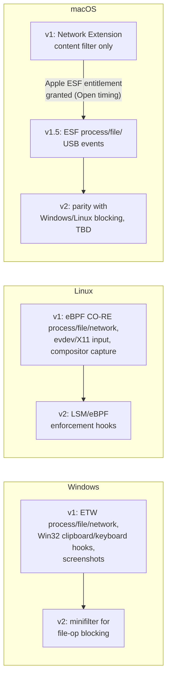

> CONFIDENTIAL — Eride Technologies (Pty) Ltd. Not for distribution outside Eride
> Technologies or parties under written NDA. Contains proprietary architecture.

Status note: Provisional. The macOS v1.5 column depends on Apple granting the Endpoint
Security entitlement, an external dependency with no committed date (see section 3 and
`011_ENDPOINT_AGENT_DESIGN.md` section 7.2). The v2 columns for all platforms are directional
and will be revisited once v1 pilot data exists.

## 1. Purpose

This is the single reference for "what does Bheka actually see, on which OS, and when."
Sales, support and product must not promise a capability ahead of what this matrix states.
Per CANON's anti-drift rule, exact event schemas live in `schemas/events/*.json`; this
document states availability and the technical reason for any gap, not payload shape.

## 2. How to read this matrix

- **v1** = Windows-first ship per CANON section 15 platform order (Windows → Linux → macOS).
- **v1.5** = capabilities that land after v1 general availability, ahead of a full v2, gated
  primarily on the macOS Endpoint Security entitlement.
- **v2** = capabilities that require a kernel driver/minifilter on Windows or a Linux
  kernel-module-equivalent decision, which CANON explicitly defers.
- "Yes" means the capability is collected as designed at the tier shown in CANON section 4.
  "No — reason" states the specific technical or policy blocker.

## 3. The headline honesty statement

macOS lags Windows and Linux in this product, structurally, because process- and
file-level visibility equivalent to Windows ETW or Linux eBPF requires Apple's
`com.apple.developer.endpoint-security.client` entitlement, a restricted grant only Apple
can issue. Reported approval times range from "4-6 weeks turnaround in ideal case" to
"it took 13 months," with Apple Developer Technical Support stated to have "no visibility"
into entitlement status once a request is filed
([Apple Developer Forums 133494](https://developer.apple.com/forums/thread/133494),
[Michael Tsai](https://mjtsai.com/blog/2020/11/23/requesting-entitlements-still-broken/),
[Apple Developer Forums 733491](https://developer.apple.com/forums/thread/733491)). Eride
filed this request in week 1 of the project per CANON section 15. Until it is granted (or
denied), macOS ships on Network Extension content filtering only, which gives network and
URL visibility but no process, file, or endpoint-level event stream. This is disclosed to
customers in the sales process, not discovered by them after purchase.

## 4. Capability matrix

| Telemetry capability | Windows | macOS | Linux | Technical reason for any gap |
|---|---|---|---|---|
| Process create/exit events | v1 — ETW (`Microsoft-Windows-Kernel-Process`) | v1.5 — ESF (`es_event_type_notify_exec`/`exit`), gated | v1 — eBPF tracepoints (`sched_process_exec`/`exit`) | macOS v1 has no process visibility at all: NE content filter operates at the network layer only, not process lifecycle. Process events require ESF, which requires the Apple entitlement. |
| Image/module load events | v1 — ETW (`Microsoft-Windows-Kernel-Process` image-load) | v1.5 — ESF | v1 — eBPF (`uprobe`/`kprobe` on loader paths) | Same ESF dependency as above. |
| File create/rename/delete metadata | v1 — ETW (`Microsoft-Windows-Kernel-File`), Elevated tier | v1.5 — ESF file events, gated | v1 — eBPF kprobes on `vfs_open`/`vfs_unlink`/`vfs_rename` | No user-mode file-system filter framework exists on Windows for blocking, but ETW gives observation-only file metadata without a driver ([Stack Overflow](https://stackoverflow.com/questions/2849790/windows-filesystem-minifilter-drivers-can-i-monitor-and-prevent-fs-operations-u)); on macOS there is no non-ESF path to file events at all. |
| File content blocking/prevention | v2 — requires minifilter | v2 or later — requires ESF authorization events, still observation-oriented even post-grant | v2 — requires LSM/eBPF enforcement hooks, kernel version dependent | CANON section 2: minifilter explicitly deferred to v2. Bheka v1/v1.5 is detect-and-evidence, not block, on every platform. |
| Network connection metadata (process-to-socket) | v1 — ETW (`Microsoft-Windows-Kernel-Network`) | v1 — Network Extension content filter (`NEFilterDataProvider`) | v1 — eBPF cgroup/skb programs | Full parity on all three platforms in v1; this is why macOS ships NE first — "no approval process for this... available to all (paid) developers" ([Apple Developer Forums 816877](https://developer.apple.com/forums/thread/816877)). |
| Full URL / domain visibility | v1 — via network events + browser extension roadmap Open | v1 — Network Extension content filter | v1 — via network events + browser extension roadmap Open | Available on all three in v1 at the network layer; deep per-tab URL attribution inside a browser process is Open on every platform pending a browser-extension component, not yet designed. |
| App/URL category usage (Baseline tier) | v1 — `SetWinEventHook` window focus + ETW process context | v1 — NSWorkspace notifications (user-mode, no entitlement needed) | v1 — `/proc` polling + X11/Wayland focus APIs where available | No ESF dependency for this coarse metadata on any platform; Linux desktop focus detection varies by compositor and is best-effort. |
| USB device identifiers (Elevated tier) | v1 — ETW (`Microsoft-Windows-Kernel-PnP`) | v1.5 — ESF I/O Kit device events, gated | v1 — `udev`/`netlink` uevent monitoring | macOS USB device attach/detach at the granularity Bheka needs is exposed through ESF-adjacent APIs gated the same way as process events; no reliable non-ESF equivalent. |
| Clipboard event metadata (Elevated tier) | v1 — `AddClipboardFormatListener` (Win32, user-mode) | v1.5 — requires ESF or Accessibility-adjacent APIs, gated/deprecated | v1 — X11 clipboard selection monitoring (Wayland: compositor-dependent, may be Open per session type) | macOS has no stable non-entitled clipboard-content-change notification API for a background agent; Wayland's security model intentionally restricts cross-application clipboard visibility, so Linux clipboard coverage is compositor-dependent and stated as such to customers. |
| Clipboard content (Investigation tier) | v2 — pending DLP-equivalent design; Enterprise-only Windows APIs (`DlpNotifyPostPasteFromClipboard`) require Windows Enterprise licensing on the customer side ([Microsoft — endpointdlp functions](https://learn.microsoft.com/ja-jp/windows/win32/lwef/endpointdlp-functions)) | v2 — same ESF gate as above, content capture design Open | v2 — design Open | Not yet designed on any platform at content-capture granularity; tracked as Open, not silently assumed. |
| Keystroke metadata (rhythm/WPM, Baseline tier, no content) | v1 — `WH_KEYBOARD_LL` timing only | v1.5 — CGEventTap requires Accessibility/Input Monitoring consent, itself being deprecated in favour of a consent-based settings dictionary ([mdm.tools](https://mdm.tools/blog/pppc-macos-27-still-needs-a-profile/)) | v1 — `evdev`/`libinput` timing where permission allows | macOS keystroke timing needs a user/MDM consent grant even for metadata-only capture; Windows and Linux can obtain timing without an equivalent consent gate at this coarse granularity. |
| Keystroke content (Investigation tier, dual-authorised, masked) | v1 — `WH_KEYBOARD_LL` full capture with credential-field masking | v1.5 — gated on ESF + Input Monitoring consent | v1 — `evdev` capture where kernel permission allows | Same ESF/consent dependency as metadata row; masking logic is shared across platforms per `011_ENDPOINT_AGENT_DESIGN.md` section 8. |
| Periodic low-rate screenshots (Elevated tier) | v1 — Windows Graphics Capture API | v1 — `CGDisplayStream`/ScreenCaptureKit, but Screen Recording permission is deny-only in MDM PPPC, so first grant requires user or manual TCC action even under supervision ([Apple — PPPC payload](https://support.apple.com/guide/deployment/privacy-preferences-policy-control-payload-dep38df53c2a/web), [ActivTrak](https://support.activtrak.com/hc/en-us/articles/30043256082715-Deploy-the-Agent-on-macOS-Sequoia-and-higher)) | v1 — X11/`grim`(Wayland) capture, permission model varies by distro/compositor | macOS is technically capable in v1 but operationally weaker: unlike Windows/Linux, MDM cannot silently pre-grant Screen Recording, so rollout requires either user action or manual approval per machine. Documented explicitly, not silently assumed to work like MDM push. |
| Full screen recording (Investigation tier) | v1 — Windows Graphics Capture API, sustained capture | v1 — ScreenCaptureKit, same deny-only PPPC caveat as above | v1 — compositor-dependent capture | Same macOS caveat as periodic screenshots; sustained recording magnifies the same permission gap. |
| File content hashes / optional copies (Investigation tier) | v1.5 — needs ETW file event plus a read-back step; full design pending | v1.5 — same ESF gate as file events | v1 — eBPF file event plus userspace read-back | macOS blocked entirely on ESF; Windows/Linux technically closer but the read-back-and-hash pipeline is not yet fully specified — treat as Open on exact timing even though the OS primitives exist. |
| Tamper resistance (service/extension non-removal) | v1 — service restart policy + maintenance token | v1 — `NonRemovableSystemExtensions`/`RemovableSystemExtensions` MDM keys, supervised devices only ([Jamf blog](https://www.jamf.com/blog/system-extension-changes-in-sequoia/)) | v1 — systemd `Restart=always` + watchdog unit | macOS tamper resistance is materially weaker on unsupervised (non-MDM-enrolled) devices, where the non-removable keys do not apply; this is disclosed as a platform difference, not a defect unique to Bheka. |
| Offline buffering (30-day) | v1 | v1 | v1 | Full parity — implemented in `bheka-agent-store`, platform-agnostic (`011_ENDPOINT_AGENT_DESIGN.md` section 9). |
| Load-shedding / power-loss durability | v1 | v1 (laptops; less relevant for desktop-tethered power loss scenarios but implemented identically) | v1 | Full parity — WAL journaling is a SQLite property, not an OS-specific one. |

## 5. Why macOS specifically lags — the Apple ESF entitlement queue

- The entitlement is requested through a web form, not an API, and grants a specific
  provisioning-profile type once approved; there is no self-service path
  (`agent_packaging_distribution.md` Topic 2.1).
- Observed outcomes include grants scoped to Development only, requiring a second request
  for Developer ID (production) distribution — one reported case waited five months for
  that second grant
  ([Apple Developer Forums 714768](https://developer.apple.com/forums/thread/714768)).
- Observed mis-configured grants requiring re-work after the fact
  ([Apple Developer Forums 671511](https://developer.apple.com/forums/thread/671511)).
- Without the entitlement, an Endpoint Security client cannot even be created for local
  development testing unless System Integrity Protection and AMFI are disabled, which is
  not representative of a production customer machine
  ([The Art of Mac Malware Vol. 2, ch. 11](https://taomm.org/vol2/pdfs/CH%2011%20Persistence%20Monitor.pdf)).
- Consequence for this matrix: every "v1.5, gated" row above has no committed ship date.
  Sales and product must present the Windows/Linux v1 matrix as the committed baseline and
  the macOS v1.5 rows as roadmap items contingent on a third party's decision Eride does
  not control.

## 6. Version-gate summary by platform

## 7. What this document does not cover

- Exact event field names and types — `schemas/events/*.json`.
- Packaging and installer mechanics per platform — `013_PACKAGING_AND_DISTRIBUTION.md`.
- Internal agent architecture — `011_ENDPOINT_AGENT_DESIGN.md`.

## AI implementation constraints
- Do not mark any macOS ESF-dependent row as "v1" or as shipped; it must remain "v1.5,
  gated" until Apple grants the entitlement and the capability is verified in a build.
- Do not claim feature parity across platforms in customer-facing material derived from
  this document; the gaps in section 4 are real engineering constraints, not conservatism.
- Do not invent a specific Apple approval date; treat entitlement timing as Open.

## Required inputs
- Confirmation of Apple ESF entitlement grant (Development and/or Developer ID scope) when
  received, to move v1.5 rows to v1.5-shipped status.
- Linux distro/compositor support matrix (X11 vs Wayland clipboard and screen capture
  behaviour) from QA.
- Windows Enterprise licensing dependency confirmation for any future DLP-equivalent
  clipboard content capability.

## Expected outputs
- This matrix kept current as the single reference cited by sales enablement, support
  playbooks, and the product roadmap.
- A changelog entry each time a row's version gate changes.

## Dependencies
- `011_ENDPOINT_AGENT_DESIGN.md` for the underlying collector implementation per platform.
- Apple Developer Program entitlement process (external).

## Acceptance criteria
- Given a prospective customer asks what Bheka collects on macOS today, when support
  consults this document, then the answer matches the v1/v1.5 status shown here with no
  capability overstated.
- Given the Apple ESF entitlement is granted, when the v1.5 macOS capabilities are verified
  working in a build, then this document is updated in the same release cycle, not
  retroactively.
- Given a new telemetry capability is proposed, when it is added to the roadmap, then it is
  added to this matrix with an explicit version gate and technical reason before being
  described in any external material.

## Test checklist
- [ ] Every "v1" row has a corresponding passing integration test in the platform-specific
      collector crate.
- [ ] Every "v1.5, gated" row is verified to be inert (compiled but not runtime-active)
      in the shipped v1 build.
- [ ] Sales enablement deck cross-checked against this matrix for overstatement, each
      release.
- [ ] macOS Screen Recording permission behaviour re-validated against the current macOS
      release each time Apple ships a major OS version, given the PPPC deny-only
      constraint noted in section 4.
