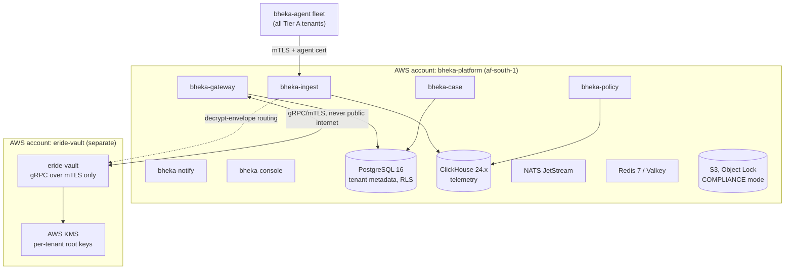
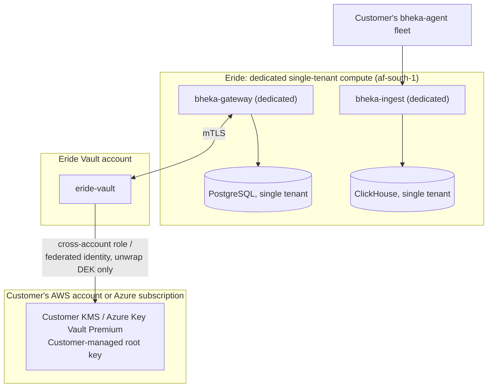
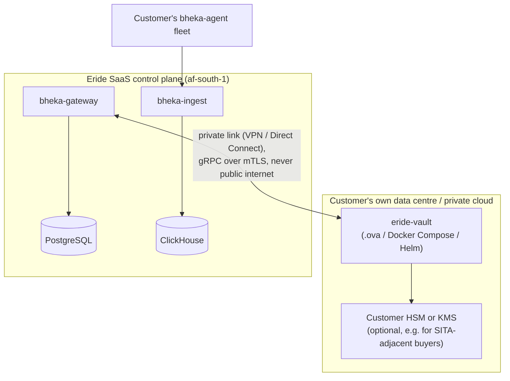
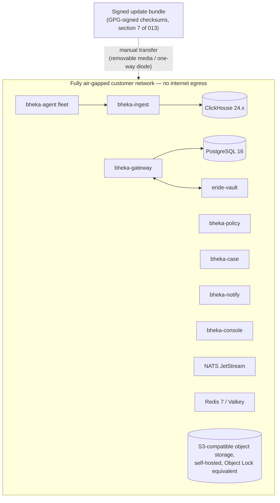

> CONFIDENTIAL — Eride Technologies (Pty) Ltd. Not for distribution outside Eride
> Technologies or parties under written NDA. Contains proprietary architecture.

Status note: Provisional. The Terraform module layout in section 4 is the intended shape but
has not yet been implemented against a live AWS account; the fully air-gapped topology
(section 3.4) depends on SITA product certification, whose fee and total elapsed time are
not yet known (see `agent_packaging_distribution.md` Topic 6.3, "Certification fees and
total elapsed time: n.a."). Treat both as best-current-answer, not final.

## 1. Purpose

This document maps CANON's three key custody tiers (section 6) and the general
infrastructure stack (section 2) onto four concrete deployment topologies Eride actually
sells: SaaS multi-tenant, single-tenant dedicated, customer-hosted Eride Vault (Tier C), and
fully air-gapped. It also fixes the AWS region choice and its cost consequence.

## 2. Recap: key custody tiers driving topology choice (CANON section 6)

| Tier | Name | Root key location | Can Eride decrypt? | Target buyer | Topology this drives |
|---|---|---|---|---|---|
| A | Eride-managed | Eride's AWS KMS, per-tenant root | Yes, via Vault policy | SME, default | SaaS multi-tenant |
| B | Customer-managed (CMK) | Customer's own AWS KMS / Azure Key Vault | No | Banks, insurers, listed companies | Single-tenant dedicated |
| C | Customer-hosted Vault | Entirely inside customer estate | No | Government, air-gapped, SITA-adjacent | Customer-hosted Vault / fully air-gapped |

There is no global master key in any topology; per-tenant root keys with no common ancestor
cap a single key compromise at one tenant (CANON section 6).

## 3. The four topologies

### 3.1 SaaS multi-tenant (Tier A, default)

All `bheka-*` services run in Eride's own AWS account(s) in `af-south-1`, serving every
Tier A tenant from shared compute with PostgreSQL Row Level Security enforcing tenant
isolation at the data layer (CANON section 8: every tenant-scoped table carries `tenant_id`
and RLS, no exceptions). `eride-vault` runs in a separate AWS account from the rest of the
platform (CANON section 2), so a compromise of `bheka-gateway`/`bheka-ingest` infrastructure
does not automatically expose key material.



Suited to CANON's SME default segment. Cost efficiency comes from shared infrastructure;
isolation comes from RLS plus per-tenant KMS root keys, not from separate compute per
tenant.

### 3.2 Single-tenant dedicated (Tier B, customer-managed key)

One customer's `bheka-*` control-plane services run in dedicated compute (separate VPC,
optionally a separate AWS account under Eride's organization), but the root key lives in
the *customer's* AWS KMS or Azure Key Vault rather than Eride's. `eride-vault` still runs in
Eride's separate Vault account and enforces policy, but every unwrap operation calls out to
the customer's KMS/Key Vault via a cross-account role or federated identity, so Eride never
holds the root key material at rest.



This is why CANON's envelope encryption rule (ADR-011) matters operationally here: the
Vault decrypts data encryption keys only, never bulk payloads. A cross-account/cross-cloud
call to the customer's KMS for every 400 MB screen recording would be both slow and a
compliance liability; instead only the small sealed DEK crosses that boundary.

### 3.3 Customer-hosted Eride Vault (Tier C)

The `eride-vault` service itself — not just the key — runs entirely inside the customer's
own infrastructure estate, shipped as the `.ova` + Docker Compose + Helm chart artifact
described in `013_PACKAGING_AND_DISTRIBUTION.md` section 7. The rest of the Bheka platform
(`bheka-gateway`, `bheka-ingest`, etc.) may still run in Eride's SaaS environment, connecting
to the customer's Vault over a private network path (VPN/Direct Connect/leased line), or the
entire stack may run on customer premises for the fully air-gapped variant (section 3.4).



Target buyer: government, SITA-adjacent, or any customer whose procurement or regulatory
posture requires that the entity holding decryption capability never be Eride at all —
directly satisfying CANON section 6's "Can Eride decrypt? No" row for Tier C, and
structurally avoiding the RICA s21 decryption-direction problem: Eride is never the
"decryption key holder" for this tenant (CANON section 7).

### 3.4 Fully air-gapped

The entire Bheka stack — `bheka-gateway`, `bheka-ingest`, `bheka-policy`, `bheka-case`,
`bheka-notify`, `bheka-console`, `eride-vault`, PostgreSQL, ClickHouse, NATS, Redis, and
object storage — runs inside the customer's network with no outbound path to the public
internet, delivered as the `.ova` appliance plus Docker Compose/Helm chart. This is the same
artifact family as Tier C (section 3.3) taken to its logical extreme: no private link back
to Eride's SaaS control plane at all.



Consequences specific to this topology:

- Agent updates and detection content updates cannot use the ring-based online rollout
  described in `023_RELEASE_AND_UPDATE_STRATEGY.md` automatically; they arrive as a signed
  bundle transferred manually (removable media or a one-way data diode) and are applied by
  the customer's own change process. Eride still ships the same canary-tested, ring-soaked
  artifact; only the transport differs.
- Licensing must use an offline activation flow rather than the online per-seat token model
  used elsewhere. A documented commercial pattern for this (not Eride's own, cited for
  design reference only) issues an `initialization_code` from a portal, which an offline
  SDK combines with the license key to produce an `activation_code` and `hardware_id`; the
  portal then returns a policy ID and confirmation code typed back into the offline client
  ([LicenseSpring — air-gapped license activation](https://docs.licensespring.com/license-entitlements/license-activation-types/air-gapped-license-activation)).
  Bheka's own offline licensing implementation is Open — this is a reference design, not a
  committed Eride mechanism yet.
- SITA product certification is a likely prerequisite for government sales into this
  topology. The process requires an OEM Agreement/MOA with SITA first, then a Product
  Certification Checklist and Detail Spec submission with "at least 10 different
  deliverables," followed by SITA-run lab testing
  ([SITA — Technology Certification Process](https://www.sita.co.za/prodcert.htm),
  [TCP PDF](https://www.sita.co.za/sites/default/files/documents/Product_Certification/Tech_Certification_Process_(TCP).pdf)).
  Certification fees and total elapsed time were not confirmed from any fetched source and
  are marked n.a.; do not commit a government-sector delivery date around an assumed
  certification timeline.

## 4. Terraform module layout

```
infra/terraform/
├── modules/
│   ├── network/                # VPC, subnets, security groups, per topology
│   ├── platform-compute/       # bheka-gateway/ingest/policy/case/notify/console runtime
│   ├── platform-data/          # PostgreSQL (RDS), ClickHouse, Redis, NATS JetStream
│   ├── object-storage/         # S3 buckets, Object Lock COMPLIANCE mode, lifecycle policy
│   ├── vault-account/          # eride-vault compute + AWS KMS, deployed in a distinct account
│   ├── observability/          # OpenTelemetry collector, Grafana stack wiring
│   └── dns-tls/                # Route 53 / ACM or customer-supplied DNS+TLS
├── environments/
│   ├── saas-multi-tenant/      # composes network + platform-compute + platform-data + vault-account
│   ├── single-tenant/          # per-customer dedicated compute, parameterised customer KMS ARN
│   ├── customer-hosted-vault/  # emits Helm values + .ova build inputs for eride-vault only
│   └── air-gapped/             # emits full offline bundle manifest, no remote state backend to Eride
└── global/
    ├── org-accounts/           # AWS Organizations account vending (platform vs vault separation)
    └── iam-boundaries/         # permission boundaries enforcing least privilege across accounts
```

- `environments/saas-multi-tenant` and `environments/single-tenant` both target
  `af-south-1` and both compose the same `modules/*` building blocks; the difference is
  which module instances are shared (multi-tenant) versus dedicated per customer
  (single-tenant), and whether `vault-account`'s KMS module points at an Eride-owned key or
  a customer-supplied KMS/Key Vault ARN passed as a Terraform variable.
- `environments/customer-hosted-vault` does not provision compute in Eride's AWS account for
  the Vault itself; it instead renders the Helm chart values and `.ova` build manifest
  consumed by `013_PACKAGING_AND_DISTRIBUTION.md` section 7, while still provisioning the
  rest of the platform in `af-south-1` per section 3.3.
- `environments/air-gapped` produces a self-contained bundle (Docker Compose file set, Helm
  chart, GPG-signed checksums) with no Terraform remote state backend reachable from Eride,
  since by definition no Eride-operated control plane exists for this topology once
  delivered.
- State backend: Terraform state for `saas-multi-tenant` and `single-tenant` environments
  lives in an S3 backend within the `platform` account, never in the `vault-account`, to
  keep infrastructure-as-code blast radius for the Vault account minimal and separately
  audited.

## 5. AWS region: af-south-1 and the 19.9% premium

Primary object storage and compute region is AWS `af-south-1` (Cape Town), per CANON
section 2. This carries a real cost premium: average hourly instance pricing in `af-south-1`
is **$0.2892**, **+19.9% versus the cheapest AWS region**, ranking **#33 of 36** regions by
price ([CloudPrice af-south-1](https://cloudprice.net/aws/region/af-south-1)). A second
pricing index puts the premium slightly lower, at **+14.8%**, and notes that only a subset
of instance families is available in `af-south-1` compared with larger regions like Mumbai
or US regions ([Holori AWS region prices](https://calculator.holori.com/aws-regions),
[aws-pricing.com](https://aws-pricing.com/regions.html)). The billing code for the region is
`AFS1` ([AWS region billing codes](https://docs.aws.amazon.com/global-infrastructure/latest/regions/aws-region-billing-codes.html)).
AWS service and pricing coverage in `af-south-1` has historically lagged larger regions
([Frank Contrepois region notes](https://aws.frankcontrepois.com/regions/index.print.html)),
which is a design input for the Terraform module layout in section 4: modules must not
assume every instance family or managed service available in `us-east-1` is available in
`af-south-1`, and should fail explicit and loud (a Terraform plan error) rather than
silently substitute an unavailable resource type.

CANON section 15 states this premium is charged to the customer as data residency, not
absorbed by Eride — pricing reflects this pass-through rather than treating `af-south-1` as
cost-neutral.

## 6. DPSA residency requirement

The Department of Public Service and Administration (DPSA) cloud computing directive
(14 January 2022) states plainly: "Data must reside within South Africa. If this approach is
not practically possible, cloud service providers must comply with section 72 of the POPIA"
([Michalsons — DPSA directive](https://www.michalsons.com/blog/directive-on-cloud-computing-in-the-public-service-dpsa/55782)).
The subsequent National Policy on Data and Cloud (published 31 May 2024) goes further for
national-security-relevant government data, requiring storage "only in digital
infrastructure located within the borders of South Africa," with penalties reaching "10
percent of global turnover for non-compliance"
([ITIF analysis](https://itif.org/publications/2025/06/09/south-africa-localization-regulation/),
[policy gazette PDF](https://www.gov.za/sites/default/files/gcis_document/202406/50741gen2533.pdf)).

Architectural consequence: any government customer topology (Tier C or fully air-gapped)
must keep all data — telemetry, evidence, metadata, and backups — inside South African
borders. `af-south-1` satisfies this for the SaaS and single-tenant topologies. For
customer-hosted Vault and fully air-gapped topologies, the customer's own premises are by
definition within South Africa if the customer is a South African government entity, so
residency is structurally satisfied by the topology choice itself rather than by a
region setting. Where a government customer's Tier B/C deployment involves any Eride-managed
component (e.g. the SaaS control plane in a Tier C hybrid), that component must also stay
within `af-south-1`, with no cross-region replication to a non-South African region without
explicit written justification tied to POPIA section 72 transborder rules (CANON section 7).

## 7. Deployment topology decision summary

| Topology | Key custody tier | Where eride-vault runs | Where control plane runs | Typical buyer | Residency handling |
|---|---|---|---|---|---|
| SaaS multi-tenant | A | Eride's separate Vault AWS account | Eride's platform AWS account, `af-south-1` | SME, default | `af-south-1` by default |
| Single-tenant dedicated | B | Eride's separate Vault AWS account, unwraps via customer KMS | Eride's platform AWS account (dedicated), `af-south-1` | Banks, insurers, listed companies | `af-south-1`, customer KMS may itself be region-pinned by the customer |
| Customer-hosted Vault | C | Customer's own estate | Eride's platform AWS account, `af-south-1`, connected privately | Government, air-gapped-adjacent, SITA-adjacent | Vault always in-country by construction |
| Fully air-gapped | C | Customer's own estate | Customer's own estate, no internet egress | Highest-sensitivity government/defence | Everything in-country, manual update transport |

## 8. What this document does not cover

- Terraform resource-level HCL — lives in `infra/terraform/` itself, not in prose here
  (CANON anti-drift rule).
- Vault cryptographic protocol detail (HPKE, envelope encryption mechanics) — see the Eride
  Vault architecture document (not yet written) and CANON section 6.
- Update delivery mechanics for the air-gapped topology's manual bundle — see
  `023_RELEASE_AND_UPDATE_STRATEGY.md`.
- Business continuity and DR runbook for these topologies — see
  `026_BUSINESS_CONTINUITY.md`.

## AI implementation constraints
- Do not provision `eride-vault` compute in the same AWS account as `bheka-gateway`/
  `bheka-ingest`/etc. under any topology; CANON section 2 requires a separate account.
- Do not default any Terraform module to a region other than `af-south-1` for South
  African customer data; a non-default region requires an explicit, documented POPIA
  section 72 justification.
- Do not implement automatic online update delivery for the fully air-gapped topology; use
  the manual signed-bundle transport described in section 3.4.
- Do not assume AWS service/instance-family parity between `af-south-1` and larger regions
  when writing Terraform modules; validate availability explicitly.

## Required inputs
- Confirmed list of AWS instance families and managed services actually available in
  `af-south-1` at build time.
- Customer-specific KMS/Key Vault ARNs for each Tier B single-tenant deployment.
- SITA OEM Agreement/MOA status for any government-sector fully air-gapped deal in
  the pipeline.
- Decision on whether Azure South Africa North is ever used as a secondary/DR region
  (currently out of scope; AWS `af-south-1` is primary per CANON section 2).

## Expected outputs
- `infra/terraform/` populated per the module layout in section 4.
- A signed `.ova` build pipeline reused identically by the customer-hosted Vault and
  fully air-gapped topologies.
- A topology selection checklist used during sales/solutions engineering scoping, keyed to
  the CANON section 6 key custody tier the customer requires.

## Dependencies
- CANON sections 2, 6, and 7.
- `013_PACKAGING_AND_DISTRIBUTION.md` for the `.ova`/Helm/Docker Compose artifact.
- `023_RELEASE_AND_UPDATE_STRATEGY.md` for how updates reach each topology.
- `026_BUSINESS_CONTINUITY.md` for DR posture per topology.

## Acceptance criteria
- Given a Tier A customer signs up, when their tenant is provisioned, then all their data
  and compute run in the shared `af-south-1` SaaS environment with RLS-enforced isolation
  and no dedicated infrastructure spin-up required.
- Given a Tier B customer requires a customer-managed key, when `eride-vault` performs a
  DEK unwrap, then the call crosses into the customer's own KMS/Key Vault and Eride's
  infrastructure never persists the resulting plaintext root key.
- Given a Tier C customer hosts their own Vault, when `bheka-gateway` needs a policy
  decision or key operation, then the request travels over a private network path via gRPC
  over mTLS, never traversing the public internet.
- Given a fully air-gapped customer receives a signed update bundle, when they apply it
  through their own change process, then the artifact is verifiable via the same GPG
  signature chain used for the Linux repository packages, with no network call to Eride
  required to validate it.

## Test checklist
- [ ] Terraform plan for `environments/saas-multi-tenant` provisions no resources inside
      the `vault-account` module boundary.
- [ ] Terraform plan for `environments/single-tenant` accepts a customer KMS ARN variable
      and fails closed (plan error) if it is unset for a Tier B environment.
- [ ] Cross-account IAM role trust policy between `platform` and `vault-account` reviewed
      for least privilege before first production apply.
- [ ] `.ova` boots and completes first-run configuration with zero outbound network calls,
      verified in an isolated test network.
- [ ] Region-availability check step in CI fails the build if a Terraform module references
      an AWS service not confirmed available in `af-south-1`.
- [ ] Signed update bundle for the air-gapped topology verifies against the published GPG
      key on a machine with no network interface enabled.
