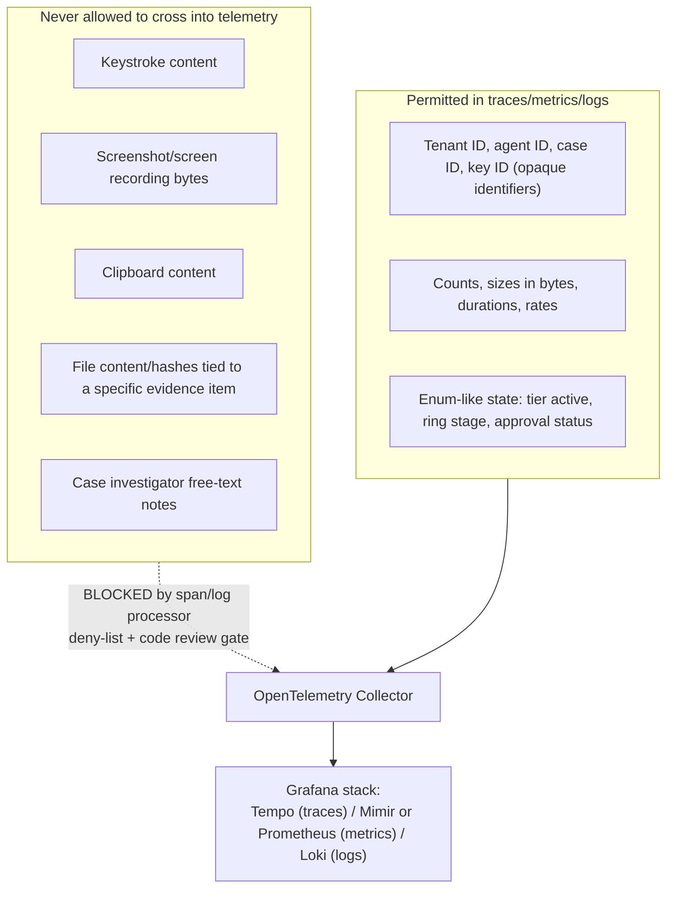

> CONFIDENTIAL — Eride Technologies (Pty) Ltd. Not for distribution outside Eride
> Technologies or parties under written NDA. Contains proprietary architecture.

Status note: Provisional. Numeric SLO targets below are proposed starting points for v1
launch, pending real production load data; they are not yet validated against any live
traffic and must be revisited after the first full quarter of SaaS operation.

## 1. Purpose and the non-negotiable constraint

This document defines Bheka's OpenTelemetry instrumentation plan and the SLIs, SLOs, error
budgets, dashboards and alert rules built on top of it. One constraint overrides every
convenience in this design:

**Telemetry about the product must never leak customer evidence content.**

Traces, metrics and logs describing how Bheka's own services are performing are
operational data about Eride's software. They are not, and must never become, a side
channel for the keystrokes, screenshots, file contents, or clipboard content Bheka collects
about a customer's employees. This document treats that separation as a hard architectural
boundary, not a coding-style guideline.

## 2. OpenTelemetry instrumentation plan

Per CANON section 2, observability uses OpenTelemetry traces/metrics/logs feeding a Grafana
stack.

### 2.1 Instrumentation scope

| Service | Traces | Metrics | Logs |
|---|---|---|---|
| `bheka-gateway` | Every inbound HTTP request, OIDC/mTLS auth decision, downstream calls | Request rate, latency histogram, error rate, rate-limit rejections | Structured JSON, request ID correlated, no request/response bodies |
| `bheka-ingest` | Per-batch decrypt-envelope routing span, ClickHouse write span | Batch size, batch latency, envelope-routing errors, ClickHouse write throughput | Structured, batch metadata only (agent ID, tenant ID, byte count) — never event payload |
| `bheka-policy` | Detection rule evaluation span, risk-score recompute span | Rule evaluation latency, detections raised per minute, risk recompute duration | Rule ID, tenant ID, detection ID — never the underlying evidence that triggered it |
| `bheka-case` | Case lifecycle transitions, approval workflow spans | Case open/close rate, approval latency, Tier 3 activation count | Case ID, actor ID, action type — never evidence content or free-text case notes |
| `bheka-notify` | Notification dispatch span (WhatsApp/email) | Delivery success/failure rate, latency | Recipient class (admin/employee), never message body |
| `bheka-console` | Page load / API call spans (frontend RUM, opt-in) | Core Web Vitals, API error rate | Standard frontend error logs, scrubbed of any rendered evidence content |
| `eride-vault` | Key operation spans (issue, rotate, unwrap-DEK, shred) | Operation latency, operation count by type, KMS call latency | Operation type, tenant ID, key ID — never key material, never plaintext DEKs |
| `bheka-agent` | Local: collection cycle span, upload batch span (kept locally, not exported by default) | Buffer depth, upload success rate, resource usage (CPU/RAM/disk/network) against the ceilings in `011_ENDPOINT_AGENT_DESIGN.md` section 12 | Local diagnostic log, rotated, never contains captured content — only operational state (tier active, buffer size, last upload timestamp) |
| `bheka-updater` | Ring advancement span, rollout health-check span | Ring state, crash-rate per ring, halt events | Ring transitions, version numbers — never customer data |

### 2.2 The evidence-content firewall

Enforcement mechanisms, in depth-of-defence order:

1. **Type-level separation in code.** Evidence payloads (keystroke buffers, screenshot
   bytes, clipboard content, file bytes) are never passed as function arguments to any
   tracing/logging/metrics call. This is enforced by keeping evidence types in a module that
   does not import the tracing crate, so a call site attempting to log an evidence value is
   a compile error in Rust services (`bheka-agent`, `eride-vault`) and a lint failure enforced
   in CI for TypeScript services (custom ESLint rule forbidding evidence-typed variables as
   arguments to `logger.*`/`span.setAttribute`).
2. **OpenTelemetry Collector processor deny-list.** Even if a bug slipped a large text or
   binary attribute into a span or log record, an attribute-size cap (reject/truncate any
   string attribute over a small fixed length) and a deny-list of attribute key patterns
   (e.g. anything named `*content*`, `*keystroke*`, `*screenshot*`, `*clipboard*`) run in the
   collector pipeline before export, dropping the offending attribute and emitting a
   collector-internal alert so the code defect is caught even though the leak itself is
   stopped in transit.
3. **Separate storage and access control.** Observability backends (Tempo/Loki/Mimir or
   Prometheus) are operated as infrastructure Eride's SRE team can access; evidence storage
   (`evidence`, `evidence_access_grants` tables, sealed S3 objects) requires the same
   dual-authorisation and WebAuthn step-up as any Tier 3 view (CANON section 9). These are
   deliberately different systems with different access grants, so a person with
   observability access never automatically has evidence access.
4. **Retention discipline.** Trace and log retention is short relative to evidence
   retention (which follows POPIA section 14 retention schedules and crypto-shredding —
   CANON section 6). Observability data does not need multi-year retention to be useful for
   operating the product, so it is not kept at evidence-grade durability or duration.

## 3. Service Level Indicators and Objectives

Numeric targets below are v1 launch proposals (Provisional). They will be recalibrated once
real traffic data exists.

| SLI | Definition | SLO target (proposed) | Error budget (30-day window) |
|---|---|---|---|
| Ingest availability | Percentage of agent upload batches accepted by `bheka-ingest` without a 5xx | 99.9% | 43.2 minutes/month |
| Ingest latency | p95 time from batch received to ClickHouse write acknowledged | < 5 s | Budget consumed if p95 exceeds target for more than 5% of 5-minute windows in the month |
| Gateway API availability | Percentage of `/v1` requests completing without a 5xx | 99.9% | 43.2 minutes/month |
| Gateway API latency | p95 request latency, excluding long-running export operations | < 500 ms | Same 5% rolling-window rule |
| Detection pipeline freshness | Time from event ingested to a policy rule having evaluated it | p95 < 60 s | Tracked as a budget on staleness incidents, not uptime minutes |
| Evidence sealing durability | Percentage of sealed evidence objects confirmed written with Object Lock COMPLIANCE mode before acknowledgement to the case workflow | 100% (no error budget — this is a correctness invariant, not an availability target) | n.a. — any failure is a Sev-2 or higher incident per `025_INCIDENT_RESPONSE.md` |
| Vault key-operation availability | Percentage of `eride-vault` key operations (issue/rotate/unwrap-DEK) completing successfully | 99.95% | 21.6 minutes/month |
| Agent offline resilience | Percentage of buffered events successfully uploaded within 24 hours of connectivity restoration, for endpoints that were offline within the 30-day capacity window | 99.5% | Tracked as a monthly aggregate across the fleet, not per-endpoint |
| Console availability | Percentage of `bheka-console` page loads and API calls completing without error | 99.5% | 3.6 hours/month |

Notes:

- Evidence sealing durability is deliberately not expressed as a percentage-with-budget
  SLO; a lost or corrupted evidence object is a correctness and legal-admissibility failure
  (LRA/BCEA procedural fairness requirement, CANON section 7), not an availability statistic
  to be traded off against an error budget.
- The detection pipeline freshness SLI matters more than raw ingest latency for the
  product's core promise (timely insider-risk detection); both are tracked because a fast
  ingest with a slow policy evaluator would still mean slow detections.

## 4. Error budget policy

- Each service-level SLO in section 3 (excluding evidence sealing durability) has a
  standard 30-day rolling error budget.
- Budget burn-rate alerting uses a two-window approach (fast burn: 1-hour window catching
  a burn rate that would exhaust the monthly budget in under a day; slow burn: 6-hour window
  catching a burn rate that would exhaust the budget over the remaining days in the month),
  the standard multi-window/multi-burn-rate pattern for SLO alerting.
- When a service's error budget is exhausted mid-month, `bheka-updater` ring advancement for
  that service's next release is automatically paused at the current ring (see
  `023_RELEASE_AND_UPDATE_STRATEGY.md`) until the budget resets or an explicit engineering
  leadership override is recorded, mirroring the "automatic halt on crash-rate regression"
  principle CANON already applies to agent rollouts.
- Evidence sealing durability failures bypass the error-budget mechanism entirely and page
  on-call immediately regardless of budget state, per section 3.

## 5. Dashboards

| Dashboard | Audience | Key panels |
|---|---|---|
| Platform health overview | On-call SRE | Per-service availability/latency SLI vs SLO, current error-budget burn rate, active alerts |
| Ingest and detection pipeline | Engineering, product | Batch throughput, decrypt-envelope routing latency, detection pipeline freshness, ClickHouse write lag |
| Vault operations | Security engineering, Information Officer | Key operation latency/volume by type, KMS call health, cross-account call latency for Tier B customers, key rotation and shred event counts (counts only, never key material) |
| Agent fleet health | Support, customer success | Fleet-wide buffer depth distribution, upload success rate, resource-ceiling breach counts by platform (Windows/macOS/Linux), offline-endpoint count and age distribution |
| Update ring status | Release engineering | Current ring per platform/version, crash-rate per ring, soak-timer countdowns, halt events |
| Regional and topology view | Platform infrastructure | Per-topology (SaaS/single-tenant/customer-hosted-Vault/air-gapped) health where telemetry is reachable; explicitly blank for air-gapped customers, annotated as such rather than shown as a false "no data" incident |

No dashboard displays evidence content, case notes, or anything from the `evidence` table
family. Dashboards querying `bheka-case`/`bheka-policy` join on identifiers and counts only.

## 6. Alert rules

| Alert | Condition | Severity | Routes to |
|---|---|---|---|
| Ingest fast burn | Error-budget burn rate implies budget exhaustion in < 24h at current rate (1h window) | Page | On-call SRE |
| Ingest slow burn | Error-budget burn rate implies exhaustion within the remaining monthly window (6h window) | Ticket, reviewed next business day | On-call SRE backlog |
| Vault key-operation failure spike | Vault operation error rate exceeds threshold for 5 consecutive minutes | Page | On-call SRE plus security engineering |
| Evidence sealing failure | Any single evidence-sealing write fails to confirm Object Lock write | Page, immediate | On-call SRE plus Information Officer, per `025_INCIDENT_RESPONSE.md` |
| Detection pipeline staleness | p95 event-to-evaluation latency exceeds SLO for 15 minutes | Page | On-call SRE |
| Agent fleet resource-ceiling breach surge | A statistically significant jump in the number of endpoints breaching CPU/RAM/disk ceilings from `011_ENDPOINT_AGENT_DESIGN.md` section 12 | Ticket | Endpoint engineering |
| Update ring crash-rate regression | Crash rate in any ring exceeds the pre-release baseline by a defined margin | Automatic halt plus page | Release engineering, per `023_RELEASE_AND_UPDATE_STRATEGY.md` |
| Telemetry deny-list trigger | OpenTelemetry Collector processor drops an attribute matching the evidence-content deny-list (section 2.2) | Page, treated as a security defect, not noise | Security engineering plus the engineer who owns the offending span/log call site |
| Air-gapped customer telemetry gap | Expected periodic health check-in from a customer-hosted or air-gapped deployment (where any check-in is contractually agreed) is missed | Ticket, not page, since silence is the expected steady state for the most locked-down topology | Customer success |

## 7. Why the telemetry deny-list trigger is itself a page-worthy alert

Most observability systems treat a dropped attribute as routine data hygiene. Bheka treats
it differently: a dropped attribute matching `*content*`/`*keystroke*`/`*screenshot*`/
`*clipboard*` means an engineer's code attempted to put evidence-shaped data into the
observability pipeline. Even though the collector processor caught it before export, the
underlying code defect could still leak that data through a different, unprotected path
(an uncaught exception message, a different log statement, a debug build). This alert exists
to catch the human/code mistake at the earliest possible point, consistent with the
depth-of-defence model in section 2.2.

## 8. What this document does not cover

- Incident severity classification and breach notification obligations —
  `025_INCIDENT_RESPONSE.md`.
- Backup and disaster recovery metrics (RTO/RPO) — `026_BUSINESS_CONTINUITY.md`.
- Detection rule logic itself — owned by `bheka-policy`, not an observability concern.

## AI implementation constraints
- Do not pass any value of an evidence-bearing type (keystroke buffer, screenshot bytes,
  clipboard content, file content) as an argument to any tracing span attribute, log
  statement, or metric label, under any circumstance, including debug or development builds.
- Do not implement a "verbose"/"debug" logging mode for `bheka-ingest`, `bheka-policy`, or
  `eride-vault` that logs full event or evidence payloads; debug tooling must operate on
  synthetic or redacted data.
- Do not remove or bypass the OpenTelemetry Collector attribute deny-list processor in any
  environment, including staging.
- Do not treat evidence sealing durability as subject to the standard error-budget trade-off;
  it always pages regardless of budget state.

## Required inputs
- Production traffic baseline from the first full quarter of SaaS operation, to recalibrate
  the Provisional SLO numbers in section 3.
- Final list of OpenTelemetry Collector deny-list attribute key patterns, reviewed by
  security engineering before v1 launch.
- Confirmation from customer success of which air-gapped/customer-hosted customers have
  agreed to any periodic health check-in mechanism.

## Expected outputs
- OpenTelemetry Collector configuration implementing the processor deny-list and
  attribute-size cap described in section 2.2.
- Grafana dashboards matching section 5, provisioned as code (not manually clicked
  together) so they are reviewable in the same repository as this document.
- Alert rule definitions (e.g. as Prometheus/Mimir alerting rules or Grafana alerting YAML)
  matching section 6.
- A CI lint rule (ESLint custom rule for TypeScript services; a Rust `clippy` lint or
  module-boundary test for Rust services) enforcing the type-level separation in section
  2.2, item 1.

## Dependencies
- CANON section 2 (OpenTelemetry, Grafana stack).
- `011_ENDPOINT_AGENT_DESIGN.md` for the resource ceilings referenced in the agent fleet
  health dashboard.
- `023_RELEASE_AND_UPDATE_STRATEGY.md` for the ring-halt integration with error budgets.
- `025_INCIDENT_RESPONSE.md` for severity routing of the evidence-sealing-failure alert.

## Acceptance criteria
- Given an engineer writes a log statement that includes a keystroke buffer variable, when
  the code is compiled or linted, then the build fails before the code can be merged.
- Given the OpenTelemetry Collector receives a span with an attribute matching the
  evidence-content deny-list, when the processor pipeline runs, then the attribute is
  dropped, the span is still exported without it, and a security-routed alert fires.
- Given `bheka-ingest`'s error budget is exhausted mid-month, when `bheka-updater` attempts
  to advance a ring for a new `bheka-ingest` release, then the advancement is automatically
  paused until the budget resets or an explicit override is recorded.
- Given an evidence-sealing write fails to confirm an Object Lock write, when the failure is
  detected, then an immediate page fires regardless of the current error-budget state for
  any other SLO.

## Test checklist
- [ ] Unit test confirms the Rust evidence-payload module cannot be imported by any crate
      that also imports the tracing/logging crate.
- [ ] CI lint test confirms a deliberately introduced evidence-content log call in a
      TypeScript service fails the build.
- [ ] Integration test sends a synthetic span with a `keystroke_content` attribute through
      the OpenTelemetry Collector and confirms it is dropped and an alert fires.
- [ ] Chaos test: inject 5xx errors into `bheka-ingest` at a rate that should trigger the
      fast-burn alert within the 1-hour window; confirm the page fires and ring advancement
      pauses.
- [ ] Dashboard review: confirm no dashboard panel queries the `evidence`,
      `evidence_access_grants`, or `case_participants` tables for anything beyond counts and
      identifiers.
- [ ] Verify air-gapped topology dashboards render an explicit "not reachable — expected"
      state rather than a false incident indicator.
