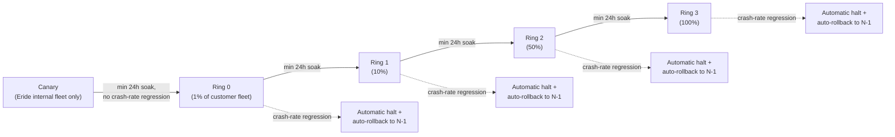
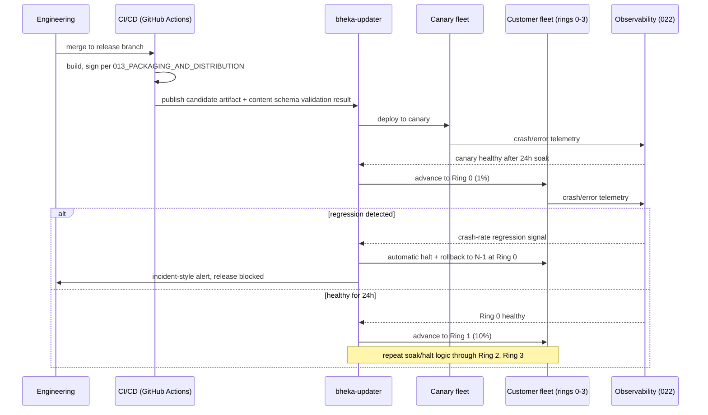

> CONFIDENTIAL — Eride Technologies (Pty) Ltd. Not for distribution outside Eride
> Technologies or parties under written NDA. Contains proprietary architecture.

Status note: the ring model, minimum soak times, and automatic halt requirement are Locked
per CANON section 11. Exact numeric halt thresholds (what counts as a "crash-rate
regression") are Provisional pending the error-budget baselines described in
`022_OBSERVABILITY_AND_SLOS.md`, which do not yet exist for a live fleet.

## 1. Purpose

This document specifies how `bheka-updater` ships agent code updates and detection content
updates safely, and records the CrowdStrike Channel File 291 incident as the design
authority for why the ring model exists at all. It applies to `bheka-agent` binaries,
`bheka-policy` detection rule content, and any other artifact that reaches a customer
endpoint or a customer-facing service outside Eride's own control.

## 2. The core lesson: content updates are code

CrowdStrike's own root cause analysis for the 19 July 2024 outage states the failure
precisely: "the mismatch between the 21 inputs validated by the Content Validator versus
the 20 provided to the Content Interpreter, the latent out-of-bounds read issue in the
Content Interpreter, and the lack of a specific test for non-wildcard matching criteria in
the 21st field"
([Channel File 291 Incident Root Cause Analysis, PDF](https://www.crowdstrike.com/wp-content/uploads/2024/08/Channel-File-291-Incident-Root-Cause-Analysis-08.06.2024.pdf);
[RCA blog post](https://www.crowdstrike.com/en-us/blog/channel-file-291-rca-available/);
[CISA alert](https://www.cisa.gov/news-events/alerts/2024/07/19/widespread-it-outage-due-crowdstrike-update)).
A configuration/content file — not a code binary in the traditional sense — crashed
millions of Windows machines worldwide because it was validated by one component against a
different input schema than the component that consumed it, and no staged rollout caught
the defect before it reached every subscribed machine at once.

The design rule this establishes for Bheka: **a detection rule update, a policy content
update, or any data file the agent or backend parses and acts on is a code change from a
safety perspective**, and must go through the same staged rollout discipline as a binary
release, never a "just push it, it's just data" shortcut.

### 2.1 Remediation commitments as design rules

Quoted directly from the RCA, and adopted here as binding design requirements:

- "Each Template Instance should be deployed in a staged rollout." → Every Bheka detection
  content release and every agent binary release uses the ring model in section 3, with no
  exceptions for "small" or "urgent" changes — urgency changes soak time policy (section 4),
  not whether staging happens at all.
- "New Template Instances that have passed canary testing are to be successively promoted
  to wider deployment rings or rolled back if problems are detected." → `bheka-updater`
  implements automatic promotion and automatic rollback, not manual per-ring sign-off as the
  only safety net.
- "Each ring is designed to identify and mitigate potential issues before wider
  deployment." → Ring sizing (section 3) is chosen so that a regression is statistically
  visible before it reaches a majority of the fleet.
- "Promoting a Template Instance to the next successive ring is followed by additional
  bake-in time." → Minimum soak times (section 4) are enforced mechanically by
  `bheka-updater`, not left to a human's judgement call under release pressure.
- "Customers can choose where and when Rapid Response Content updates are deployed." →
  Every Bheka customer gets a ring assignment and a pause switch for both code and content
  updates (section 6), not just for binary releases.
- Fix timeline for scale, for calibration of what "fast but safe" looks like: sensor
  compile-time validation patch developed 19 July 2024, in production 27 July 2024; bounds
  checking added 25 July 2024; general availability by 9 August 2024; Content Validator fix
  by 19 August 2024
  ([RCA PDF](https://www.crowdstrike.com/wp-content/uploads/2024/08/Channel-File-291-Incident-Root-Cause-Analysis-08.06.2024.pdf)).
  Even the vendor at the centre of a global outage took roughly three weeks to fully close
  out validator-level remediation; Bheka's ring model is designed to make the *blast radius*
  of an equivalent defect small on day one, not to promise Eride will be faster at root-causing
  one.

## 3. The ring model (Locked, CANON section 11)

- **Canary**: Eride's own internal fleet (dogfood machines, staging environments running
  real endpoint agents). No customer exposure. This is the first place a build runs on real
  hardware across Windows, macOS and Linux.
- **Ring 0 (1%)**: a small, deliberately diverse slice of the customer fleet spanning
  multiple platforms, tenant sizes, and topologies (section 7), so a regression specific to
  one OS build or one deployment topology is more likely to be caught early rather than
  averaged away.
- **Ring 1 (10%)**, **Ring 2 (50%)**, **Ring 3 (100%)**: successive widening, each gated on
  the soak and halt conditions in section 4.
- Minimum 24-hour soak per ring (CANON section 11) is a floor, not a target; sections 4 and
  5 describe when it is extended.

## 4. Soak times and automatic halt

- **Minimum soak per ring: 24 hours.** `bheka-updater` will not advance a release to the
  next ring until 24 hours have elapsed at the current ring, even if no problems are
  observed sooner — this mirrors the RCA's explicit requirement that "promoting a Template
  Instance to the next successive ring is followed by additional bake-in time," not zero
  bake-in time for a release that looks clean after an hour.
- **Automatic halt condition:** if the observed crash rate (agent process crashes per
  1,000 active endpoints per hour) or the observed backend error rate (for backend service
  releases, tied into the SLO error budgets in `022_OBSERVABILITY_AND_SLOS.md`) at the
  current ring exceeds the pre-release baseline by a defined statistical margin, ring
  advancement halts automatically and the release is rolled back to the previous known-good
  version (N-1) at that ring, without requiring a human to notice and intervene first.
  Exact numeric thresholds for "exceeds baseline by a defined margin" are Provisional,
  pending a real crash-rate baseline from production telemetry (see
  `022_OBSERVABILITY_AND_SLOS.md` section 3) — do not hardcode a specific percentage in
  code as if it were finalised.
- **N-1/N-2 model**: at any time, the fleet may run at most three concurrently supported
  versions per platform — the version currently being rolled out, and up to two prior
  versions (N-1, N-2) for endpoints that have not yet advanced or that are pinned by
  customer choice (section 6). Versions older than N-2 are not supported and are
  force-upgraded on next successful contact, subject to the customer's own change window
  preferences where contractually agreed.
- **Halt is content-and-code symmetric.** A detection content release and an agent binary
  release both go through the identical soak/halt state machine in `bheka-updater`; there is
  no separate "fast lane" for content, precisely because the Channel File 291 root cause was
  a content update that skipped the code-grade safety net.

## 5. Sequence: a release moving through the pipeline

## 6. Content-vs-code update separation, and the customer pause switch

- **Code updates**: changes to the `bheka-agent`, `bheka-gateway`, `bheka-ingest`,
  `bheka-policy`, `bheka-case`, `bheka-notify`, `bheka-console`, `eride-vault`, or
  `bheka-updater` binaries themselves. These follow the full packaging and signing pipeline
  in `013_PACKAGING_AND_DISTRIBUTION.md` before entering the ring model.
- **Content updates**: detection rule definitions, risk-scoring parameters, and any other
  data file `bheka-policy` or `bheka-agent` interprets at runtime without a binary
  recompile. These are versioned, schema-validated artifacts (a content schema validator
  runs in CI before an artifact is ever published to `bheka-updater`, directly mirroring the
  gap in CrowdStrike's own Content Validator/Content Interpreter mismatch — Bheka's
  validator and interpreter must be tested against the exact same schema version, with a CI
  test asserting this rather than an assumption).
- **Fail-open on malformed content**: if `bheka-agent` or `bheka-policy` receives a content
  update that fails schema validation locally, it discards the update and continues running
  its last-known-good content, logging the rejection (visible via `bhekactl status` and
  reported to the backend), rather than crashing or applying a partially-parsed rule set.
  This is the direct fix for the Channel File 291 failure mode: the agent's local content
  interpreter never trusts an update it cannot fully validate against its own schema
  version.
- **Customer ring assignment and pause switch**: every customer tenant has a ring
  assignment (mirroring the "Auto - Latest / N-1 / N-2 / Specific Version / updates off"
  policy model documented for a comparable EDR product —
  [InventiveHQ — configure sensor update policies](https://inventivehq.com/knowledge-base/crowdstrike/how-to-configure-crowdstrike-sensor-update-policies)),
  configurable in `bheka-console`, and can pause both code and content updates
  independently. A paused tenant continues receiving security-relevant content only after
  explicit re-enablement or a hard support-driven override communicated to the customer,
  never silently.
- **Air-gapped topology**: per `014_DEPLOYMENT_TOPOLOGIES.md` section 3.4, updates cannot
  be pushed automatically; the same canary-through-Ring-3-tested artifact is instead
  packaged as a signed bundle for manual transfer. The ring model still gates *when Eride
  itself considers a release fit to ship*; it does not gate the air-gapped customer's own
  internal change process once the bundle is in their hands.

## 7. Ring composition across topologies

`014_DEPLOYMENT_TOPOLOGIES.md` describes four topologies (SaaS multi-tenant, single-tenant
dedicated, customer-hosted Vault, fully air-gapped). Ring 0 and Ring 1 populations are
deliberately drawn to include a mix of SaaS multi-tenant and single-tenant dedicated
customers wherever contractually permitted, because a defect specific to the single-tenant
dedicated compute path (for example, a Tier B customer-KMS cross-account call pattern) could
otherwise remain undetected until Ring 2 or Ring 3. Customer-hosted Vault and fully
air-gapped customers are, by construction, either on a manually-controlled update cadence or
outside the automatic ring push entirely (section 6), so they are excluded from the
automatic ring percentages and instead receive releases only after Ring 3 has completed
successfully across the automatically-updatable fleet.

## 8. Rollback

- **Agent rollback**: `bheka-updater` retains the previous N-1 signed artifact for every
  platform and can trigger a downgrade install using the same signed-installer mechanism
  described in `013_PACKAGING_AND_DISTRIBUTION.md` — a rollback is a normal signed install
  of an older version, not a special unsigned emergency path. This preserves the guarantee
  that every binary that ever runs on a customer endpoint is signed and traceable.
- **Content rollback**: reverting to the last-known-good content version is near-instant,
  since the agent already holds it locally (fail-open behaviour in section 6 means a bad
  content push never actually displaces a working local copy until the new one passes local
  validation).
- **Backend service rollback**: standard blue/green or canary-deployment rollback within
  Eride's own AWS account (`014_DEPLOYMENT_TOPOLOGIES.md` section 4's Terraform module
  layout), triggered by the same error-budget burn-rate signals described in
  `022_OBSERVABILITY_AND_SLOS.md` section 4.
- **Rollback is never silent**: every automatic halt-and-rollback event emits a
  `bheka.agent.update_ring_advanced.v1`-family event (CANON section 10 event bus topics)
  recording the reversal, visible to both Eride release engineering and, for customers who
  have opted into update notifications, the customer's own admin console.

## 9. What this document does not cover

- Packaging/signing mechanics for the artifacts being rolled out — see
  `013_PACKAGING_AND_DISTRIBUTION.md`.
- SLO/error-budget definitions used as halt-trigger inputs — see
  `022_OBSERVABILITY_AND_SLOS.md`.
- Incident response procedure once a halted release is confirmed to have caused customer
  impact — see `025_INCIDENT_RESPONSE.md`.
- Detection rule authoring workflow — owned by `bheka-policy`, out of scope here.

## AI implementation constraints
- Do not implement any release path — for agent binaries or for detection content — that
  skips the canary/Ring 0/Ring 1/Ring 2/Ring 3 sequence, regardless of stated urgency.
- Do not implement a fixed sleep-based soak timer that can complete early; the 24-hour
  minimum soak must be a hard floor enforced by `bheka-updater`, not a default that can be
  silently reduced by a config change without triggering a review.
- Do not implement automatic ring advancement without a corresponding automatic halt
  condition wired to real crash-rate/error-rate telemetry; advancement and halt must ship
  together, not advancement first with halt logic deferred.
- Do not let `bheka-agent` or `bheka-policy` apply a content update that fails local schema
  validation; always fail open to last-known-good content.

## Required inputs
- Production crash-rate and error-rate baselines from `022_OBSERVABILITY_AND_SLOS.md` to
  finalise the Provisional halt thresholds in section 4.
- Content schema version negotiation design between the content publishing pipeline (CI)
  and the local interpreter (`bheka-agent`/`bheka-policy`) — the exact mechanism preventing
  a Content-Validator/Content-Interpreter mismatch must be specified and tested before v1
  launch.
- List of customers/tenants eligible for Ring 0/Ring 1 inclusion, agreed with customer
  success and sales.

## Expected outputs
- `bheka-updater` service implementing the ring state machine, soak timers, halt detection,
  and rollback triggers described above.
- CI pipeline step validating that content schema versions match between publisher and
  every currently-supported agent version (N, N-1, N-2).
- `bheka-console` UI surfacing ring assignment, pause switch, and current version per tenant.

## Dependencies
- `013_PACKAGING_AND_DISTRIBUTION.md` for signed artifact production.
- `022_OBSERVABILITY_AND_SLOS.md` for the telemetry feeding halt decisions.
- CANON section 10 event bus topics, specifically `bheka.agent.update_ring_advanced.v1`.
- CANON section 11 (Locked ring model).

## Acceptance criteria
- Given a new agent release is published, when it reaches Ring 0, then it cannot advance to
  Ring 1 before 24 hours have elapsed even if telemetry looks clean immediately.
- Given crash-rate telemetry at any ring exceeds the defined regression threshold, when
  `bheka-updater` evaluates the halt condition, then ring advancement stops automatically
  and affected endpoints are rolled back to the N-1 signed artifact without requiring manual
  intervention to initiate the rollback.
- Given a detection content update fails local schema validation on an agent, when the
  agent processes the update, then it discards the update, continues on last-known-good
  content, and reports the rejection, without crashing or partially applying the new rules.
- Given a customer has paused updates for their tenant, when a new ring advances across the
  rest of the fleet, then that customer's tenant remains on its pinned version until they
  re-enable updates or a documented override is applied.

## Test checklist
- [ ] Simulated crash-rate spike injected at Ring 0 triggers automatic halt and rollback
      within the alerting latency defined in `022_OBSERVABILITY_AND_SLOS.md`.
- [ ] Content schema mismatch test: publish a content artifact against schema version N+1
      to an agent fleet running the interpreter for schema version N; confirm fail-open
      behaviour and no crash.
- [ ] Ring advancement is blocked in a test harness that fast-forwards less than 24 hours
      of simulated time.
- [ ] Rollback artifact for N-1 is confirmed present and independently signature-verified
      before a rollback is executed in a drill.
- [ ] Tenant-level pause switch verified to exclude a test tenant from a live ring
      advancement in a staging environment.
- [ ] Event bus emits a `bheka.agent.update_ring_advanced.v1` event for every ring
      transition, halt, and rollback, verified against CANON section 10's topic naming.
