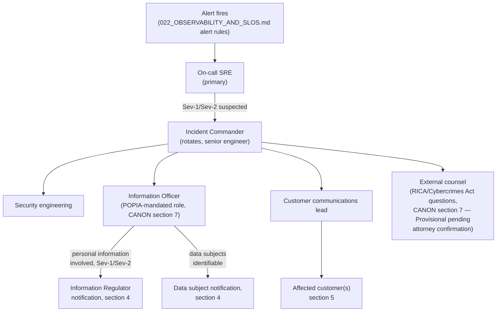
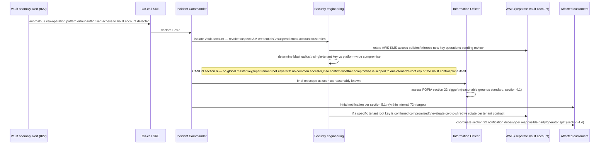

> CONFIDENTIAL — Eride Technologies (Pty) Ltd. Not for distribution outside Eride
> Technologies or parties under written NDA. Contains proprietary architecture.

Status note: Provisional. POPIA section 22 does not prescribe a fixed notification
deadline — it requires notification "as soon as reasonably possible" — and the Information
Regulator has not published a bright-line hour count. Any specific hour target in this
document (e.g. the 72-hour internal target in section 4) is Eride's own operating
discipline, benchmarked against commentary that treats 72 hours as a reasonable proxy, not
a statutory requirement. This document is also Provisional pending attorney review of the
exact current text of RICA following its 2021 constitutional amendment (CANON section 7).

## 1. Purpose

This document defines how Eride detects, classifies, responds to, and communicates about
security incidents, with specific attention to the two things that make Bheka's incident
response different from a generic SaaS vendor's: (1) POPIA section 22 breach notification
obligations, because Bheka itself processes personal information on behalf of, and about,
its customers' employees; and (2) the specific, severe scenario of a compromise of Eride
Vault, the one system whose failure could expose the cryptographic material protecting
every tenant's evidence.

## 2. Severity levels

| Severity | Definition | Example | Initial response time target |
|---|---|---|---|
| Sev-1 | Confirmed or strongly suspected unauthorised access to customer personal information, evidence content, or cryptographic key material; total platform outage | Eride Vault compromise (section 7); ClickHouse or S3 evidence bucket accessed by an unauthorised party; `af-south-1` platform account fully unreachable | On-call paged immediately, Incident Commander assigned within 15 minutes |
| Sev-2 | Significant service degradation without confirmed data exposure; a single tenant's data isolation possibly (not confirmed) breached; evidence-sealing failure (per `022_OBSERVABILITY_AND_SLOS.md` section 3) | RLS policy misconfiguration discovered in code review before exploitation confirmed; `bheka-ingest` evidence-sealing write failures | On-call paged, Incident Commander assigned within 30 minutes |
| Sev-3 | Service degradation with a defined workaround, no suspected data exposure | Elevated API latency breaching SLO, degraded but not failed | Ticketed, addressed within the current business day |
| Sev-4 | Minor issue, cosmetic or low-impact | Console UI bug, non-security | Standard backlog triage |

Severity can be upgraded but never silently downgraded without Incident Commander and
Information Officer sign-off recorded in the incident log — a Sev-1 is not quietly
reclassified to Sev-2 once the notification clock (section 4) has started.

## 3. On-call and escalation



- Primary on-call is drawn from platform SRE, with a secondary escalation to endpoint
  engineering for agent-specific incidents (crash storms, tamper-event surges) and to
  security engineering for anything touching `eride-vault` or key material.
- The Incident Commander role is distinct from the on-call engineer: the IC coordinates
  communication, decision-making, and the notification clock, while the on-call engineer(s)
  focus on technical containment and remediation.
- The Information Officer (a POPIA-mandated role, CANON section 7) is looped in immediately,
  not after technical triage completes, for any Sev-1 or Sev-2 that could plausibly involve
  personal information — POPIA's own guidance is explicit that "an investigation into a
  security compromise does not need to be completed before it is reported," so waiting for
  full technical certainty before involving the Information Officer would itself delay the
  regulatory clock unnecessarily
  ([Information Regulator — Fact Sheet: Handling of Security Compromises](https://inforegulator.org.za/2025/08/19/fact-sheet-handling-of-security-compromises/)).

## 4. POPIA section 22 breach notification obligations and timelines

### 4.1 The statutory trigger and standard

Section 22(1) of POPIA requires that where there are reasonable grounds to believe personal
information has been accessed or acquired by an unauthorised person, the responsible party
must notify both the Information Regulator and, subject to section 22(3), the affected data
subjects, unless a data subject's identity cannot be established
([POPIA section 22, full text](https://popia.co.za/section-22-notification-of-security-compromises/)).
The threshold is deliberately low: "reasonable grounds to believe," not forensic certainty,
and the Information Regulator's own Fact Sheet states "POPIA does not have a threshold for
reporting of security compromises. All security compromises must be reported by the
responsible party irrespective of the deemed level of risk"
([Information Regulator Fact Sheet](https://inforegulator.org.za/2025/08/19/fact-sheet-handling-of-security-compromises/)).
This is materially stricter than a risk-based regime — Eride does not get to decide a
compromise is "too minor to report."

### 4.2 Timing: "as soon as reasonably possible," no fixed statutory hour count

Section 22(2) requires notification "as soon as reasonably possible after the discovery of
the compromise, taking into account the legitimate needs of law enforcement or any measures
reasonably necessary to determine the scope of the compromise and to restore the integrity
of the responsible party's information system"
([POPIA section 22](https://popia.co.za/section-22-notification-of-security-compromises/)).
There is no fixed number of hours in the statute itself. The Information Regulator's
guidance explicitly rejects waiting for a completed investigation: "an investigation into a
security compromise does not need to be completed before it is reported... report the
security compromise as soon as reasonably practicable based on the information at hand, and
then... update the notification as further information comes to light"
([Information Regulator Fact Sheet](https://inforegulator.org.za/2025/08/19/fact-sheet-handling-of-security-compromises/)).

Practitioner commentary consistently treats 72 hours as a practical benchmark, by analogy to
GDPR, even though it is not a POPIA statutory requirement: one guide states plainly "in
practice, treat 72 hours from becoming aware of the breach as your target — this aligns with
GDPR's standard and is the benchmark the Regulator is likely to apply when evaluating
whether notification was sufficiently prompt"
([Montana Data Compliance — POPIA Data Breach Notification guide](https://montanadc.com/blog/popia-data-breach-notification)),
and a law firm's breach-response template similarly recommends notifying "without undue
delay and, where feasible, no later than 72 hours after becoming aware of the breach"
([CompliNEWS POPIA Data Breach Policy PDF](https://jutacomplinews.co.za/media/filestore/2021/04/POPIA_breach_plan.pdf)).
**Eride adopts 72 hours from confirmed discovery as its own internal operating target for
first notification to the Information Regulator, as a matter of internal discipline, not
because POPIA mandates that exact figure.** If Eride cannot meet 72 hours, the notification
must still go out as soon as reasonably possible, accompanied by the reason for the delay,
since the Information Regulator's notification form requires responsible parties to
"specify the date on which the security compromise occurred, the date on which the
notification is being made, together with a reason for the delay, if any"
([FANews summary of the 12 August 2022 Information Regulator guidelines](https://www.fanews.co.za/article/legal-affairs/10/general/1120/information-regulator-issues-guidance-on-popia-data-breach-notifications/35305)).

Delay is only sanctioned where "a public body responsible for the prevention, detection or
investigation of offences or the Regulator determines that notification will impede a
criminal investigation" ([POPIA section 22(3)](https://popia.co.za/section-22-notification-of-security-compromises/))
— Eride cannot unilaterally decide to delay for law-enforcement reasons without that
determination coming from the relevant public body or the Regulator itself.

### 4.3 How to notify

- **Information Regulator**: as of 1 April 2025, all section 22 notifications must be
  submitted through the Information Regulator's eServices portal
  (`https://eservices.inforegulator.org.za`), replacing the older PDF-form (SCN1) process
  ([Information Regulator eServices guidance](https://inforegulator.org.za/popia/),
  [Michalsons — Guideline on notification of security compromises](https://www.michalsons.com/blog/guideline-notification-of-security-compromises-to-the-information-regulator/58993)).
  The Information Officer or a deputy files this notification; it is not delegated to
  engineering or support staff.
- **Data subjects**: section 22(4) prescribes the permitted channels — mailed to the data
  subject's last known physical/postal address, emailed to their last known email address,
  placed in a prominent position on Eride's website, published in the news media, or as
  directed by the Regulator
  ([POPIA section 22(4)](https://popia.co.za/section-22-notification-of-security-compromises/)).
  For Bheka specifically, the "data subject" for most incidents is the monitored employee of
  a customer, whose contact details Eride's platform holds only indirectly (via the
  customer's HR/identity data feeding `users`/`endpoints` records) — the notification
  process must therefore route through the affected customer as an operational matter,
  while Eride as responsible party (or, in some engagements, operator — this categorisation
  is itself Open and requires legal confirmation per tenant contract) retains the underlying
  legal notification duty.
- Website notices should stay published for a duration the Regulator's own fact sheet
  frames as "thirty to ninety days" depending on how likely affected data subjects are to
  visit the site in that window
  ([Information Regulator Fact Sheet](https://inforegulator.org.za/2025/08/19/fact-sheet-handling-of-security-compromises/)).

### 4.4 Responsible party vs operator, and RICA interaction

For most Bheka deployments, the customer (employer) is the responsible party under POPIA
for the personal information of its own employees, and Eride is an operator processing that
information on the customer's instruction. Section 22's guidance confirms this split: "An
operator is obliged to notify the responsible party if there has been a security compromise
impacting the personal data controlled by the responsible party... An operator only needs to
notify [the Regulator/data subjects directly] if the personal information for which it is a
responsible party rather than solely an operator, suffers a security compromise"
([Information Regulator POPIA FAQ](https://inforegulator.org.za/popia/)). Practically:

- If the incident affects a single customer's data processed under Eride's operator role
  (the normal case for a Bheka Tier A/B SaaS or single-tenant deployment), Eride's immediate
  legal duty is to notify that customer (the responsible party) without delay under section
  21(2), and the customer then carries the section 22 notification duty to the Information
  Regulator and its own employees — though Eride should still offer to notify on the
  customer's behalf where contractually agreed, since Eride typically has better visibility
  into the technical scope of the compromise.
  ([Information Regulator POPIA FAQ](https://inforegulator.org.za/popia/): "An operator must
  notify the responsible party immediately where there are reasonable grounds to believe
  that the personal information of a data subject has been accessed or acquired by any
  unauthorised person.")
- If the incident affects information for which Eride itself is the responsible party (for
  example, Eride's own account/billing data about customer administrators, or a compromise
  at `eride-vault` affecting the cryptographic material Eride manages directly under Tier A
  custody), Eride carries the direct section 22 duty itself.
- RICA's s21 decryption-direction regime is why Tier B/C custody exists at all (CANON
  section 7): under Tier A, Eride, as a "decryption key holder," could in principle receive
  a RICA decryption direction; Tier B/C are structured so Eride is never in that position for
  those tenants. Whether and how a RICA decryption direction interacts with an active
  incident response is Provisional and requires attorney confirmation of RICA's current text
  after its 2021 constitutional amendment (CANON section 7) before this document can state a
  firm procedure.

## 5. Customer communication templates

Draft templates below are internal starting points; every actual notification is reviewed
by the Information Officer and, for Sev-1 incidents, external counsel before sending.

### 5.1 Initial notification (within the 72-hour internal target, section 4.2)

```
Subject: Security notice — Bheka platform incident [INCIDENT-ID]

[Customer contact name],

We are writing to notify you, in our capacity as [operator/responsible party — select per
contract], of a security incident affecting the Bheka platform first identified on
[date/time, UTC and SAST].

What we know so far: [factual, scope-bounded description — never speculative attribution].
What we do not yet know: [explicitly stated — do not imply completeness prematurely].
What we have done: [containment actions taken to date].
What you may need to do: [any customer-side action, e.g. rotating customer-held credentials
under Tier B/C custody].

We will provide an updated notification within [X] hours/days as our investigation
progresses, consistent with our POPIA section 22 obligations. A dedicated incident contact
is available at [contact channel].

[Information Officer name and title]
Eride Technologies (Pty) Ltd
```

### 5.2 Follow-up / closure notification

```
Subject: Security notice update — Bheka platform incident [INCIDENT-ID] — [status]

[Customer contact name],

This updates our notification of [date]. Our investigation has concluded / continues as
follows: [summary].

Scope confirmed: [systems, data categories, approximate number of affected data subjects if
determinable].
Root cause: [summary, or "under investigation" if not yet determined].
Remediation completed: [list].
Ongoing monitoring: [list].

If you have questions or believe your own downstream notification obligations require
additional detail from us, contact [Information Officer contact].

[Information Officer name and title]
Eride Technologies (Pty) Ltd
```

## 6. Eride Vault compromise — the specific severe scenario

An `eride-vault` compromise is the single most severe incident category Bheka can
experience, because Vault holds per-tenant root key material and is the policy enforcement
point for every decrypt operation across every tenant (CANON section 6). It is treated as
Sev-1 automatically, with no discretion to classify it lower pending investigation.



### 6.1 Why the blast radius question matters first

CANON section 6 is explicit: "There is no global master key. Per-tenant root keys with no
common ancestor. A single key compromise is capped at one tenant." The first substantive
technical question in a Vault incident is therefore not "was Vault compromised" but
"was the compromise scoped to the Vault control plane/infrastructure (potentially
affecting the mechanism protecting many tenants' keys) or to a single tenant's root key
material specifically." These have very different blast radii and very different
notification scope, and the incident response must not default to a platform-wide
notification if the evidence supports a single-tenant scope, nor understate scope if the
evidence is genuinely ambiguous — the Regulator's guidance to report based on "information
at hand" and update later (section 4.2) applies directly here.

### 6.2 Containment specifics

- `eride-vault` runs in a separate AWS account from the rest of the platform (CANON section
  2); this means containment (revoking IAM roles, rotating AWS KMS grants, cutting the
  gRPC/mTLS trust between `bheka-gateway` and Vault) can happen without taking down the rest
  of the platform, at the cost of Vault-dependent operations (new key issuance, DEK unwraps
  for newly requested evidence views) failing closed during containment. This fail-closed
  behaviour is intentional: CANON's envelope encryption rule already means the Vault never
  holds bulk payloads, so containment cannot itself expose more customer data — the worst
  outcome of an aggressive containment response is temporary unavailability, not further
  disclosure.
- For Tier B customers, the customer's own KMS/Key Vault is a second point of containment
  the customer may need to act on independently (e.g. revoking the cross-account role
  Eride's Vault uses to call their KMS) — this must be communicated to the customer promptly
  as part of the incident, since Eride cannot unilaterally act inside the customer's own
  cloud account.
- For Tier C customers, the Vault runs inside the customer's own estate
  (`014_DEPLOYMENT_TOPOLOGIES.md` section 3.3); an incident there is primarily the
  customer's own infrastructure incident, with Eride providing support and root-cause
  analysis of the Vault software itself, not direct containment access to infrastructure
  Eride does not operate.

### 6.3 Crypto-shredding as a response option

If a specific tenant's root key is confirmed compromised beyond confident remediation (for
example, key material itself, not just access credentials, is believed exposed), the
tenant's own crypto-shredding mechanism (CANON section 6) is available as a last-resort
containment step: destroying the tenant root key renders all of that tenant's evidence
permanently unrecoverable, including in backups. This is an extreme, irreversible action
requiring the customer's explicit informed consent except where the customer's contract
pre-authorises it for exactly this scenario — it trades total data loss for total
certainty that the compromised key can never be used again. See
`026_BUSINESS_CONTINUITY.md` section 3 for how this interacts with backup strategy.

## 7. What this document does not cover

- Detailed breach root-cause taxonomy and postmortem template — a separate operational
  runbook, not yet written.
- RTO/RPO and backup mechanics referenced in section 6.3 — `026_BUSINESS_CONTINUITY.md`.
- The observability alerting that triggers incident detection — `022_OBSERVABILITY_AND_SLOS.md`.
- The release-halt mechanism that may itself be the root cause of a Sev-2/Sev-3 incident —
  `023_RELEASE_AND_UPDATE_STRATEGY.md`.

## AI implementation constraints
- Do not implement any logic that automatically downgrades a Sev-1 classification without
  explicit Incident Commander and Information Officer sign-off recorded in the incident log.
- Do not implement a fixed-hour auto-notification suppression for POPIA section 22 purposes;
  the 72-hour figure in section 4.2 is an internal target, not a basis for withholding
  notification if reasonable grounds exist earlier.
- Do not build any code path that allows Eride engineering to decrypt a customer's Tier B or
  Tier C data as an incident-response "break glass" measure; incident response must operate
  within the same envelope-encryption boundaries as normal operation (CANON section 6,
  ADR-011).
- Do not trigger crypto-shredding as an automated incident response action; it always
  requires an explicit human decision with customer involvement per section 6.3.

## Required inputs
- Per-tenant contract terms establishing whether Eride is responsible party or operator for
  that tenant's data, to route section 22 obligations correctly (section 4.4).
- Attorney confirmation of RICA's current post-2021-amendment text before finalising the
  RICA-interaction procedure referenced in section 4.4.
- Confirmed external counsel engagement for Sev-1 incidents.
- Named Information Officer and deputy Information Officer contact details, kept current in
  the on-call escalation system.

## Expected outputs
- A staffed on-call rotation with documented escalation paths matching section 3.
- Incident Commander runbook operationalising the Vault-compromise sequence in section 6.
- Pre-approved (legal-reviewed) versions of the templates in section 5, ready to customise
  per incident rather than drafted from scratch under time pressure.
- Integration between `022_OBSERVABILITY_AND_SLOS.md` alert rules and Sev-1/Sev-2
  auto-paging.

## Dependencies
- CANON sections 6 and 7.
- `014_DEPLOYMENT_TOPOLOGIES.md` for the account/topology boundaries relevant to
  containment.
- `022_OBSERVABILITY_AND_SLOS.md` for detection signals.
- `026_BUSINESS_CONTINUITY.md` for the crypto-shred/backup interaction.

## Acceptance criteria
- Given an alert indicating anomalous Vault access fires, when on-call triages it, then the
  incident is classified Sev-1 by default and the Incident Commander and Information
  Officer are both notified within the timeframes in section 2, with no discretion to
  pre-classify it lower.
- Given reasonable grounds exist to believe personal information was accessed by an
  unauthorised party, when the Information Officer assesses the incident, then a POPIA
  section 22 notification process begins regardless of the assessed severity or scale of the
  breach, per the Regulator's no-threshold guidance.
- Given a tenant's root key is confirmed compromised beyond remediation, when
  crypto-shredding is considered, then it proceeds only after explicit documented customer
  consent or a pre-existing contractual authorisation, never automatically.
- Given a Tier C customer experiences a Vault-adjacent incident on their own premises, when
  Eride is engaged, then Eride's role is limited to software-level root-cause support, not
  direct infrastructure containment actions Eride has no access to perform.

## Test checklist
- [ ] Tabletop exercise simulating an `eride-vault` AWS account credential compromise,
      timed against the section 6 sequence.
- [ ] Verify Sev-1 alerts page both on-call SRE and the Information Officer's on-call
      contact simultaneously, not sequentially.
- [ ] Verify the incident log records severity changes with timestamp, actor, and
      justification for every reclassification.
- [ ] Confirm the eServices portal notification workflow is documented step by step and a
      test/dry-run account exists for training purposes without submitting a live
      notification.
- [ ] Legal review sign-off recorded for the templates in section 5.
- [ ] Confirm no engineering runbook contains a "decrypt customer data for investigation"
      step for Tier B/C tenants.
- [ ] Verify containment runbook for a single-tenant key compromise is distinguishable, in
      writing, from the runbook for a Vault-control-plane-wide compromise.
