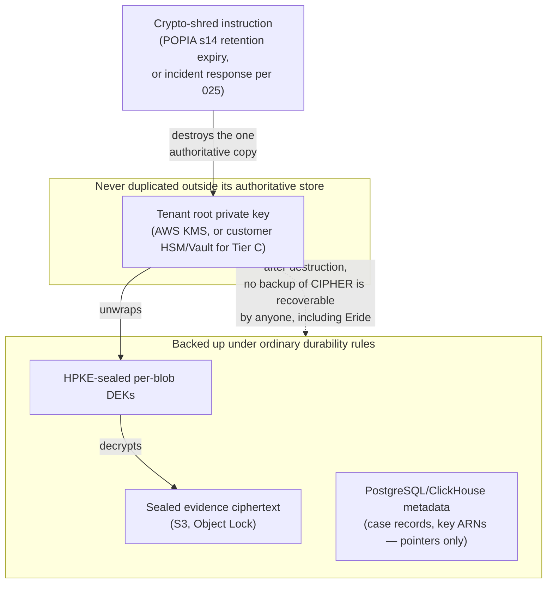
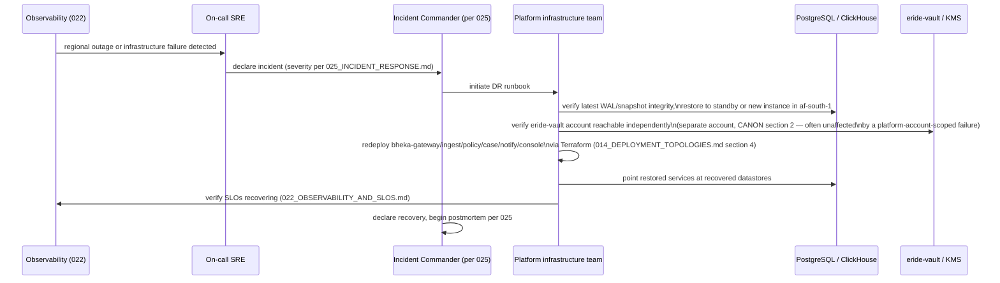

> CONFIDENTIAL — Eride Technologies (Pty) Ltd. Not for distribution outside Eride
> Technologies or parties under written NDA. Contains proprietary architecture.

Status note: Provisional. RTO/RPO numeric targets in section 2 are proposed v1 launch
targets, not yet validated by a real disaster recovery drill. The crypto-shredding/backup
interaction in section 3 is architecturally settled by CANON section 6 but its exact backup
tooling implementation has not yet been built or tested end to end.

## 1. Purpose

This document defines Bheka's recovery time and recovery point objectives, backup strategy
(including its interaction with crypto-shredding), the disaster recovery runbook, and the
South Africa-specific infrastructure risks — chiefly load-shedding — that shape the design.

## 2. RTO/RPO targets

| System | RTO (proposed) | RPO (proposed) | Rationale |
|---|---|---|---|
| `bheka-gateway` / `bheka-console` (control plane) | 4 hours | 15 minutes | Customer-facing; outage blocks admin visibility and case work, but does not itself lose telemetry since agents buffer locally regardless (`011_ENDPOINT_AGENT_DESIGN.md` section 9) |
| `bheka-ingest` / ClickHouse (telemetry pipeline) | 4 hours | 15 minutes for in-flight batches; zero loss of agent-buffered data given the 30-day local buffer | Agents queue locally during any backend outage (CANON section 16), converting what would be a data-loss incident elsewhere into a latency incident here |
| PostgreSQL (tenant metadata, cases, RBAC, audit) | 2 hours | 5 minutes (continuous WAL archiving) | Cases, approvals, and audit log are the system of record for legal admissibility (CANON section 7 procedural fairness requirement); a longer RPO here risks losing an approval or audit record that cannot be reconstructed from the agent buffer |
| `eride-vault` / AWS KMS | 1 hour | Near-zero — key material itself is not "backed up" in the conventional sense; see section 3 | Vault availability blocks all new evidence decryption and new key issuance platform-wide; its narrow blast radius (separate account, CANON section 2) means it can be restored independently of the rest of the platform |
| S3 sealed evidence (Object Lock COMPLIANCE mode) | n.a. — S3 durability is AWS's, not a restore-from-backup scenario in the traditional sense | Zero — Object Lock COMPLIANCE mode is designed to prevent loss or overwrite for the lock duration | Evidence integrity depends on S3's own durability guarantees and Object Lock, not a separate Eride-run backup/restore cycle for the object bytes themselves |
| Customer-hosted Vault (Tier C) / air-gapped deployments | Customer-owned, per their own DR posture; Eride provides runbook support only | Customer-owned | Eride does not operate infrastructure it does not control (`014_DEPLOYMENT_TOPOLOGIES.md` section 3.3–3.4) |

These are v1 launch proposals. They have not been validated against a real regional AWS
`af-south-1` outage or a full-scale DR drill, and should be treated as a starting negotiating
position for customer SLAs, not a guarantee, until at least one successful drill (section 4)
has been completed.

## 3. Backup strategy and its interaction with crypto-shredding

### 3.1 What is backed up, and how

- **PostgreSQL**: continuous WAL archiving to S3 (`af-south-1`) plus periodic base
  snapshots, enabling point-in-time recovery within the RPO target in section 2.
- **ClickHouse**: replicated table engines across at least two availability zones within
  `af-south-1` where the region's zone count permits, plus periodic backups to S3 for
  longer-term restore scenarios (e.g. recovering from an operator error, not just hardware
  failure).
- **S3 evidence objects**: durability is inherent to S3; Object Lock in COMPLIANCE mode
  (CANON section 2) is configured with a retention period tied to each tenant's POPIA
  section 14 retention schedule, meaning the objects cannot be deleted or overwritten by
  anyone — including Eride — before that period expires, regardless of intent.
- **`eride-vault` / AWS KMS root keys**: AWS KMS keys are not "backed up" by Eride in the
  traditional file-copy sense; they exist as managed key material within KMS's own
  redundancy model. What Eride does back up is the Vault's own configuration and policy
  state (which tenant maps to which KMS key ARN, custody tier, rotation history) — the
  metadata needed to operate the Vault correctly, never the key bytes themselves outside
  KMS.

### 3.2 The crypto-shredding interaction — the core design tension

CANON section 6 states plainly: "Crypto-shredding: destroying a tenant root key renders all
that tenant's evidence permanently unrecoverable, including in backups. This is the POPIA
s14 retention mechanism." This creates a direct, intentional tension with conventional
backup philosophy, which normally treats "more copies, longer retained, more recoverable"
as an unambiguous good. For Bheka, it is not: **a backup that could survive a legitimate
crypto-shred would be a compliance defect, not a resilience feature.**

The design resolution:

- Every evidence blob is encrypted with a random per-blob DEK, itself sealed via HPKE to the
  tenant's root public key (CANON section 2, Agent crypto; CANON section 6, envelope
  encryption). Backups of the ciphertext (the sealed blob and its sealed DEK) can exist
  in as many redundant copies as ordinary durability requires, because a ciphertext copy is
  worthless without the tenant root private key.
- The tenant root private key itself lives only in AWS KMS (Tier A/B) or the customer's own
  Vault/HSM (Tier B/C) — never duplicated into a conventional backup store, snapshot, or
  cold-storage archive by Eride. This is what makes crypto-shredding effective: destroying
  the one authoritative copy of the root key in KMS (or instructing the customer to destroy
  it in their own Tier C estate) is sufficient to render every backup copy of the ciphertext
  permanently unrecoverable, without Eride needing to separately locate and delete every
  backup copy of the ciphertext itself.
- Consequence for backup tooling: any future backup mechanism that would copy KMS key
  material out of KMS (for example, an ill-advised "export key for DR" feature) would
  directly undermine crypto-shredding as a POPIA section 14 retention mechanism and is
  therefore explicitly prohibited (see AI implementation constraints).
- PostgreSQL and ClickHouse backups, which hold metadata (case records, detection
  identifiers, tenant configuration) rather than the sealed evidence bytes themselves, are
  handled under ordinary backup retention rules, but any column referencing tenant key
  material or key ARNs is itself non-sensitive (an ARN is a pointer, not the key), so backing
  up that metadata does not create a crypto-shred bypass.

### 3.3 Backup testing and restore verification

- Restore drills (section 4) must include a positive test (routine data restores correctly)
  and a negative test (a crypto-shredded tenant's data remains unrecoverable even from the
  oldest retained backup snapshot), since the negative case is the one most likely to be
  silently broken by a well-intentioned backup-completeness improvement elsewhere in the
  stack.

## 4. Disaster recovery runbook

- The DR runbook assumes infrastructure-as-code (Terraform, per
  `014_DEPLOYMENT_TOPOLOGIES.md` section 4) is the source of truth for redeploying compute;
  manual click-ops recovery is not a supported path and should never be the only way to
  reconstitute a service.
- Because `eride-vault` runs in a separate AWS account (CANON section 2), a failure isolated
  to the platform account's networking, IAM, or compute does not necessarily take Vault down
  with it, and vice versa — the DR runbook explicitly checks both accounts independently
  rather than assuming a single combined failure domain.
- For single-tenant dedicated (Tier B) and customer-hosted Vault (Tier C) topologies, the DR
  runbook is scoped per the boundaries in `014_DEPLOYMENT_TOPOLOGIES.md`: Eride recovers what
  it operates, and the customer recovers what they operate, with the runbook including
  explicit customer-communication checkpoints so neither party assumes the other is handling
  a given component.
- DR drills should be run at least at a cadence sufficient to catch infrastructure drift
  before a real event does; a specific committed cadence (e.g. quarterly) is not yet locked
  and is Open pending the platform infrastructure team's capacity in the first year of
  operation.

## 5. Load-shedding and South Africa-specific infrastructure risk

### 5.1 Endpoint-side load-shedding resilience

CANON section 16 requires the agent to survive ungraceful power loss with journaled writes
and no data loss on abrupt shutdown. This is implemented at the agent level via SQLite WAL
journaling with `synchronous = FULL` (`011_ENDPOINT_AGENT_DESIGN.md` section 9) — a laptop
or desktop that loses power mid-write during a load-shedding event does not corrupt its
local telemetry buffer, and resumes cleanly once power returns. Combined with the 30-day
offline buffering capacity, an endpoint can ride out extended outages (rolling blackouts,
multi-day power instability during severe stages of load-shedding) without losing Baseline
or Elevated-tier telemetry, only delaying its upload.

### 5.2 Backend-side infrastructure risk

The backend control plane runs in AWS `af-south-1`, which — as a hyperscale, UPS- and
generator-backed data centre region — is materially better insulated from grid-level
load-shedding than a typical South African office or on-premises server room, but it is not
immune to broader South African infrastructure risk more generally: fibre cuts, municipal
water supply issues affecting cooling at colocation facilities, and logistics disruptions
affecting hardware replacement lead times are all part of the operating environment. Teraco,
the anchor colocation provider underpinning much of South Africa's cloud and interconnect
infrastructure, operates multiple sites (Johannesburg's JB1–JB4/JB7, Cape Town's CT1/CT2,
and Durban) with substantial IT load capacity, which is the kind of redundant, professionally
operated facility base that makes `af-south-1` a meaningfully more resilient choice than
customer-premises hosting for the SaaS and single-tenant topologies
([Teraco](https://www.teraco.co.za/), [Teraco locations](https://www.teraco.co.za/data-centre-locations/)).

For the fully air-gapped and customer-hosted Vault topologies (`014_DEPLOYMENT_TOPOLOGIES.md`
sections 3.3–3.4), infrastructure resilience is the customer's own responsibility, and this
is a factor Eride should raise explicitly during solutions engineering scoping: a government
customer choosing an on-premises `.ova` deployment inherits that premises' own power and
connectivity resilience posture, which may be considerably weaker than `af-south-1`'s.
Eride's sales and delivery teams should not implicitly assume parity between a hyperscale
region and a customer's own server room when setting availability expectations for these
topologies.

### 5.3 Low-bandwidth and connectivity degradation

CANON section 16 also requires a low-bandwidth mode (aggressive batching, zstd compression,
metadata-only fallback below a throughput threshold). This is directly relevant to business
continuity because South African connectivity — particularly outside major metros, or
during periods when load-shedding affects local ISP infrastructure even if the customer's
own site has backup power — can degrade gradually rather than failing outright. The agent's
graceful degradation ladder (`011_ENDPOINT_AGENT_DESIGN.md` section 10) is the same
mechanism serving both the disk-quota and low-bandwidth cases, so a connectivity-constrained
environment and a disk-constrained one are handled by one unified backpressure design rather
than two separate ad hoc mechanisms.

## 6. What this document does not cover

- Incident classification and communication procedure — `025_INCIDENT_RESPONSE.md`.
- Terraform module structure used to redeploy infrastructure during DR —
  `014_DEPLOYMENT_TOPOLOGIES.md` section 4.
- Agent-level buffer and backpressure mechanics in full detail —
  `011_ENDPOINT_AGENT_DESIGN.md` sections 9–10.

## AI implementation constraints
- Do not implement any mechanism that exports or duplicates a tenant root private key out
  of AWS KMS (or the customer's own HSM/Vault for Tier C) into a conventional backup store,
  snapshot, or cold-storage archive; doing so would defeat crypto-shredding as a POPIA
  section 14 retention mechanism.
- Do not implement backup restore tooling that can bring back a crypto-shredded tenant's
  evidence ciphertext into a decryptable state; a successful crypto-shred must remain
  irreversible through every restore path, tested explicitly (section 3.3).
- Do not assume feature or availability parity between AWS `af-south-1` and other AWS
  regions when designing DR failover logic; validate specific service availability first
  (see `014_DEPLOYMENT_TOPOLOGIES.md` section 5).
- Do not build a DR runbook step that requires manual, undocumented infrastructure changes;
  every DR action must be expressible through the Terraform modules in
  `014_DEPLOYMENT_TOPOLOGIES.md` section 4.

## Required inputs
- A completed first DR drill to validate or revise the RTO/RPO targets in section 2.
- Confirmed AWS KMS backup/redundancy model documentation to finalise section 3.1's
  description of what Eride does and does not need to separately back up.
- Customer-specific infrastructure resilience assessments for any Tier C/air-gapped
  government deployment, gathered during solutions engineering scoping.
- A committed DR drill cadence, agreed with the platform infrastructure team once v1 is in
  production.

## Expected outputs
- Automated backup jobs for PostgreSQL (WAL archiving + snapshots) and ClickHouse
  (replication + periodic backup) matching the RPO targets in section 2.
- A documented, Terraform-driven DR runbook matching section 4, exercised at least once
  before general availability.
- A negative-test suite proving crypto-shredded tenant data is unrecoverable from every
  backup path, run as part of the same test cycle as ordinary restore verification.

## Dependencies
- CANON section 6 (key custody tiers, crypto-shredding) and section 16 (Africa module,
  load-shedding resilience).
- `011_ENDPOINT_AGENT_DESIGN.md` sections 9–10 for the agent-side buffering and backpressure
  mechanics referenced in section 5.
- `014_DEPLOYMENT_TOPOLOGIES.md` for the account/topology structure DR recovery operates
  within.
- `025_INCIDENT_RESPONSE.md` for the incident classification a DR event is declared under.

## Acceptance criteria
- Given a simulated `af-south-1` availability zone failure, when the DR runbook is
  executed, then PostgreSQL and ClickHouse are restored within the RTO targets in section 2
  using only Terraform-driven redeployment steps.
- Given a tenant's root key is crypto-shredded, when a restore is attempted from the oldest
  retained backup snapshot containing that tenant's evidence ciphertext, then the data
  remains permanently unrecoverable.
- Given an endpoint loses power during a load-shedding event mid-write, when power is
  restored, then no buffered telemetry is lost or corrupted, consistent with
  `011_ENDPOINT_AGENT_DESIGN.md` section 9's WAL journaling design.
- Given a government customer scopes a fully air-gapped deployment, when infrastructure
  resilience is discussed, then Eride's solutions engineering team explicitly documents that
  power/connectivity resilience is the customer's own responsibility for that topology.

## Test checklist
- [ ] Full DR drill executed at least once before general availability, with actual
      timings recorded against the RTO/RPO targets in section 2.
- [ ] Negative restore test: attempt to recover a crypto-shredded tenant's evidence from
      every backup tier (S3 object versions, PostgreSQL snapshot, ClickHouse backup) and
      confirm irrecoverability in each.
- [ ] Simulated power-loss test on a physical or virtual endpoint during an active WAL
      write, verifying zero data loss on restart.
- [ ] Verify no code path or IAM permission allows exporting raw KMS key material to any
      non-KMS storage location.
- [ ] Confirm the DR runbook redeploys `eride-vault` and the platform account independently,
      with a test that fails one account's infrastructure while leaving the other running.
- [ ] Review solutions engineering scoping templates to confirm they document customer-owned
      infrastructure resilience responsibilities for Tier C/air-gapped deals.
