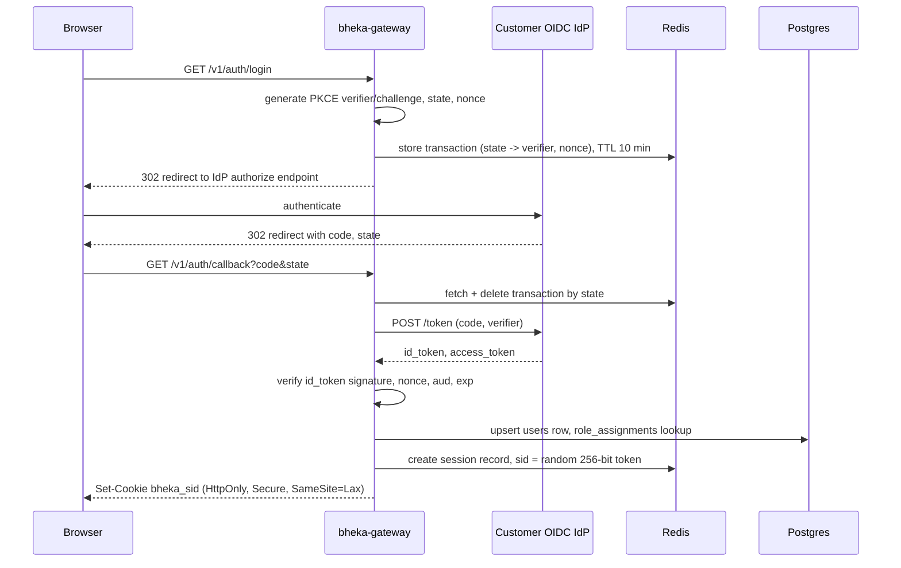
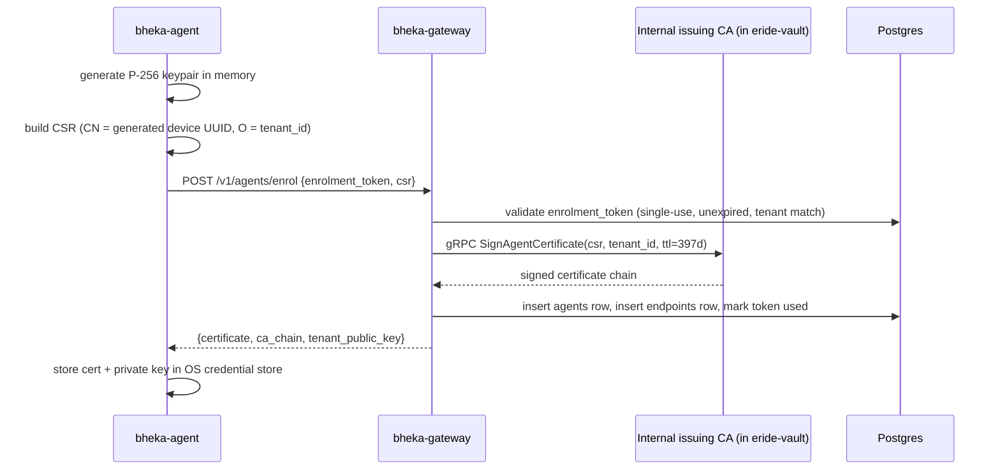

> CONFIDENTIAL — Eride Technologies (Pty) Ltd. Not for distribution outside Eride
> Technologies or parties under written NDA. Contains proprietary architecture.

# GUIDE-01: Authentication

Status note: this guide is Provisional because the OIDC identity provider has not
been contractually selected (pending vendor negotiation with Microsoft Entra ID and
Auth0, both technically compatible). Everything else in this guide — session handling,
agent mTLS enrolment, WebAuthn step-up, SCIM provisioning — is Locked per CANON section 9.

This guide builds authentication for `bheka-gateway` (human users, OIDC + session)
and the agent identity path (mTLS certificates, no OIDC). It also covers WebAuthn
step-up required before any Tier 3 evidence view per CANON section 4, and SCIM
provisioning for enterprise customers who manage identity centrally.

## 1. Scope and non-goals

In scope:
- OIDC authorization code flow with PKCE for `bheka-console` human users.
- Server-side session issuance, storage in Redis, rotation, revocation.
- Agent enrolment: one-time enrolment token exchanged for a short-lived client
  certificate, renewed automatically before expiry.
- WebAuthn step-up ceremony gating Tier 3 evidence access and approvals.
- SCIM 2.0 `/scim/v2/Users` and `/scim/v2/Groups` for customer-driven provisioning.

Out of scope: the identity provider itself (customer's Entra ID / Okta / Google
Workspace tenant), and RBAC role-to-permission mapping, which is covered in the
`bheka-gateway` authorization middleware, not this guide.

## 2. Architecture



## 3. OIDC login flow (bheka-gateway)

### 3.1 Dependencies

```bash
cd services/bheka-gateway
npm install openid-client fastify @fastify/cookie ioredis zod pino
```

### 3.2 Per-tenant OIDC configuration

Each tenant configures its own OIDC issuer (or uses Eride's default IdP for SMEs
without their own). Store discovery metadata, not raw secrets, in Postgres; store
the client secret in AWS Secrets Manager referenced by ARN. This table is additive
to the canonical schema and must be added as `schemas/database/040_oidc_config.sql`
by the schema owner before this guide is implemented — do not inline a CREATE TABLE
here (CANON section 14 anti-drift rule). The columns this guide assumes: `tenant_id`,
`issuer_url`, `client_id`, `client_secret_arn`, `redirect_uri`, `scim_enabled`.

### 3.3 Fastify auth plugin

```typescript
// services/bheka-gateway/src/plugins/auth-oidc.ts
import { FastifyPluginAsync } from "fastify";
import { Issuer, generators, Client } from "openid-client";
import { z } from "zod";
import Redis from "ioredis";
import { randomBytes } from "node:crypto";
import { getOidcConfigForTenant } from "../db/oidc-config.js";
import { getSecretValue } from "../aws/secrets.js";

const AuthCallbackQuery = z.object({
  code: z.string().min(1),
  state: z.string().min(1),
});

interface OidcTransaction {
  tenantId: string;
  codeVerifier: string;
  nonce: string;
  returnTo: string;
}

const clientCache = new Map<string, Client>();

async function getClientForTenant(tenantId: string): Promise<Client> {
  const cached = clientCache.get(tenantId);
  if (cached) return cached;

  const cfg = await getOidcConfigForTenant(tenantId);
  if (!cfg) {
    throw new Error(`No OIDC configuration for tenant ${tenantId}`);
  }
  const issuer = await Issuer.discover(cfg.issuerUrl);
  const clientSecret = await getSecretValue(cfg.clientSecretArn);

  const client = new issuer.Client({
    client_id: cfg.clientId,
    client_secret: clientSecret,
    redirect_uris: [cfg.redirectUri],
    response_types: ["code"],
  });

  clientCache.set(tenantId, client);
  return client;
}

const authOidcPlugin: FastifyPluginAsync = async (app) => {
  const redis = new Redis(process.env.REDIS_URL!);

  app.get("/v1/auth/login", async (req, reply) => {
    const tenantSlug = z.string().min(1).parse(
      (req.query as Record<string, unknown>).tenant,
    );
    const tenantId = await resolveTenantIdBySlug(tenantSlug);
    const client = await getClientForTenant(tenantId);

    const codeVerifier = generators.codeVerifier();
    const codeChallenge = generators.codeChallenge(codeVerifier);
    const nonce = generators.nonce();
    const state = randomBytes(32).toString("base64url");

    const tx: OidcTransaction = {
      tenantId,
      codeVerifier,
      nonce,
      returnTo: "/dashboard",
    };
    await redis.set(`oidc:tx:${state}`, JSON.stringify(tx), "EX", 600);

    const authUrl = client.authorizationUrl({
      scope: "openid profile email",
      code_challenge: codeChallenge,
      code_challenge_method: "S256",
      state,
      nonce,
    });

    reply.redirect(authUrl);
  });

  app.get("/v1/auth/callback", async (req, reply) => {
    const { code, state } = AuthCallbackQuery.parse(req.query);

    const raw = await redis.get(`oidc:tx:${state}`);
    if (!raw) {
      return reply.code(400).send({
        type: "https://bheka.eride.tech/problems/invalid-oidc-state",
        title: "OIDC transaction not found or expired",
        status: 400,
      });
    }
    await redis.del(`oidc:tx:${state}`);
    const tx = JSON.parse(raw) as OidcTransaction;

    const client = await getClientForTenant(tx.tenantId);
    const tokenSet = await client.callback(
      (await getOidcConfigForTenant(tx.tenantId))!.redirectUri,
      { code, state },
      { code_verifier: tx.codeVerifier, nonce: tx.nonce, state },
    );

    const claims = tokenSet.claims();
    const user = await upsertUserFromClaims(tx.tenantId, claims);

    const sid = randomBytes(32).toString("base64url");
    await redis.set(
      `session:${sid}`,
      JSON.stringify({
        userId: user.id,
        tenantId: tx.tenantId,
        mfaSatisfied: false,
        stepUpSatisfiedAt: null,
        createdAt: new Date().toISOString(),
      }),
      "EX", 28800, // 8 hour absolute session lifetime
    );

    reply
      .setCookie("bheka_sid", sid, {
        httpOnly: true,
        secure: true,
        sameSite: "lax",
        path: "/",
        maxAge: 28800,
      })
      .redirect(tx.returnTo);
  });
};

export default authOidcPlugin;
```

### 3.4 Session verification middleware

Every authenticated request re-reads the session from Redis (not a signed JWT
cookie) so that a revoked session takes effect immediately — required for
offboarding and incident response (see `runbooks/RUNBOOK-04-Vault-Break-Glass.md`
for the emergency revocation path).

```typescript
// services/bheka-gateway/src/plugins/session.ts
import { FastifyPluginAsync, FastifyRequest, FastifyReply } from "fastify";
import Redis from "ioredis";

declare module "fastify" {
  interface FastifyRequest {
    session?: {
      userId: string;
      tenantId: string;
      mfaSatisfied: boolean;
      stepUpSatisfiedAt: string | null;
    };
  }
}

const sessionPlugin: FastifyPluginAsync = async (app) => {
  const redis = new Redis(process.env.REDIS_URL!);

  app.decorateRequest("session", undefined);

  app.addHook("onRequest", async (req: FastifyRequest, reply: FastifyReply) => {
    const sid = req.cookies?.bheka_sid;
    if (!sid) return; // public routes handle their own auth requirement

    const raw = await redis.get(`session:${sid}`);
    if (!raw) return;

    req.session = JSON.parse(raw);

    // Set the RLS GUC for the duration of this request's DB transactions.
    // See schemas/database/000_extensions_and_domains.sql current_tenant_id().
    req.tenantIdForRls = req.session?.tenantId ?? null;
  });
};

export default sessionPlugin;
```

Sliding expiry: on every authenticated request, extend the Redis TTL back to
1800 seconds (30 minutes idle) but never beyond the 8-hour absolute `createdAt`
ceiling. Enforce the absolute ceiling in application code, not just TTL, so a
compromised Redis TTL reset cannot extend a session indefinitely.

## 4. Agent mTLS certificate enrolment

The agent never uses OIDC. It authenticates to `bheka-ingest` and `bheka-gateway`
with a per-device client certificate issued at enrolment and renewed automatically.
The enrolment token is single-use and injected via the MSI/`.pkg`/`.deb` installer
properties defined in CANON section 11 (`TENANT_ID`, `ENROLMENT_TOKEN`, `SERVER_URL`).

### 4.1 Enrolment protocol



397-day certificate lifetime matches the CA/Browser Forum maximum for publicly
trusted TLS leaf certificates as a conservative external ceiling ([CA/Browser
Forum Baseline Requirements](https://cabforum.org/baseline-requirements-documents/));
the agent-to-backend channel uses a private CA so this is a policy choice, not a
public-CA constraint. Renewal is triggered automatically by `bheka-agent` at 30
days before expiry using the still-valid current certificate to authenticate the
renewal request (RFC 8555-style, but over the private mTLS channel, not ACME).

### 4.2 Rust: CSR generation and enrolment client

```rust
// crates/bheka-agent/src/enrolment.rs
use rcgen::{CertificateParams, KeyPair, PKCS_ECDSA_P256_SHA256};
use reqwest::Client;
use serde::{Deserialize, Serialize};
use uuid::Uuid;

#[derive(Serialize)]
struct EnrolRequest {
    enrolment_token: String,
    csr_pem: String,
}

#[derive(Deserialize)]
pub struct EnrolResponse {
    pub certificate_pem: String,
    pub ca_chain_pem: String,
    pub tenant_public_key_x25519_b64: String,
    pub agent_id: Uuid,
}

pub fn generate_csr(tenant_id: &str) -> anyhow::Result<(String, KeyPair)> {
    let device_id = Uuid::new_v4();
    let mut params = CertificateParams::new(vec![device_id.to_string()]);
    params.distinguished_name.push(rcgen::DnType::CommonName, device_id.to_string());
    params.distinguished_name.push(rcgen::DnType::OrganizationName, tenant_id.to_string());
    params.alg = &PKCS_ECDSA_P256_SHA256;

    let key_pair = KeyPair::generate(&PKCS_ECDSA_P256_SHA256)?;
    let cert = rcgen::Certificate::from_params({
        let mut p = params;
        p.key_pair = Some(key_pair.clone_into_owned()?);
        p
    })?;
    let csr_pem = cert.serialize_request_pem()?;
    Ok((csr_pem, key_pair))
}

pub async fn enrol(
    server_url: &str,
    tenant_id: &str,
    enrolment_token: &str,
) -> anyhow::Result<(EnrolResponse, KeyPair)> {
    let (csr_pem, key_pair) = generate_csr(tenant_id)?;

    let client = Client::builder()
        .use_rustls_tls()
        .build()?;

    let resp = client
        .post(format!("{server_url}/v1/agents/enrol"))
        .json(&EnrolRequest {
            enrolment_token: enrolment_token.to_string(),
            csr_pem,
        })
        .send()
        .await?
        .error_for_status()?
        .json::<EnrolResponse>()
        .await?;

    // Persist private key to the OS credential store, never to plain disk:
    // Windows -> DPAPI-protected file under ProgramData with restricted ACL,
    // Linux -> root-only file mode 0600 under /etc/bheka-agent/,
    // macOS -> Keychain (kSecClassKey, access group com.eride.bheka-agent).
    crate::os_keystore::store_agent_private_key(&key_pair)?;
    crate::os_keystore::store_agent_certificate(&resp.certificate_pem)?;

    Ok((resp, key_pair))
}
```

### 4.3 Renewal job

```rust
// crates/bheka-agent/src/renewal.rs
use std::time::Duration;
use tokio::time;
use x509_parser::prelude::*;

const RENEWAL_WINDOW_DAYS: i64 = 30;
const CHECK_INTERVAL: Duration = Duration::from_secs(6 * 60 * 60); // every 6h

pub async fn run_renewal_loop(ctx: crate::AgentContext) {
    let mut interval = time::interval(CHECK_INTERVAL);
    loop {
        interval.tick().await;
        if let Err(e) = check_and_renew(&ctx).await {
            tracing::warn!(error = %e, "certificate renewal check failed, will retry");
        }
    }
}

async fn check_and_renew(ctx: &crate::AgentContext) -> anyhow::Result<()> {
    let cert_pem = crate::os_keystore::load_agent_certificate()?;
    let (_, pem) = x509_parser::pem::parse_x509_pem(cert_pem.as_bytes())?;
    let cert = pem.parse_x509()?;
    let not_after = cert.validity().not_after.to_datetime();
    let days_remaining = (not_after - time::OffsetDateTime::now_utc()).whole_days();

    if days_remaining <= RENEWAL_WINDOW_DAYS {
        tracing::info!(days_remaining, "renewing agent certificate");
        crate::enrolment::renew_with_mtls(ctx).await?;
    }
    Ok(())
}
```

Renewal reuses the current, still-valid mTLS client certificate to authenticate
to `POST /v1/agents/renew`, presenting a fresh CSR. `bheka-gateway` validates the
presented certificate against the CA chain and the `agents` table before asking
`eride-vault`'s internal CA to sign the replacement.

## 5. WebAuthn step-up before Tier 3 access

Per CANON section 9, WebAuthn is required before any Tier 3 evidence view or
approval, in addition to the standing OIDC session. This is a step-up, not a
replacement for the session: a valid `bheka_sid` is still required.

### 5.1 Registration (once per user, per authenticator)

```bash
npm install @simplewebauthn/server @simplewebauthn/browser
```

```typescript
// services/bheka-gateway/src/routes/webauthn.ts
import { FastifyPluginAsync } from "fastify";
import {
  generateRegistrationOptions,
  verifyRegistrationResponse,
  generateAuthenticationOptions,
  verifyAuthenticationResponse,
} from "@simplewebauthn/server";
import { z } from "zod";
import { requireSession } from "../middleware/require-session.js";
import { db } from "../db/client.js";
import Redis from "ioredis";

const RP_ID = process.env.WEBAUTHN_RP_ID!; // e.g. "app.bheka.eride.tech"
const RP_NAME = "Bheka";

const webauthnRoutes: FastifyPluginAsync = async (app) => {
  const redis = new Redis(process.env.REDIS_URL!);

  app.post("/v1/auth/webauthn/register/options", { preHandler: requireSession }, async (req, reply) => {
    const userId = req.session!.userId;
    const existing = await db.query.webauthnCredentials.findMany({ where: (t, { eq }) => eq(t.userId, userId) });

    const options = await generateRegistrationOptions({
      rpName: RP_NAME,
      rpID: RP_ID,
      userID: Buffer.from(userId),
      userName: req.session!.userId,
      attestationType: "none",
      excludeCredentials: existing.map((c) => ({ id: c.credentialId, type: "public-key" })),
      authenticatorSelection: {
        residentKey: "preferred",
        userVerification: "required", // mandatory: this is what makes it a step-up factor
      },
    });

    await redis.set(`webauthn:reg:${userId}`, options.challenge, "EX", 300);
    reply.send(options);
  });

  app.post("/v1/auth/webauthn/register/verify", { preHandler: requireSession }, async (req, reply) => {
    const userId = req.session!.userId;
    const expectedChallenge = await redis.get(`webauthn:reg:${userId}`);
    if (!expectedChallenge) {
      return reply.code(400).send({
        type: "https://bheka.eride.tech/problems/webauthn-challenge-expired",
        title: "Registration challenge expired",
        status: 400,
      });
    }

    const verification = await verifyRegistrationResponse({
      response: req.body as any,
      expectedChallenge,
      expectedOrigin: `https://${RP_ID}`,
      expectedRPID: RP_ID,
    });

    if (!verification.verified || !verification.registrationInfo) {
      return reply.code(400).send({
        type: "https://bheka.eride.tech/problems/webauthn-verification-failed",
        title: "Could not verify authenticator",
        status: 400,
      });
    }

    const { credentialID, credentialPublicKey, counter } = verification.registrationInfo;
    await db.insert(db.schema.webauthnCredentials).values({
      userId,
      credentialId: Buffer.from(credentialID).toString("base64url"),
      publicKey: Buffer.from(credentialPublicKey),
      signCount: counter,
    });

    await redis.del(`webauthn:reg:${userId}`);
    reply.send({ verified: true });
  });

  app.post("/v1/auth/webauthn/stepup/options", { preHandler: requireSession }, async (req, reply) => {
    const userId = req.session!.userId;
    const creds = await db.query.webauthnCredentials.findMany({ where: (t, { eq }) => eq(t.userId, userId) });
    if (creds.length === 0) {
      return reply.code(409).send({
        type: "https://bheka.eride.tech/problems/no-authenticator-enrolled",
        title: "No WebAuthn authenticator enrolled for this account",
        status: 409,
        detail: "Tier 3 access requires a registered hardware or platform authenticator.",
      });
    }

    const options = await generateAuthenticationOptions({
      rpID: RP_ID,
      userVerification: "required",
      allowCredentials: creds.map((c) => ({ id: Buffer.from(c.credentialId, "base64url"), type: "public-key" })),
    });

    await redis.set(`webauthn:stepup:${userId}`, options.challenge, "EX", 120);
    reply.send(options);
  });

  app.post("/v1/auth/webauthn/stepup/verify", { preHandler: requireSession }, async (req, reply) => {
    const userId = req.session!.userId;
    const expectedChallenge = await redis.get(`webauthn:stepup:${userId}`);
    if (!expectedChallenge) {
      return reply.code(400).send({
        type: "https://bheka.eride.tech/problems/webauthn-challenge-expired",
        title: "Step-up challenge expired",
        status: 400,
      });
    }

    const cred = await db.query.webauthnCredentials.findFirst({
      where: (t, { eq, and }) => and(eq(t.userId, userId), eq(t.credentialId, (req.body as any).id)),
    });
    if (!cred) {
      return reply.code(400).send({
        type: "https://bheka.eride.tech/problems/webauthn-unknown-credential",
        title: "Credential not recognised",
        status: 400,
      });
    }

    const verification = await verifyAuthenticationResponse({
      response: req.body as any,
      expectedChallenge,
      expectedOrigin: `https://${RP_ID}`,
      expectedRPID: RP_ID,
      authenticator: {
        credentialID: Buffer.from(cred.credentialId, "base64url"),
        credentialPublicKey: cred.publicKey,
        counter: cred.signCount,
      },
    });

    if (!verification.verified) {
      return reply.code(401).send({
        type: "https://bheka.eride.tech/problems/webauthn-verification-failed",
        title: "Step-up verification failed",
        status: 401,
      });
    }

    await db.update(db.schema.webauthnCredentials)
      .set({ signCount: verification.authenticationInfo.newCounter })
      .where((t, { eq }) => eq(t.id, cred.id));

    // Step-up is valid for 10 minutes and scoped to this session only.
    await redis.set(`session:stepup:${userId}`, "1", "EX", 600);
    await redis.del(`webauthn:stepup:${userId}`);

    reply.send({ verified: true, expiresInSeconds: 600 });
  });
};

export default webauthnRoutes;
```

### 5.2 Enforcement middleware

```typescript
// services/bheka-gateway/src/middleware/require-stepup.ts
import { FastifyRequest, FastifyReply } from "fastify";
import Redis from "ioredis";

const redis = new Redis(process.env.REDIS_URL!);

export async function requireTier3StepUp(req: FastifyRequest, reply: FastifyReply) {
  if (!req.session) {
    return reply.code(401).send({
      type: "https://bheka.eride.tech/problems/unauthenticated",
      title: "Authentication required",
      status: 401,
    });
  }

  const satisfied = await redis.get(`session:stepup:${req.session.userId}`);
  if (!satisfied) {
    return reply.code(403).send({
      type: "https://bheka.eride.tech/problems/stepup-required",
      title: "WebAuthn step-up required",
      status: 403,
      detail: "Tier 3 evidence access and approvals require a fresh WebAuthn verification.",
    });
  }
}
```

Attach `requireTier3StepUp` to every route in `bheka-case` and `bheka-console`'s
API surface that touches `evidence_views`, `evidence_access_grants`, or writes an
`approvals` row for a tier 3 escalation. See `schemas/database/*.sql` for those
tables' exact columns (not restated here per CANON section 14).

## 6. SCIM provisioning

Enterprise customers (Tier B/C custody, per CANON section 6) push user and group
lifecycle events from their IdP via SCIM 2.0 instead of relying on JIT provisioning
at OIDC login. `bheka-gateway` implements the SCIM server side.

### 6.1 Endpoints

| Method | Path | Purpose |
|---|---|---|
| GET | `/scim/v2/Users` | List/filter users (supports `filter=userName eq "..."`) |
| GET | `/scim/v2/Users/:id` | Fetch one user |
| POST | `/scim/v2/Users` | Provision a new user |
| PATCH | `/scim/v2/Users/:id` | Partial update (e.g. `active: false` to deprovision) |
| PUT | `/scim/v2/Users/:id` | Full replace |
| DELETE | `/scim/v2/Users/:id` | Hard deprovision (maps to soft-delete, never SQL DELETE, per CANON section 8) |
| GET/POST | `/scim/v2/Groups` | Group sync, mapped to `role_assignments` |

Authentication for the SCIM endpoints is a long-lived bearer token, one per
tenant, generated at onboarding (see `build-guides/GUIDE-08-Tenant-Onboarding.md`),
stored hashed (Argon2id) in the same `oidc_config`-adjacent table, never mTLS —
most customer IdPs cannot present client certificates for SCIM.

### 6.2 SCIM user-provisioning handler

```typescript
// services/bheka-gateway/src/routes/scim/users.ts
import { FastifyPluginAsync } from "fastify";
import { z } from "zod";
import { requireScimToken } from "../../middleware/require-scim-token.js";
import { db } from "../../db/client.js";

const ScimName = z.object({
  givenName: z.string().optional(),
  familyName: z.string().optional(),
});

const ScimUserCreate = z.object({
  schemas: z.array(z.string()),
  userName: z.string().email(),
  name: ScimName.optional(),
  active: z.boolean().default(true),
  externalId: z.string().optional(),
});

function toScimUser(row: { id: string; email: string; givenName: string | null; familyName: string | null; active: boolean; externalId: string | null }) {
  return {
    schemas: ["urn:ietf:params:scim:schemas:core:2.0:User"],
    id: row.id,
    externalId: row.externalId ?? undefined,
    userName: row.email,
    name: { givenName: row.givenName ?? undefined, familyName: row.familyName ?? undefined },
    active: row.active,
    meta: { resourceType: "User" },
  };
}

const scimUsersRoutes: FastifyPluginAsync = async (app) => {
  app.addHook("preHandler", requireScimToken);

  app.post("/scim/v2/Users", async (req, reply) => {
    const body = ScimUserCreate.parse(req.body);
    const tenantId = req.scimTenantId!;

    const existing = await db.query.users.findFirst({
      where: (t, { and, eq }) => and(eq(t.tenantId, tenantId), eq(t.email, body.userName)),
    });
    if (existing) {
      return reply.code(409).send({
        schemas: ["urn:ietf:params:scim:api:messages:2.0:Error"],
        detail: "User already exists",
        status: "409",
      });
    }

    const [user] = await db.insert(db.schema.users).values({
      tenantId,
      email: body.userName,
      givenName: body.name?.givenName ?? null,
      familyName: body.name?.familyName ?? null,
      active: body.active,
      externalId: body.externalId ?? null,
      provisionedVia: "scim",
    }).returning();

    // Every privileged endpoint writes to audit_log before returning, per CANON section 9.
    await db.insert(db.schema.auditLog).values({
      tenantId,
      actorType: "scim_client",
      action: "user.provisioned",
      targetType: "user",
      targetId: user.id,
      metadata: { source: "scim", externalId: body.externalId },
    });

    reply.code(201).send(toScimUser(user));
  });

  app.patch("/scim/v2/Users/:id", async (req, reply) => {
    const params = z.object({ id: z.string().uuid() }).parse(req.params);
    const tenantId = req.scimTenantId!;

    const patchBody = z.object({
      Operations: z.array(z.object({
        op: z.enum(["replace", "add", "remove"]),
        path: z.string().optional(),
        value: z.any(),
      })),
    }).parse(req.body);

    const deactivate = patchBody.Operations.some(
      (op) => op.path === "active" && op.value === false,
    );

    if (deactivate) {
      await db.update(db.schema.users)
        .set({ active: false, deletedAt: new Date() })
        .where((t, { and, eq }) => and(eq(t.id, params.id), eq(t.tenantId, tenantId)));

      await db.insert(db.schema.auditLog).values({
        tenantId,
        actorType: "scim_client",
        action: "user.deprovisioned",
        targetType: "user",
        targetId: params.id,
        metadata: { source: "scim" },
      });
    }

    const user = await db.query.users.findFirst({ where: (t, { eq }) => eq(t.id, params.id) });
    reply.send(toScimUser(user!));
  });
};

export default scimUsersRoutes;
```

SCIM-driven deprovisioning must also revoke every active Redis session for the
user and any issued agent certificates tied to devices they were the primary
user of, by publishing `bheka.agent.enrolled.v1`'s inverse — there is no
canonical revocation event name yet; this is an Open item, see section 8.

## 7. Data model note

This guide assumes but does not define an `oidc_config` table and a
`webauthn_credentials` table. Neither exists yet in `schemas/database/`. Before
implementation, the schema owner must add `schemas/database/040_oidc_config.sql`
and `schemas/database/041_webauthn_credentials.sql` following the RLS and
`updated_at` trigger conventions established in `schemas/database/010_tenants.sql`.
Do not create these tables ad hoc inside `bheka-gateway` migrations.

## 8. Open items

- No canonical event name exists yet for "agent certificate revoked" or "session
  force-revoked". Proposed: `bheka.agent.revoked.v1`, `bheka.session.revoked.v1`.
  Needs sign-off against CANON section 10's event list before use.
- OIDC IdP-of-record for SMEs without their own tenant (Eride's default IdP)
  is not yet selected. Provisional, pending vendor negotiation.

---

## AI implementation constraints
- Never store agent private keys on disk outside the OS-native credential store
  named in section 4.2. This is a hard rule, not a preference.
- Never implement session state as a self-contained signed JWT for `bheka_sid`;
  it must be a Redis-backed opaque token so revocation is immediate.
- Never skip `userVerification: "required"` in WebAuthn options — without it the
  ceremony is not a step-up factor, only a second possession factor.
- Never write SCIM handlers that perform SQL DELETE on `users`; deprovisioning is
  always `active = false` plus `deleted_at`, per CANON section 8.
- Do not invent table columns; if a table this guide references does not yet
  exist in `schemas/database/`, stop and flag it rather than inlining a schema.

## Required inputs
- Tenant's OIDC issuer discovery URL, client ID, and client secret (stored in
  AWS Secrets Manager, referenced by ARN).
- `WEBAUTHN_RP_ID` and `REDIS_URL` environment variables for `bheka-gateway`.
- The private issuing CA hosted inside `eride-vault` (see
  `build-guides/GUIDE-02-Eride-Vault.md`) must be operational before agent
  enrolment can be tested end to end.

## Expected outputs
- A working `/v1/auth/login` -> `/v1/auth/callback` OIDC round trip issuing a
  Redis-backed session cookie.
- `/v1/agents/enrol` issuing a signed client certificate consumable by
  `bheka-agent`.
- `/v1/auth/webauthn/*` endpoints gating a test Tier 3 route.
- `/scim/v2/Users` create and deactivate flows verified against a real IdP's
  SCIM conformance test client (e.g. Entra ID's SCIM validator).

## Dependencies
- `schemas/database/010_tenants.sql` (tenant identity).
- `build-guides/GUIDE-02-Eride-Vault.md` (issuing CA for agent certificates).
- `schemas/database/040_oidc_config.sql` and `041_webauthn_credentials.sql`
  (not yet written — blocking dependency, see section 7).

## Acceptance criteria
- Given a tenant with valid OIDC configuration, when a user completes the
  authorize-code-with-PKCE flow, then `bheka-gateway` issues a session cookie
  and the session is retrievable from Redis by its opaque token.
- Given an agent with a valid single-use enrolment token, when it submits a CSR
  to `/v1/agents/enrol`, then it receives a signed certificate and the
  enrolment token is marked used and cannot be replayed.
- Given a user without a registered WebAuthn authenticator, when they attempt a
  Tier 3 evidence view, then the API returns 409 with a problem+json body
  instructing enrolment, not a silent bypass.
- Given a user who has completed WebAuthn step-up, when 11 minutes elapse, then
  a subsequent Tier 3 request is rejected with 403 and must re-verify.
- Given a SCIM PATCH deactivating a user, when the request completes, then the
  user's `active` flag is false, `deleted_at` is set, and an `audit_log` row
  exists for the deprovisioning action.

## Test checklist
- [ ] OIDC login round trip succeeds against a real test IdP (Entra ID or Auth0 dev tenant).
- [ ] Replaying an authorization code after successful exchange is rejected.
- [ ] Session absolute 8-hour ceiling is enforced even if idle TTL keeps sliding.
- [ ] Agent enrolment token cannot be reused after first successful enrolment.
- [ ] Agent certificate renewal succeeds within the 30-day window using mTLS auth.
- [ ] WebAuthn registration and step-up verified against at least one platform
      authenticator (Windows Hello or Touch ID) and one roaming authenticator (FIDO2 key).
- [ ] Tier 3 route returns 403 problem+json when step-up is missing or expired.
- [ ] SCIM create, patch-deactivate, and list-with-filter all verified against
      a real IdP SCIM client, not just a manual curl script.
- [ ] Every privileged endpoint touched in this guide has a corresponding
      `audit_log` insert before it returns a success response.
