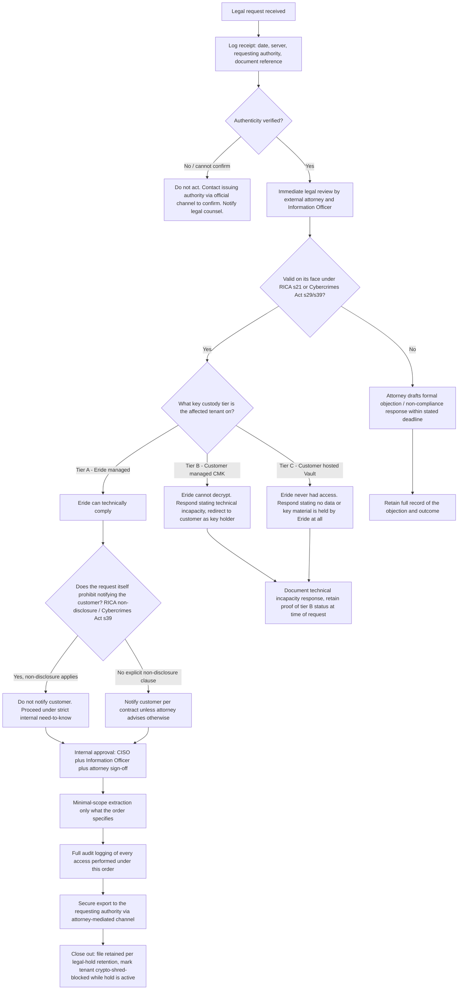

> CONFIDENTIAL — Eride Technologies (Pty) Ltd. Not for distribution outside Eride
> Technologies or parties under written NDA. Contains proprietary architecture.

# RUNBOOK-06: Legal Request Received

Status note: this runbook is Provisional. RICA section 21 has been partially
declared unconstitutional and amended following [AmaBhungane Centre for
Investigative Journalism NPC v Minister of Justice and Correctional Services
2021 (3) SA 246 (CC)](https://www.saflii.org/za/cases/ZACC/2021/3.html), and
the amendment process was still working through Parliament as of this
document's last review. Every step below that depends on the exact current
form of section 21 must be confirmed with Eride's external attorney before
being relied on operationally. Do not treat this runbook as legal advice.

Purpose: the formal process for handling a RICA section 21 interception or
decryption direction, or a Cybercrimes Act section 29 search-and-seizure
warrant, or a section 39 disclosure request, served on Eride Technologies in
relation to a Bheka tenant's data.

## Decision tree



## Procedure

### Step 1 — Receipt and logging

Every legal request, regardless of channel (email, courier, in-person
service), must be logged immediately, before any substantive action:

```bash
curl -s -X POST "https://legal-intake.internal.eride.tech/v1/legal-requests" \
  -H "Authorization: Bearer $LEGAL_INTAKE_TOKEN" \
  -d '{
    "received_at": "'"$(date -u +%Y-%m-%dT%H:%M:%SZ)"'",
    "received_via": "courier",
    "requesting_authority": "South African Police Service - Cybercrime Unit",
    "document_reference": "Cybercrimes Act s29 warrant, case ref CAS-2026-XXXX",
    "affected_tenant_id": "'"$TENANT_ID"'",
    "stated_deadline": "2026-08-05T00:00:00Z",
    "logged_by": "information-officer-nkosi"
  }'
```

This creates an internal record independent of and prior to any Vault or
platform action, ensuring a legal request can never be actioned "off the
books."

### Step 2 — Verify authenticity

Do not act on an unverified document. Contact the issuing court, prosecutor,
or investigating officer via an independently-sourced official contact
channel (not a number or email provided only on the document itself) to
confirm the request is genuine. Fraudulent or social-engineered legal
requests are a known attack vector against platforms holding sensitive data.

### Step 3 — Immediate legal review

Route to Eride's external attorney and the Information Officer together,
before any technical step. The attorney determines:
1. Whether the document is valid on its face (correct court/authority,
   correct legal basis cited, within the requesting body's jurisdiction).
2. What the request actually compels — RICA section 21 directions and
   Cybercrimes Act section 29 warrants have materially different scope and
   procedural requirements, and conflating them risks either
   over-disclosure or unlawful non-compliance.
3. The applicable response deadline.

### Step 4 — Determine what Eride can technically provide (key custody tier check)

This is the step most specific to Bheka's architecture and must not be
skipped or assumed.

```sql
-- Run by the Information Officer against the production read replica,
-- not exposed as a general API — see schemas/database/010_tenants.sql
select t.id, t.legal_name, kcc.custody_tier
from tenants t
join key_custody_config kcc on kcc.tenant_id = t.id
where t.id = $1;
```

- If `custody_tier = 'tier_a'` (Eride-managed, AWS KMS): Eride holds the
  means to decrypt and technical compliance is possible, subject to the
  attorney's determination in Step 3 of whether compliance is actually
  required.
- If `custody_tier = 'tier_b'` (customer-managed CMK): per CANON section 6,
  Eride cannot decrypt this tenant's data under any circumstance — the
  customer's own KMS holds the only usable key. The lawful response is to
  state this technical incapacity in writing (attorney-drafted) and, where
  legally appropriate, identify the customer as the party who may hold
  responsive material, without volunteering more than the order requires.
- If `custody_tier = 'tier_c'` (customer-hosted Vault): Eride never
  possessed the data or any key material capable of decrypting it — the
  entire Vault runs inside the customer's own estate
  (`build-guides/GUIDE-10-On-Prem-Appliance.md`). The honest, complete
  response is that Eride holds nothing responsive.

Do not attempt to obtain tier B or tier C key material from the customer on
the requesting authority's behalf unless the attorney confirms Eride is
itself compelled to seek it — ordinarily that obligation, if it exists,
falls on the customer directly as the party who actually holds the key.

### Step 5 — Internal approval

For a tier A tenant where technical compliance is possible and the attorney
confirms the request is valid and must be honoured, obtain sign-off from all
three: CISO, Information Officer, and the reviewing attorney, before any
extraction. Record this as a Vault quorum-gated action where the extraction
itself requires an `UnwrapDek` call:

```bash
grpcurl -cacert vault-ca.pem -cert ops.pem -key ops.key \
  -d '{
    "tenant_id": "'"$TENANT_ID"'",
    "proposal_type": "legal_compulsion_extraction",
    "proposed_by": "information-officer-nkosi",
    "payload": {"legal_request_id": "'"$LEGAL_REQUEST_ID"'", "scope": "evidence records dated 2026-06-01 to 2026-06-30 for user U-4471 only"},
    "required_approvals": 2
  }' \
  vault.internal.eride.tech:8443 eride.vault.v1.QuorumService/ProposePolicyChange
```

### Step 6 — Minimal-scope extraction

Extract only what the order specifies — no broader time window, no
additional users, no unrelated evidence categories. Over-collection beyond
the order's scope creates independent legal exposure for Eride.

```bash
curl -s -X POST "https://gateway.bheka.eride.tech/v1/admin/legal-extraction" \
  -H "Authorization: Bearer $LEGAL_COMPLIANCE_TOKEN" \
  -H "Idempotency-Key: $(uuidgen)" \
  -d '{
    "legal_request_id": "'"$LEGAL_REQUEST_ID"'",
    "tenant_id": "'"$TENANT_ID"'",
    "subject_user_id": "U-4471",
    "date_range": {"from": "2026-06-01", "to": "2026-06-30"},
    "evidence_categories": ["file_ops", "web"]
  }'
```

`bheka-case` performs the decrypt-in-memory pattern from
`build-guides/GUIDE-05-Evidence-Viewer.md` — the export tool never persists
decrypted content to disk outside a controlled, encrypted-at-rest export
package.

### Step 7 — Full audit logging

Every access performed under this order writes to `audit_log` with an
explicit reference to the legal request ID, distinct from routine
investigator access, so the record is unambiguous if later scrutinised by a
court, the Information Regulator, or the customer.

```bash
curl -s -X GET "https://gateway.bheka.eride.tech/v1/admin/tenants/$TENANT_ID/audit-log?legal_request_id=$LEGAL_REQUEST_ID" \
  -H "Authorization: Bearer $OPS_ADMIN_TOKEN" | jq '.data'
```

### Step 8 — Secure export

Deliver the extraction package via an attorney-mediated channel (not a
direct email attachment), typically encrypted to the requesting authority's
or the court's own key, per the attorney's instruction on acceptable
delivery method for the specific legal process.

### Step 9 — The non-disclosure constraint

RICA and, in some circumstances, Cybercrimes Act section 39 disclosure
provisions can prohibit informing the affected customer or data subject that
a request was made or fulfilled. Where such a non-disclosure obligation
applies (confirmed by the attorney in Step 3, not assumed by default):
- Do not notify the customer.
- Restrict internal knowledge of the request to the smallest group necessary
  (CISO, Information Officer, attorney, and the specific engineer performing
  extraction under Step 6).
- Do not create customer-visible artefacts (e.g. do not surface the
  extraction in the customer-facing audit log view, if one exists, unless
  the attorney confirms this is permitted) — this may require the
  extraction audit entries to be flagged as legal-privilege-restricted at
  the query layer rather than fully suppressed, since CANON's own audit
  design treats completeness of the internal record as non-negotiable even
  when customer-facing visibility must be restricted. This distinction
  (internal completeness vs external visibility) is an open item requiring
  a dedicated access-control review — see Open items below.

Where no non-disclosure obligation applies, notify the customer per the
standard contractual terms and Eride's transparency posture, once the
attorney confirms this is safe to do without prejudicing any investigation.

### Step 10 — Legal hold and closeout

Mark the tenant as crypto-shred-blocked for the duration of any related
retention obligation:

```sql
update tenants set legal_hold = true, legal_hold_reference = $1
where id = $2;
```

This must be checked by `runbooks/RUNBOOK-03-Crypto-Shred-A-Tenant.md`
before any shred proceeds. File the complete record (request, verification,
legal review notes, approval chain, extraction scope, audit log excerpt,
delivery confirmation) in the legal-hold archive with its own long-term
retention schedule, independent of the tenant's normal retention_schedules
configuration.

## Open items

- The precise mechanism for restricting customer-facing audit log
  visibility for legal-compulsion entries, while preserving full internal
  audit completeness per `build-guides/GUIDE-07-Audit-Log.md`, is not yet
  designed. This needs its own access-control specification before this
  runbook can be promoted from Provisional to Locked.
- RICA section 21's post-amendment final text should be re-confirmed with
  counsel before this runbook is relied upon for an actual production
  request; the amendment process referenced above was ongoing as of last
  review.

---

## AI implementation constraints
- Never act on a legal request before Step 2 authenticity verification and
  Step 3 legal review are both complete.
- Never attempt technical decryption for a tier B or tier C tenant — the
  architecture makes this impossible by design (CANON section 6), and any
  code path that appears to make it possible is a bug, not a feature, and
  must be reported immediately rather than used.
- Never notify a customer when a confirmed non-disclosure obligation
  applies, and never skip notifying them when no such obligation exists and
  the attorney has cleared notification.
- Never let an engineer perform extraction (Step 6) without the Step 5
  three-party sign-off already recorded.

## Required inputs
- The original legal document and its verified authenticity.
- Attorney and Information Officer availability for Step 3 review.
- Confirmed key custody tier for the affected tenant.

## Expected outputs
- A logged, verified legal request record independent of any subsequent
  action taken.
- A documented custody-tier-based response (compliance, technical
  incapacity, or no-data-held).
- A complete, legal-request-tagged audit trail for any extraction performed.
- A tenant legal hold flag set for the duration of the obligation.

## Dependencies
- `build-guides/GUIDE-02-Eride-Vault.md` (quorum-gated extraction).
- `build-guides/GUIDE-07-Audit-Log.md` (audit trail).
- `build-guides/GUIDE-05-Evidence-Viewer.md` (decrypt-in-memory export
  pattern).
- `runbooks/RUNBOOK-03-Crypto-Shred-A-Tenant.md` (legal hold cross-check).

## Acceptance criteria
- Given a legal request for a tier B tenant, when the custody-tier check
  runs, then the response is technical incapacity, never an attempted
  decryption.
- Given a legal request under a confirmed non-disclosure obligation, when
  extraction completes, then no customer-visible notification is generated.
- Given a legal hold set on a tenant, when a crypto-shred is attempted
  against that tenant, then it is blocked until the hold is lifted.

## Test checklist
- [ ] Tabletop exercise with a simulated tier A, tier B, and tier C request
      to confirm each produces the architecturally correct response.
- [ ] Confirm legal hold flag actually blocks
      `runbooks/RUNBOOK-03-Crypto-Shred-A-Tenant.md` execution in a staging
      test.
- [ ] Confirm audit log entries created under Step 7 are distinguishable
      from routine investigator access entries by legal_request_id.
- [ ] Attorney sign-off obtained confirming the current RICA section 21 text
      and this runbook's assumptions before promoting to Locked.
