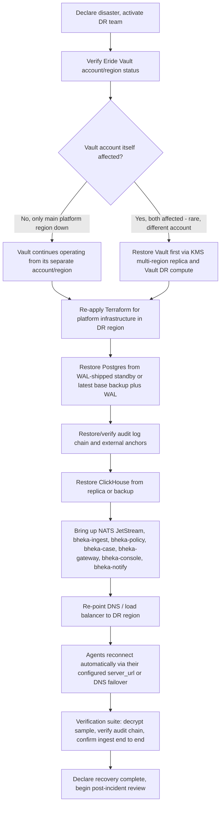

> CONFIDENTIAL — Eride Technologies (Pty) Ltd. Not for distribution outside Eride
> Technologies or parties under written NDA. Contains proprietary architecture.

# RUNBOOK-08: Disaster Recovery

Status note: Provisional. This runbook has not yet been exercised against a
real af-south-1 regional outage; RTO/RPO figures below are design targets,
not measured results, until a full game-day exercise validates them. Treat
the numbers as commitments to test toward, not yet as proven SLAs to quote
to customers.

Purpose: recover the Bheka platform following loss of the primary af-south-1
region, covering Postgres, ClickHouse, NATS JetStream, S3 evidence storage,
and — most critically — the separate-account Eride Vault
(`build-guides/GUIDE-02-Eride-Vault.md`), without which no encrypted data
anywhere in the platform is recoverable regardless of the state of any other
datastore.

## RTO / RPO targets

| Component | RPO target | RTO target | Notes |
|---|---|---|---|
| Eride Vault (KMS key material, quorum state) | near-zero (KMS multi-region key replication) | 2 hours | Highest priority — nothing else can be decrypted without it |
| Postgres (tenants, cases, policies, audit metadata) | 5 minutes (continuous WAL shipping) | 4 hours | Restore before ClickHouse since ClickHouse writes reference tenant/policy state |
| Audit log hash chain | zero (external anchoring, `build-guides/GUIDE-07-Audit-Log.md` section 6) | 4 hours | Must be verifiable immediately on restore, not just present |
| ClickHouse (telemetry) | 15 minutes (replicated writes) | 6 hours | Larger volume, can tolerate a longer RTO than control-plane data |
| S3 evidence/audit storage | near-zero (cross-region replication) | n.a. (S3 itself does not "go down" the way a compute region does) | Object Lock retention must survive replication |
| NATS JetStream | best-effort, some in-flight message loss acceptable | 2 hours | Agents buffer locally up to 30 days per CANON section 16, absorbing bus downtime |

## Recovery order (strict — do not reorder)



## Procedure

### Step 1 — Declare disaster and activate DR team

Confirm this is a genuine regional-scale event (not a single-service
incident better handled by a normal on-call response) before invoking the
full DR process, which involves cross-team coordination overhead
disproportionate to a routine outage.

### Step 2 — Verify Vault status first

The Vault runs in a separate cloud account specifically so that a platform
region incident does not automatically take it down too
(`build-guides/GUIDE-02-Eride-Vault.md` section 8, deployment topology).
Confirm:

```bash
grpcurl -cacert vault-ca.pem -cert ops.pem -key ops.key \
  vault.internal.eride.tech:8443 grpc.health.v1.Health/Check
```

If the Vault is healthy, it requires no recovery action — proceed directly
to platform infrastructure recovery (Step 3) with the Vault as a stable,
available dependency throughout.

If the Vault account/region is also affected (a materially rarer, larger
event given the separate-account isolation), recover it first, before
anything else, since no other datastore can be usefully decrypted without
it:

```bash
# AWS KMS multi-region keys allow the same key material to be used from a
# replica key in a second region. See
# https://docs.aws.amazon.com/kms/latest/developerguide/multi-region-keys-overview.html
aws kms describe-key --key-id "$REPLICA_KEY_ARN" --region af-south-1-alt

# Bring up eride-vault compute in the DR region pointed at the replica key.
terraform -chdir=infra/vault-dr apply -var="aws_region=af-south-1-alt" -var="kms_replica_key_arn=$REPLICA_KEY_ARN"
```

### Step 3 — Re-apply Terraform for platform infrastructure

```bash
cd infra/platform
terraform init -reconfigure -backend-config="region=af-south-1-alt"
terraform plan -var-file="dr.tfvars" -out=dr.plan
terraform apply dr.plan
```

This provisions the network, compute (ECS/EKS per the deployed target),
Postgres RDS instance (or promotes an existing cross-region read replica —
preferred over a fresh apply if one exists, since it carries live data),
ClickHouse cluster, and NATS JetStream cluster in the DR region.

### Step 4 — Restore Postgres

Preferred path — promote existing cross-region replica:

```bash
aws rds promote-read-replica --db-instance-identifier bheka-pg-dr-replica --region af-south-1-alt
```

Fallback path — restore from base backup plus WAL if no live replica exists:

```bash
# Using pgBackRest or equivalent WAL-archiving tool configured for the
# primary. Exact tool choice is an infrastructure decision not yet locked
# in CANON; Terraform module should be parameterised for this.
pgbackrest restore --stanza=bheka-primary --target-time="$LAST_KNOWN_GOOD_TIMESTAMP" --pg1-path=/var/lib/postgresql/data
```

Verify RLS and roles came up correctly per
`schemas/database/000_extensions_and_domains.sql` before allowing
application traffic:

```sql
select rolname from pg_roles where rolname in ('bheka_app', 'bheka_migrator', 'bheka_readonly');
select current_tenant_id(); -- should error outside a session context, confirming the GUC function itself restored correctly
```

### Step 5 — Restore and verify the audit log chain

This step is not optional and not merely "restore like any other table" —
the audit log's value depends entirely on its chain being intact and
verifiable, per `build-guides/GUIDE-07-Audit-Log.md`.

```bash
bheka-audit-verify --from-db --tenant-id=all --since="$DR_WINDOW_START"
```

If verification reports a gap or break in the chain corresponding to the
disaster window itself (plausible if the primary went down mid-write),
cross-reference the external anchor receipts
(`build-guides/GUIDE-07-Audit-Log.md` section 6) to confirm no entries were
lost that had already been anchored externally — an anchored-but-not-yet-
restored entry is a restore completeness issue, not a tamper issue, and
should be resolved by re-running the restore from an earlier consistent
point if needed rather than treated as a security incident.

### Step 6 — Restore ClickHouse

```bash
clickhouse-backup restore bheka_events_latest --schema --data
```

Or promote a cross-region ClickHouse replica if the cluster topology
includes one. ClickHouse's RPO tolerance (15 minutes) is looser than
Postgres because telemetry loss, while undesirable, does not compromise the
integrity of case/policy/audit state the way control-plane data loss would.

### Step 7 — Bring up services in dependency order

```bash
kubectl apply -f k8s/dr/namespace.yaml
kubectl apply -f k8s/dr/nats-jetstream.yaml
kubectl apply -f k8s/dr/bheka-ingest.yaml
kubectl apply -f k8s/dr/bheka-policy.yaml
kubectl apply -f k8s/dr/bheka-case.yaml
kubectl apply -f k8s/dr/bheka-gateway.yaml
kubectl apply -f k8s/dr/bheka-console.yaml
kubectl apply -f k8s/dr/bheka-notify.yaml
```

Ingest before policy before case before gateway/console: this order ensures
each service's dependencies are live before it starts accepting traffic
that would otherwise fail against not-yet-ready downstream services.

### Step 8 — Re-point DNS/load balancer

```bash
aws route53 change-resource-record-sets --hosted-zone-id "$ZONE_ID" --change-batch file://dr-failover.json
```

Agents reconnect using their configured `SERVER_URL`
(`build-guides/GUIDE-08-Tenant-Onboarding.md` MSI property) which should
resolve to a DNS name fronting the active region, not a hardcoded IP —
confirm this was the original enrolment configuration for affected tenants,
since older enrolments with a hardcoded endpoint would need manual
reconfiguration.

### Step 9 — Verification suite

```bash
# 1. Confirm a sample historical evidence blob still decrypts.
grpcurl -cacert vault-ca.pem -cert ops.pem -key ops.key \
  -d '{"tenant_id": "'"$SAMPLE_TENANT_ID"'", "hpke_sealed_dek": "'"$SAMPLE_WRAPPED_DEK"'", "key_purpose": "evidence_encryption", "requesting_service": "bheka-case", "request_id": "dr-verification"}' \
  vault.internal.eride.tech:8443 eride.vault.v1.VaultService/UnwrapDek

# 2. Confirm audit chain verifies clean.
bheka-audit-verify --from-db --tenant-id=all --since="$DR_WINDOW_START"

# 3. Confirm end-to-end ingest with a synthetic test event.
curl -s -X POST "https://gateway.bheka.eride.tech/v1/ingest/batch" \
  -H "Idempotency-Key: dr-verify-$(uuidgen)" \
  --data-binary @synthetic-test-batch.zst

# 4. Confirm a live agent can heartbeat successfully.
curl -s -X GET "https://gateway.bheka.eride.tech/v1/agents/$TEST_AGENT_ID/heartbeat-status"
```

All four must pass before declaring recovery complete.

### Step 10 — Declare recovery complete, begin review

Notify customers per contractual SLA obligations regarding the outage
window and any RPO shortfall actually experienced (e.g. if the last
Postgres WAL segment was 8 minutes stale against a 5-minute target, disclose
this rather than rounding favourably). Conduct a full post-incident review
within 5 business days, feeding findings back into this runbook and, if
infrastructure gaps are found, into `implementation/BACKLOG.md`.

## Open items

- This runbook has not yet been exercised as a full game-day drill. RTO/RPO
  figures are design targets pending that exercise.
- The exact backup tool for Postgres (pgBackRest vs RDS automated snapshots
  vs another tool) is not yet Locked in CANON and should be confirmed during
  infrastructure build-out.
- Cross-region ClickHouse replication topology is not yet specified in
  Terraform; today's design assumes backup/restore rather than live
  replication, which affects the realistic RTO.

---

## AI implementation constraints
- Never restore ClickHouse or bring up application services before Vault
  health and Postgres restoration are both confirmed — decrypting anything
  or serving any policy decision without both in a known-good state risks
  silent data corruption or incorrect policy enforcement.
- Never declare recovery complete without all four verification suite
  checks in Step 9 passing.
- Never treat an audit chain gap during the disaster window as automatically
  a tamper event; check external anchor receipts first per Step 5 before
  escalating to a security incident.

## Required inputs
- Confirmed disaster declaration and DR team activation.
- Access to Terraform state and DR-region credentials.
- The disaster window start time for audit chain verification scoping.

## Expected outputs
- A fully restored platform in the DR region passing all four verification
  suite checks.
- A documented actual RPO/RTO achieved versus target, for the post-incident
  review.
- Customer notification of outage window and any data-loss disclosure
  required.

## Dependencies
- `build-guides/GUIDE-02-Eride-Vault.md` (Vault deployment topology).
- `build-guides/GUIDE-07-Audit-Log.md` (chain verification tooling).
- `build-guides/GUIDE-04-Ingest-Pipeline.md` (end-to-end verification path).

## Acceptance criteria
- Given a full DR exercise, when Vault health is confirmed before platform
  restoration begins, then no application service starts before that
  confirmation.
- Given a restored audit log, when `bheka-audit-verify` runs against it,
  then it reports either a clean chain or a fully explained, anchor-cross-
  referenced gap.
- Given a completed DR exercise, when the verification suite runs, then all
  four checks pass before recovery is declared complete.

## Test checklist
- [ ] A full game-day DR exercise conducted at least annually against a
      non-production environment, measuring actual RTO/RPO against the
      targets in this document.
- [ ] Postgres restore path tested via both the replica-promotion and the
      base-backup-plus-WAL fallback paths at least once each.
- [ ] Audit chain verification tested against a deliberately induced gap
      scenario to confirm the anchor cross-reference logic in Step 5 behaves
      as described.
- [ ] DNS failover tested to confirm agent reconnection behaviour matches
      expectations for both DNS-configured and (if any exist)
      hardcoded-endpoint enrolments.
